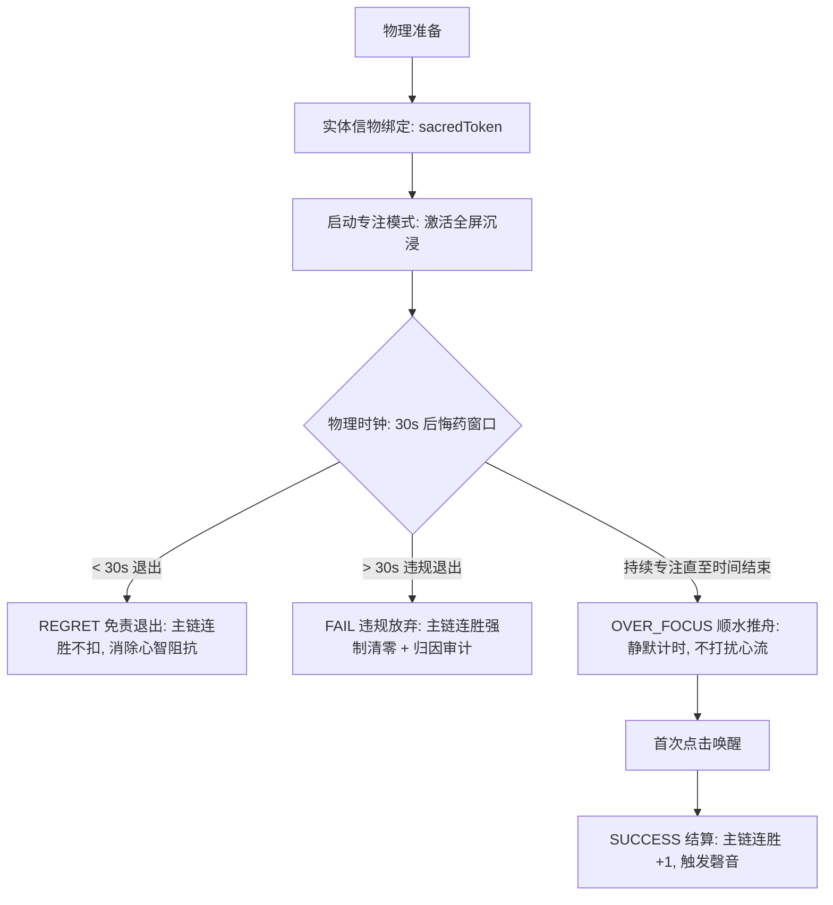
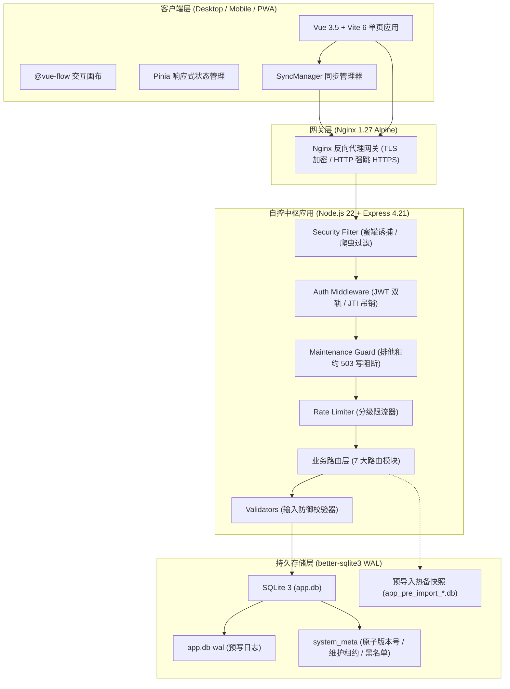
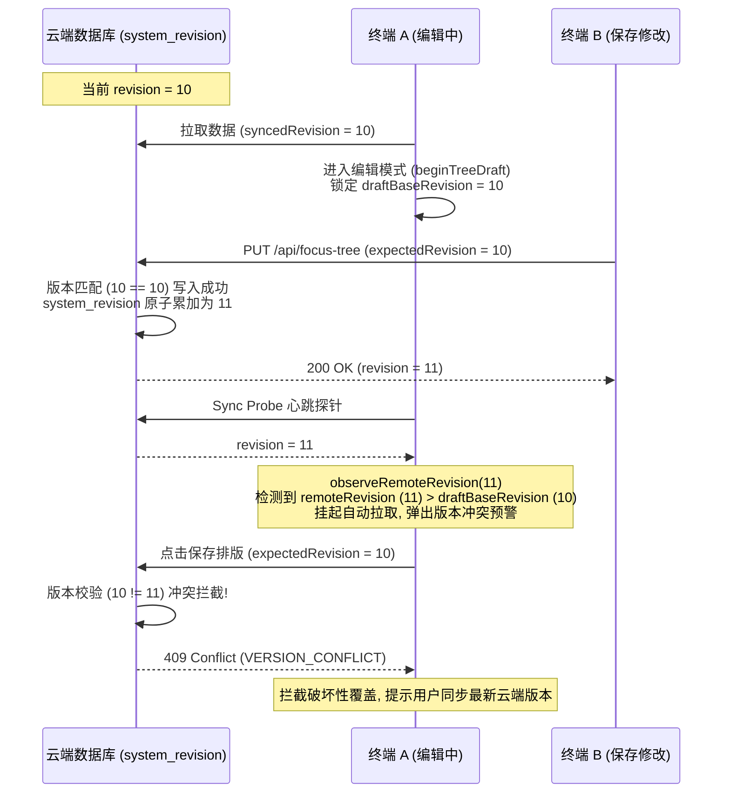

# 01-系统全景与架构设计

本文档定义 **Sacred Focus（神圣自控中枢）** 的顶层设计哲学、系统技术拓扑、跨端协同探针机制以及多级安全防护模型。文档内容完全基于当前实际工程代码反向推导，作为全系统工程落地的权威纲领。

---

## 1. 核心自控理论工程落地

Sacred Focus 是一套将认知心理学、行为工程学与现代分布式软件工程深度融合的自控系统。通过物理约束与状态机契约，消除人类自控过程中的阻抗与虚妄。

### 1.1 神圣座位协议 (CTDP, Classical Temptation Decoupling Protocol)
传统自控方案（如普通待办清单、标准番茄钟）多依赖纯意志力，极易因“意志力耗竭”或“环境提示泛化”而崩溃。CTDP 协议在工程层面落地了三大硬性机制：



1. **条件反射强锚定 (Physical Token Decoupling)**
   - 必须配置具体的物理动作或信物口令（如 `主力机开启专注模式`），在进入专注前建立明确的心智结界。
   - 界面进入专注即自动申请全屏模式（`store.enterFullscreen()`），隐藏全部导航链接与设置按钮，消除一切干扰源。
2. **30 秒物理时钟后悔药 (Zero-Friction Regret Window)**
   - 拖延的本质是潜意识对“长时间痛苦劳动”的抗拒。CTDP 协议设立 `regretWindowSeconds`（默认 30 秒）。
   - **毫秒级物理时钟差值判定**：通过 `Date.now() - sessionStartTime.getTime()` 计算物理耗时，杜绝由于移动设备息屏、切后台导致 JavaScript `setInterval` 节流引起的保护期漂移。
   - 30 秒内点击退出，状态记为 `REGRET`，当前连胜（`currentStreak`）不受任何影响，以 0ms 乐观更新响应用户，消解开始行动的心智门槛。
3. **静默顺水推舟与超额专注 (Silent Over-focus Extension)**
   - 传统番茄钟在倒计时归零时的铃声，会强行打断深度工作的心流。
   - 系统到达预设时长后，无声切换至 `OVER_FOCUS` 状态，以毫秒精度继续向上累加专注秒数。直至用户主动退出心流、首次点击屏幕时，冻结实际采集秒数并唤醒深潜结算。
4. **违规放弃破坏性清零 (Destructive Streak Reset)**
   - 超过 30 秒后主动点击放弃，系统弹出严正清零警告，强制要求输入中断诱因，在事务中将 `currentStreak` 物理清零并持久化。

### 1.2 国策树协议 (RSIP, Real-time Strategic Incentive Protocol)
RSIP 协议借鉴现代战略国策树思想，将行为规范结构化为具备层级逻辑与演化历史的 DAG（有向无环图）拓扑：

1. **时空触发场景双轨判定**
   - **精确时间点 (`hasExactTime = true`)**：如 `09:05`，自动转化为全天分钟数 `timeValueMinutes`，为列表排序与日间节奏提供量化基准。
   - **场景化描述 (`triggerScene`)**：如 `起床后5分钟内下床`、`全天候`，适应非固定时刻触发的习惯动作。
2. **水密隔舱保全机制 (Water-tight Bulkhead, `isFrozen`)**
   - 现实中遭遇突发生病、出差或不可抗力时，若强行判定断签清零，会摧毁用户的长期沉没资本并诱发自暴自弃。
   - 标记为 `isFrozen = true` 的节点，在每日凌晨 04:00 跨天断签结算引擎中获得绝对豁免权，完整保留现有等级与历史最高等级。
3. **5 槽位版本演化回滚 (5-Slot Evolution Engine)**
   - 国策体系随着个人成长需不断重构。系统维护 0 至 4 共 5 个演化槽位，支持 `vMajor.Minor` 语义化版本迭代。
   - 每次版本归档均全量持久化整棵树结构（节点、连线、分组、标签），并支持版本活跃指针（`activePointerIndex`）一键原子回滚。

---

## 2. 全栈技术拓扑与部署架构

Sacred Focus 采用模块化微单体架构，前后端既可一体化容器分发，亦可独立分离部署：



### 2.1 技术选型与职责划分
* **前端 (Frontend)**：
  - 构建产物托管于后端静态目录（生产环境 `/app/frontend/dist`），SPA 路由由 Express 回退 `index.html` 兜底。
  - 画布使用 `@vue-flow/core` 进行虚拟化渲染与坐标正交自动避障。
* **后端 (Backend)**：
  - 核心业务逻辑统一收敛于 Express 路由中，严格实施 D-2/D-3 治理，将原 God Object 解耦为 `db/` 独立子模块。
  - 全局捕获未处理异常，生产环境隐匿内部调用堆栈，杜绝敏感路径泄漏。
* **数据库 (Database)**：
  - 使用 `better-sqlite3` 直接在 Node.js 进程内通过 C++ 原生绑定读写，消除跨网络通信延迟。
  - 严格开启 WAL (Write-Ahead Logging) 模式与外键约束，读写并发互不阻塞。

---

## 3. 跨端协同探针 (Sync Probe) 设计

在多设备使用场景下，为了杜绝 WebSocket 长期持有连接带来的心跳功耗与移动端休眠断连，系统创新性地实现了**基于原子版本号（Atomic Revision）的轻量协同探针体系**。

### 3.1 探针工作机制
* **服务端探针端点**：`GET /api/sync/status`
  - 响应报文极小（通常小于 100 字节）：
    ```json
    {
      "revision": 42,
      "evolutionVersion": "v1.2",
      "updatedAt": "2026-09-14T10:00:00.000Z"
    }
    ```
  - 无需查询大表，仅通过 `SELECT value FROM system_meta WHERE key = 'system_revision'` 极速返回当前系统原子版本号。
* **客户端唤醒探测矩阵 (`syncManager.ts`)**：
  1. **低频心跳**：后台维持 60 秒一次的轻量心跳探测；
  2. **前台唤醒响应**：监听浏览器的 `document.addEventListener('visibilitychange')`，当手机解锁或切回应用前台（`visible`）瞬间立即触发探测；
  3. **窗口聚焦**：监听 `window.addEventListener('focus')`，多屏幕切换时光标切回立即触发。

### 3.2 乐观并发控制 (OCC) 与三版本分离模型
为了防止移动端与桌面端同时修改引发脏数据覆盖，前端 `focusTree` Store 实施了严格的**三版本分离机制**：



1. **`syncedRevision`**：本地已成功拉取并持久化同步的基准版本；
2. **`remoteRevision`**：探针观测到的云端最新远端版本；
3. **`draftBaseRevision`**：进入画布编辑模式瞬间冻结的草稿基准版本。
* **保存冲突拦截**：当客户端发起全量保存或结构变更时，必须在 Payload 中显式携带 `expectedRevision`。后端在事务中比对 `system_meta.system_revision`，若版本不一致直接拒绝写入并返回 `409 Conflict`，杜绝静默覆盖。

---

## 4. 多级安全防护与纵深防御模型

Sacred Focus 构建了贯穿网关层、应用层与数据层的四道安全防线：


### 4.1 第一道防线：Nginx 网关与传输安全
* **TLS 协议加固**：强制启用 TLSv1.2 与 TLSv1.3，禁用不安全弱密码套件；
* **HTTP 强跳 HTTPS**：监听 80 端口，全量 301 重定向至 443；仅对容器健康检查路径 `/api/health` 予以放行；
* **标头穿透与信任代理**：透传 `X-Real-IP`、`X-Forwarded-For` 与 `X-Forwarded-Proto https`，配合 Express 的 `app.set('trust proxy', 1)` 提取真实客户端 IP，杜绝通过伪造标头绕过限流。

### 4.2 第二道防线：全局安全诱捕与过滤 (`securityFilter`)
* **蜜罐陷阱防御 (Honeypot Trap)**：
  - 拦截针对 `/.env`, `/.git`, `/wp-login.php`, `/admin.php`, `/phpmyadmin`, `/actuator` 等 6 大经典未授权嗅探路径的探测；
  - 一旦触发，立即捕获攻击者 IP 并执行 **72 小时持久化封禁**（写入 `system_meta` 表中 `ip_ban:<ip>` 并在内存中建立高速缓存）；
  - 被封禁 IP 后续所有请求直接被截断并响应 `403 Forbidden`。
* **恶意自动化爬虫 UA 过滤**：
  - 正则阻断包含 `python-requests`, `Scrapy`, `Go-http-client`, `zgrab` 等特征的自动化扫描器。

### 4.3 第三道防线：统一身份鉴权与凭据管理 (`authMiddleware`)
* **JWT 双轨传输设计**：
  - **首选轨道**：采用安全 `HttpOnly` Cookie（`sf_token`）。在 HTTPS 环境下自动配置 `secure: true, sameSite: 'strict'`，在明文 HTTP 下自动降级为 `secure: false, sameSite: 'lax'`，兼顾开发调试与生产安全，防范 XSS 窃取令牌；
  - **备选轨道**：支持 `Authorization: Bearer <token>` 请求头传输，方便脚本或移动端离线调用；
  - **静态凭据时序安全比对**：向下兼容 `APP_ACCESS_TOKEN`，使用 `crypto.timingSafeEqual` 常量时间比对算法（`safeCompare`），彻底防御时序侧信道攻击。
* **JTI 吊销黑名单与自动物理淘汰 (`purgeExpiredRevokedJtis`)**：
  - 签发 JWT 时附加唯一 UUID 作为 `jti`；
  - 用户注销登录时，将该 `jti` 与有效到期时间存入 `system_meta`；
  - 系统启动时及每 30 分钟空闲检查点自动执行垃圾回收，清理已过自然到期时间的黑名单记录，防止元数据表无限膨胀。

### 4.4 第四道防线：分级智能限流体系 (`rateLimiter.ts`)
依托 `express-rate-limit` 构建细粒度限流规则，**本机回环地址（127.0.0.1）及环境变量配置的 `TRUSTED_IPS` 享有免流豁免**：

| 限流器名称 | 作用范围 | 窗口与配额 | 惩罚行为与防御目的 |
| :--- | :--- | :--- | :--- |
| **`loginLimiter`** | `/api/auth/login` | 15 分钟内最多 5 次 | 阻断公网环境针对管理员口令的暴力破解与字典攻击 |
| **`apiGeneralLimiter`** | 全部 `/api/*` 业务接口 | 认证用户 1000次/分<br/>未认证用户 60次/分 | 防御拒绝服务攻击 (DoS) 与异常死循环调用 |
| **`exportLimiter`** | `/api/system/export` | 10 分钟内最多 15 次 | 防范批量拖库与整机镜像生成造成的 CPU/内存耗尽 |
| **`importLimiter`** | `/api/system/import` | 1 小时内最多 10 次 | 容错极低频操作，防止频繁触发整机预热备覆写与磁盘 IO 颠簸 |

---

## 5. 本文档涉及的真实源码文件映射

* 后端系统入口：[`backend/src/server.ts`](file:///d:/Codes/Projects/sacred-focus/backend/src/server.ts)
* 环境配置与密钥拦截：[`backend/src/config.ts`](file:///d:/Codes/Projects/sacred-focus/backend/src/config.ts)
* 鉴权中间件与 JTI 淘汰：[`backend/src/middleware/auth.ts`](file:///d:/Codes/Projects/sacred-focus/backend/src/middleware/auth.ts)
* 安全诱捕与 IP 封禁：[`backend/src/middleware/security.ts`](file:///d:/Codes/Projects/sacred-focus/backend/src/middleware/security.ts)
* 分级限流规则：[`backend/src/middleware/rateLimiter.ts`](file:///d:/Codes/Projects/sacred-focus/backend/src/middleware/rateLimiter.ts)
* 同步探针路由：[`backend/src/routes/sync.ts`](file:///d:/Codes/Projects/sacred-focus/backend/src/routes/sync.ts)
* 前端同步管理器：[`frontend/src/utils/syncManager.ts`](file:///d:/Codes/Projects/sacred-focus/frontend/src/utils/syncManager.ts)
* 前端国策树状态：[`frontend/src/stores/focusTree.ts`](file:///d:/Codes/Projects/sacred-focus/frontend/src/stores/focusTree.ts)
* Nginx 安全网关配置：[`nginx/conf.d/default.conf`](file:///d:/Codes/Projects/sacred-focus/nginx/conf.d/default.conf)
