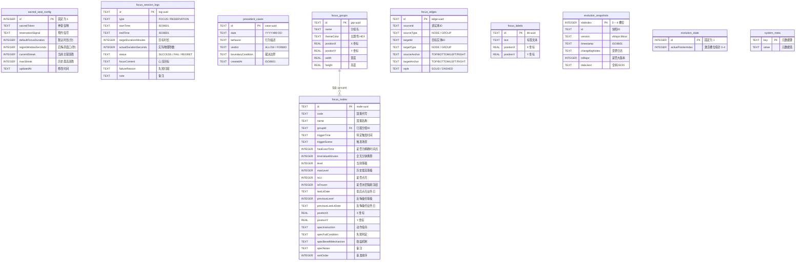
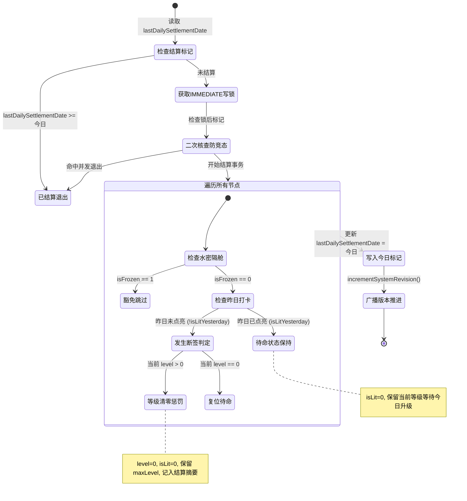
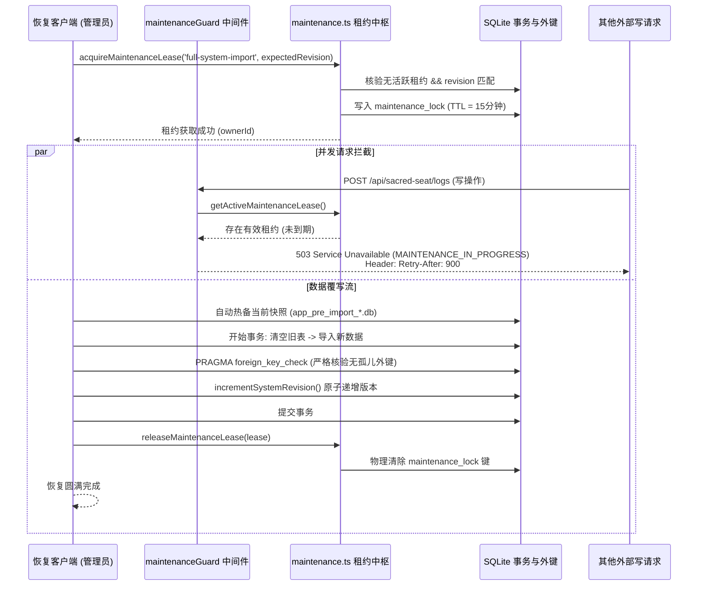

# 02-数据库模型与状态机

本文档系统性阐述 **Sacred Focus（神圣自控中枢）** 的底层持久化架构、9 大核心数据表 DDL 规格、关键性能索引、以及驱动整个自控系统稳态运行的三大核心状态机。

---

## 1. 存储引擎与数据库连接规范

系统数据持久化由原生嵌入式引擎 `better-sqlite3` 驱动（模块源码：[`backend/src/db/connection.ts`](file:///d:/Codes/Projects/sacred-focus/backend/src/db/connection.ts)）。数据库实例位于 `config.dataDir`（默认挂载路径 `/app/data/app.db`）。

### 1.1 核心 PRAGMA 配置
```typescript
// 开启高性能预写日志模式 (WAL)
db.pragma('journal_mode = WAL');

// 强制开启外键完整性约束（级联校验）
db.pragma('foreign_keys = ON');

// 锁竞争重试超时（5000 毫秒），消除并发读写冲突导致的立刻抛错
db.pragma('busy_timeout = 5000');
```

* **WAL 模式优势**：实现“读写并发互不阻塞”（Readers do not block Writers, Writers do not block Readers）。即使系统正在执行整机导出或大数据集聚合分析，前端打卡与专注流水写入依然毫秒级瞬时完成。
* **外键严格约束**：通过 `PRAGMA foreign_keys = ON`，保证分组与节点、连线关联等外键在破坏性变更时遵循级联策略或物理拦截。

### 1.2 检查点策略与优雅停机 (Graceful Shutdown)
为了防范 SQLite WAL 文件（`app.db-wal`）在长期高频写入下无限膨胀，系统部署了双重 Checkpoint 机制：
1. **定时被动检查点 (`PASSIVE`)**：[`backend/src/server.ts`](file:///d:/Codes/Projects/sacred-focus/backend/src/server.ts) 启动每 30 分钟一次的后台轻量检查点 `db.pragma('wal_checkpoint(PASSIVE)')`，不阻塞当前读写，顺带触发过期的 JTI 吊销黑名单清理。
2. **停机截断检查点 (`TRUNCATE`)**：进程监听 `SIGTERM` 和 `SIGINT` 信号。在关闭 HTTP 监听后，强制执行 `db.pragma('wal_checkpoint(TRUNCATE)')`，将全部 WAL 日志完整回写并截断至主数据文件 `app.db`，然后执行 `db.close()`，确保容器销毁或主机重启时零脏数据遗留。

---

## 2. 核心数据表 DDL 与字段规范

完整 DDL 定义位于 [`backend/src/db/schema.ts`](file:///d:/Codes/Projects/sacred-focus/backend/src/db/schema.ts)。系统包含 9 大业务数据表与 1 张系统元数据表：



### 2.1 表结构全量定义

#### (1) `sacred_seat_config`（神圣座位核心配置）
系统运行单例配置表，通过 `CHECK (id = 1)` 强制保持单行：
```sql
CREATE TABLE IF NOT EXISTS sacred_seat_config (
  id INTEGER PRIMARY KEY CHECK (id = 1),
  sacredToken TEXT NOT NULL,                -- 启动物理信物（如：主力机开启专注模式）
  reservationSignal TEXT NOT NULL,          -- 预约启动信号（如：反手拍手轻声说换人）
  defaultFocusDuration INTEGER NOT NULL DEFAULT 60, -- 默认专注时长（分钟，范围 1-1440）
  regretWindowSeconds INTEGER NOT NULL DEFAULT 30,  -- 后悔药窗口时限（秒，范围 5-300）
  currentStreak INTEGER NOT NULL DEFAULT 0,         -- 当前连续专注成功天数/次数
  maxStreak INTEGER NOT NULL DEFAULT 0,             -- 历史最高连胜天数/次数
  updatedAt TEXT NOT NULL                   -- 最后修改时间戳
);
```

#### (2) `focus_session_logs`（专注流水日志）
记录神圣座位的每一次专注实践及打卡详细流水：
```sql
CREATE TABLE IF NOT EXISTS focus_session_logs (
  id TEXT PRIMARY KEY,
  type TEXT NOT NULL CHECK(type IN ('FOCUS', 'RESERVATION')), -- 会话类型
  startTime TEXT NOT NULL,                  -- ISO 8601 开始时间戳
  endTime TEXT NOT NULL,                    -- ISO 8601 结束时间戳
  targetDurationMinutes INTEGER NOT NULL,   -- 目标专注分钟数
  actualDurationSeconds INTEGER NOT NULL,   -- 实际物理专注秒数
  status TEXT NOT NULL CHECK(status IN ('SUCCESS', 'FAIL', 'REGRET')), -- 结算状态
  focusContent TEXT,                        -- 专注目标与心流产出内容
  failureReason TEXT,                       -- 违规中断归因
  note TEXT                                 -- 审计备注
);
```

#### (3) `precedent_cases`（下必为例判例库）
记录行为定性先例，形成自控判例法：
```sql
CREATE TABLE IF NOT EXISTS precedent_cases (
  id TEXT PRIMARY KEY,
  date TEXT NOT NULL,                       -- 裁决日期 YYYY-MM-DD
  behavior TEXT NOT NULL,                   -- 争议行为描述
  verdict TEXT NOT NULL CHECK(verdict IN ('ALLOW', 'FORBID')), -- 允许(绿) 或 禁止(红)
  boundaryCondition TEXT NOT NULL,          -- 裁决法理与边界约束条件
  createdAt TEXT NOT NULL                   -- 创建时间戳
);
```

#### (4) `focus_groups`（国策树分组外框）
国策树画布上的大模块组织容器：
```sql
CREATE TABLE IF NOT EXISTS focus_groups (
  id TEXT PRIMARY KEY,
  name TEXT NOT NULL,                       -- 分组名称
  themeColor TEXT NOT NULL,                 -- 主题边框颜色 HEX（如 #2563EB）
  positionX REAL NOT NULL DEFAULT 0,        -- 画布 X 坐标
  positionY REAL NOT NULL DEFAULT 0,        -- 画布 Y 坐标
  width REAL NOT NULL DEFAULT 300,          -- 容器宽度
  height REAL NOT NULL DEFAULT 200          -- 容器高度
);
```

#### (5) `focus_nodes`（国策节点实体）
自控体系最核心的行为节点，承载时空判定、连胜等级与水密隔舱状态：
```sql
CREATE TABLE IF NOT EXISTS focus_nodes (
  id TEXT PRIMARY KEY,
  code TEXT NOT NULL,                       -- 节点代号（如 R0, M1, F3）
  name TEXT NOT NULL,                       -- 节点名称（如 离地起爆）
  groupId TEXT,                             -- 外键关联 focus_groups，支持为 NULL (独立国策)
  triggerTime TEXT,                         -- 定量时间（格式 HH:MM，如 09:05）
  triggerScene TEXT NOT NULL DEFAULT '全天候', -- 场景描述（如 起床后5分钟内）
  hasExactTime INTEGER NOT NULL DEFAULT 0,  -- 是否存在精确时间戳 (0/1)
  timeValueMinutes INTEGER,                 -- 换算为全天分钟数（如 09:05 -> 545），供排序
  level INTEGER NOT NULL DEFAULT 1,         -- 当前连续点亮等级
  maxLevel INTEGER NOT NULL DEFAULT 1,      -- 历史最高等级
  isLit INTEGER NOT NULL DEFAULT 0,         -- 今日是否已点亮 (0待命 / 1点亮)
  isFrozen INTEGER NOT NULL DEFAULT 0,      -- 是否处于水密隔舱冻结保护态 (0正常 / 1冻结)
  lastLitDate TEXT,                         -- 最后点亮业务日 (YYYY-MM-DD)
  previousLevel INTEGER NOT NULL DEFAULT 0, -- 反悔备份等级（当天点亮前回退镜像）
  previousLastLitDate TEXT,                 -- 反悔备份点亮业务日（P1-004 精准回退）
  positionX REAL NOT NULL DEFAULT 0,        -- 画布 X 坐标
  positionY REAL NOT NULL DEFAULT 0,        -- 画布 Y 坐标
  specInstruction TEXT NOT NULL DEFAULT '', -- 动作指令卡
  specFailCondition TEXT NOT NULL DEFAULT '',-- 失败判定卡
  specBenefitMechanism TEXT NOT NULL DEFAULT '', -- 收益机制与心理学解释
  specNotes TEXT,                           -- 规范卡备注
  sortOrder INTEGER NOT NULL DEFAULT 0,     -- 列表基准持久化顺序
  FOREIGN KEY (groupId) REFERENCES focus_groups (id) ON DELETE SET NULL
);
```

#### (6) `focus_edges`（拓扑有向连线）
描述国策节点或分组之间的流动与代偿关系：
```sql
CREATE TABLE IF NOT EXISTS focus_edges (
  id TEXT PRIMARY KEY,
  sourceId TEXT NOT NULL,                   -- 起点实体 ID
  sourceType TEXT NOT NULL CHECK(sourceType IN ('NODE', 'GROUP')), -- 起点类型
  targetId TEXT NOT NULL,                   -- 终点实体 ID
  targetType TEXT NOT NULL CHECK(targetType IN ('NODE', 'GROUP')), -- 终点类型
  sourceAnchor TEXT NOT NULL CHECK(sourceAnchor IN ('TOP', 'BOTTOM', 'LEFT', 'RIGHT')),
  targetAnchor TEXT NOT NULL CHECK(targetAnchor IN ('TOP', 'BOTTOM', 'LEFT', 'RIGHT')),
  style TEXT NOT NULL CHECK(style IN ('SOLID', 'DASHED')) -- 实线流水 / 虚线代偿
);
```

#### (7) `focus_labels`（说明文本标签）
画布上的流转说明（如“专注间歇”等极简文本注释框）：
```sql
CREATE TABLE IF NOT EXISTS focus_labels (
  id TEXT PRIMARY KEY,
  text TEXT NOT NULL,                       -- 说明文本
  positionX REAL NOT NULL DEFAULT 0,        -- X 坐标
  positionY REAL NOT NULL DEFAULT 0         -- Y 坐标
);
```

#### (8) `evolution_snapshots`（5 槽位版本快照）
演化快照数据包，槽位索引锁定在 0 至 4 之间：
```sql
CREATE TABLE IF NOT EXISTS evolution_snapshots (
  slotIndex INTEGER PRIMARY KEY CHECK (slotIndex >= 0 AND slotIndex <= 4),
  id TEXT NOT NULL,                         -- snap-<timestamp>
  version TEXT NOT NULL,                    -- 语义化版本号（如 v1.0, v1.1）
  timestamp TEXT NOT NULL,                  -- ISO 8601 快照时间
  changelogNotes TEXT NOT NULL,             -- 架构升级更新日志
  isMajor INTEGER NOT NULL DEFAULT 0,       -- 是否大版本更新
  dataJson TEXT NOT NULL                    -- 完整包含 nodes, edges, groups, labels 的 JSON 串
);
```

#### (9) `evolution_state`（演化指针）
```sql
CREATE TABLE IF NOT EXISTS evolution_state (
  id INTEGER PRIMARY KEY CHECK (id = 1),
  activePointerIndex INTEGER NOT NULL DEFAULT 0 -- 当前激活的槽位索引 (0-4)
);
```

#### (10) `system_meta`（系统元数据与审计标记）
以轻量 Key-Value 形式存储全局系统控制参数：
```sql
CREATE TABLE IF NOT EXISTS system_meta (
  key TEXT PRIMARY KEY,
  value TEXT NOT NULL
);
```
常见元数据键：
* `system_revision`：系统全局原子递增版本号（整数字符串，初始为 `1`）；
* `last_sync_timestamp`：最后写入时间戳；
* `lastDailySettlementDate`：最后每日跨天断签结算完成的业务日期（YYYY-MM-DD）；
* `maintenance_lock`：整机数据恢复持有中的排他租约锁 JSON；
* `revoked_jti:<jti>`：已主动注销但未超期的 JWT 黑名单到期毫秒时间戳；
* `ip_ban:<ip>`：蜜罐陷阱触发封禁的解封毫秒时间戳。

---

## 3. 高性能索引拓扑

针对高频查询、热力图聚合与拓扑级联查询，系统建立了 5 大专项索引（DDL 详见 [`backend/src/db/schema.ts`](file:///d:/Codes/Projects/sacred-focus/backend/src/db/schema.ts)）：

```sql
-- 1. 专注流水与热力图聚合索引 (覆盖 type 与按照日期截断/范围过滤)
CREATE INDEX IF NOT EXISTS idx_logs_type_starttime ON focus_session_logs(type, startTime);

-- 2. 判例法典分类与时间倒序索引
CREATE INDEX IF NOT EXISTS idx_cases_verdict_date ON precedent_cases(verdict, date DESC);

-- 3. 国策节点归属分组索引 (加速组内节点级联提取与分组过滤)
CREATE INDEX IF NOT EXISTS idx_nodes_group ON focus_nodes(groupId);

-- 4. 拓扑有向连线源端索引 (加速画布连线出度遍历与删除级联)
CREATE INDEX IF NOT EXISTS idx_edges_source ON focus_edges(sourceId);

-- 5. 拓扑有向连线终端索引 (加速画布连线入度遍历与删除级联)
CREATE INDEX IF NOT EXISTS idx_edges_target ON focus_edges(targetId);
```

---

## 4. 核心状态机机制

### 4.1 东八区 UTC+8 凌晨 04:00 业务日状态机

人的生理昼夜节律并非在午夜 00:00 截断，深夜作息（如 01:00 入睡）属于前一天的自然延伸。因此，系统确立了**以凌晨 04:00 为界线的业务日计算标准**。

#### (1) 业务日计算算法 ([`backend/src/db/dateUtils.ts`](file:///d:/Codes/Projects/sacred-focus/backend/src/db/dateUtils.ts))
算法直接基于 UTC 时间戳计算，完全解耦宿主系统（Docker 容器或物理机）本地时区：
$$\text{NetShiftMs} = (\text{timezoneOffsetHours} - 4) \times 3600 \times 1000$$
当 `timezoneOffsetHours = 8` 时，净偏移量为 $+4$ 小时。加算该偏移后读取 UTC 年月日，即可精确得出所属业务日。

#### (2) 每日首次上线断签结算状态机 ([`backend/src/db/queries/settlement.ts`](file:///d:/Codes/Projects/sacred-focus/backend/src/db/queries/settlement.ts))
每天仅在用户**第一次访问**系统时触发一次跨天结算，后续刷新绝不重复触发：



#### (3) 节点点亮与反悔升级状态机 ([`backend/src/routes/focusTree.ts`](file:///d:/Codes/Projects/sacred-focus/backend/src/routes/focusTree.ts))
当用户点击切换国策节点状态时，流转逻辑如下：
* **今日点亮操作 (`isLit: 0 -> 1`)**：
  1. 备份现场：`previousLevel = current.level`，`previousLastLitDate = current.lastLitDate`；
  2. 若 `lastLitDate == yesterday`（连续打卡）：`level = current.level + 1`；
  3. 若 `lastLitDate == today`（今日撤回过再次点亮）：`level = (previousLevel || 0) + 1`；
  4. 首次点亮或断签后首次点亮：`level = 1`；
  5. 更新 `maxLevel = Math.max(current.maxLevel, level)`，`lastLitDate = today`。
* **当天反悔取消 (`isLit: 1 -> 0`)**：
  1. 等级精准回退：`level = previousLevel`；
  2. 历史最高回退：若 `maxLevel == current.level`，则同步减回 `nextMaxLevel = Math.max(level, 1)`；
  3. **P1-004 防刷级精准日期还原**：还原 `lastLitDate = previousLastLitDate`，彻底杜绝硬编码还原为 `yesterday` 导致将历史断签洗白为连续签到的刷级漏洞。

---

### 4.2 维护租约锁机制 (`maintenance.ts`)

在执行整机冷备导入与恢复（`/api/system/import`）时，系统需执行清空全部业务表并全量重写的破坏性操作。为了保证绝对一致性，系统实现了**排他维护租约模型**：



1. **租约时限与所有权**：租约附带全局唯一 `ownerId` 与 15 分钟硬性到期时间戳（`expiresAt`），防止导入进程崩溃导致系统永久锁死。
2. **全局写阻断**：中间件 [`backend/src/middleware/maintenance.ts`](file:///d:/Codes/Projects/sacred-focus/backend/src/middleware/maintenance.ts) 对所有 `POST`, `PUT`, `PATCH`, `DELETE` 外部写请求执行嗅探。一旦检测到活跃租约，立即阻断并响应 `503 Service Unavailable`，附带 `Retry-After` 响应头。
3. **外键完整性终验 (`assertForeignKeyIntegrity`)**：在事务提交前执行 `PRAGMA foreign_key_check`。若导入数据存在孤儿子表或失效外键引用，整体事务瞬间原子回滚。

---

### 4.3 5 槽位环形版本演化状态机

国策体系演化管理依赖于 [`backend/src/routes/evolution.ts`](file:///d:/Codes/Projects/sacred-focus/backend/src/routes/evolution.ts) 实现的 5 槽位环形缓冲区：

* **版本递增规则**：基于当前活跃快照版本（如 `v1.2`）。普通变更 (`isMajor = false`) 递增 Minor（`v1.3`）；架构重构 (`isMajor = true`) 递增 Major 并清零 Minor（`v2.0`）。
* **槽位覆盖算法**：
  - 槽位未满 5 个：占用下一个空槽位（`slotIndex = existingSnapshots.length`）；
  - 槽位已满 5 个：淘汰活跃指针下一槽位的旧历史，环形覆写：`targetSlotIndex = (activePointerIndex + 1) % 5`。
* **一键回滚能力 (`/api/evolution/rollback`)**：
  - 指定目标 `targetSlotIndex`；
  - 事务内清空活跃国策树四表（`focus_edges`, `focus_nodes`, `focus_groups`, `focus_labels`）；
  - 从快照 `dataJson` 完整反序列化并灌入；
  - 核验外键、更新活跃指针 `activePointerIndex` 并推进 `system_revision`。

---

## 5. 本文档涉及的真实源码文件映射

* 数据库连接与 PRAGMA：[`backend/src/db/connection.ts`](file:///d:/Codes/Projects/sacred-focus/backend/src/db/connection.ts)
* 9 大表 DDL 与索引：[`backend/src/db/schema.ts`](file:///d:/Codes/Projects/sacred-focus/backend/src/db/schema.ts)
* 业务日算法：[`backend/src/db/dateUtils.ts`](file:///d:/Codes/Projects/sacred-focus/backend/src/db/dateUtils.ts)
* 跨天结算状态机引擎：[`backend/src/db/queries/settlement.ts`](file:///d:/Codes/Projects/sacred-focus/backend/src/db/queries/settlement.ts)
* 节点 Upsert 与读取：[`backend/src/db/queries/focusTree.ts`](file:///d:/Codes/Projects/sacred-focus/backend/src/db/queries/focusTree.ts)
* 排他维护租约锁：[`backend/src/db/maintenance.ts`](file:///d:/Codes/Projects/sacred-focus/backend/src/db/maintenance.ts)
* 维护阻断中间件：[`backend/src/middleware/maintenance.ts`](file:///d:/Codes/Projects/sacred-focus/backend/src/middleware/maintenance.ts)
* 原子版本号控制器：[`backend/src/db/revision.ts`](file:///d:/Codes/Projects/sacred-focus/backend/src/db/revision.ts)
* 演化版本快照路由：[`backend/src/routes/evolution.ts`](file:///d:/Codes/Projects/sacred-focus/backend/src/routes/evolution.ts)
