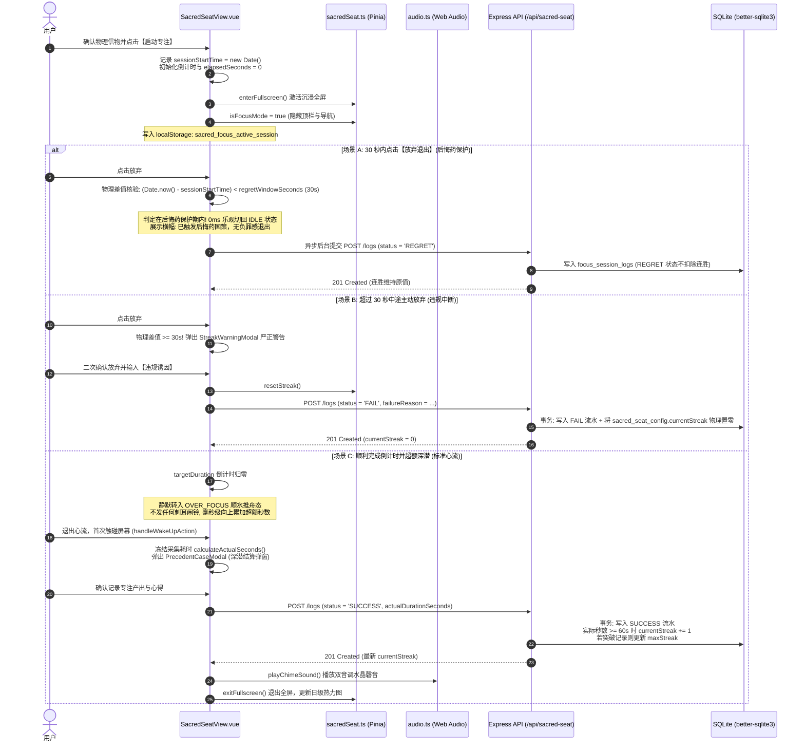
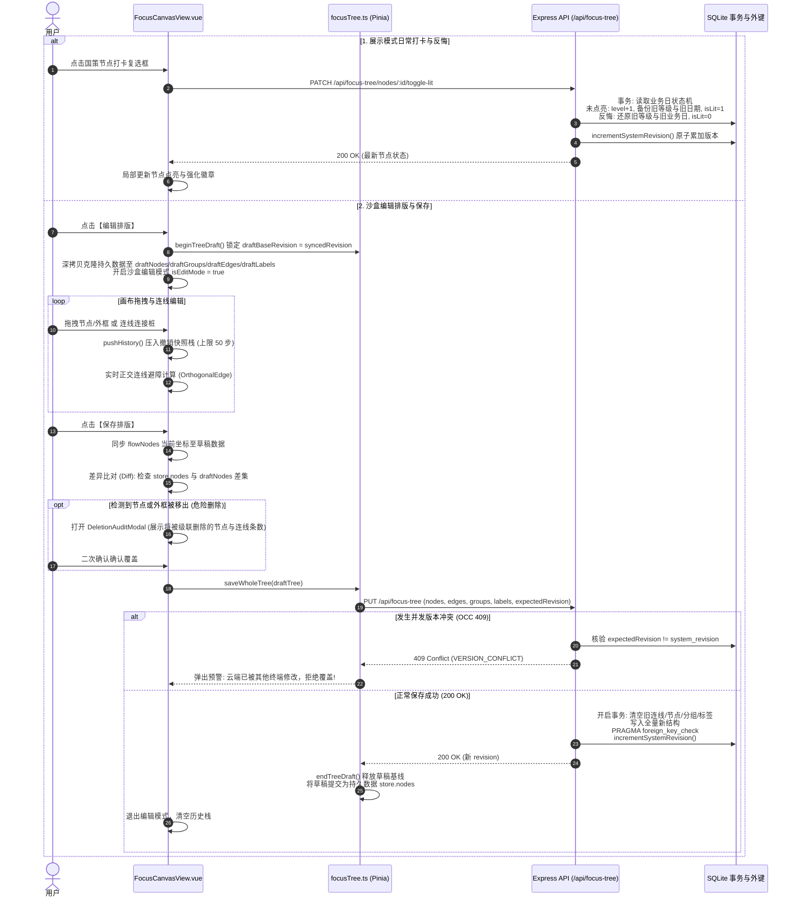
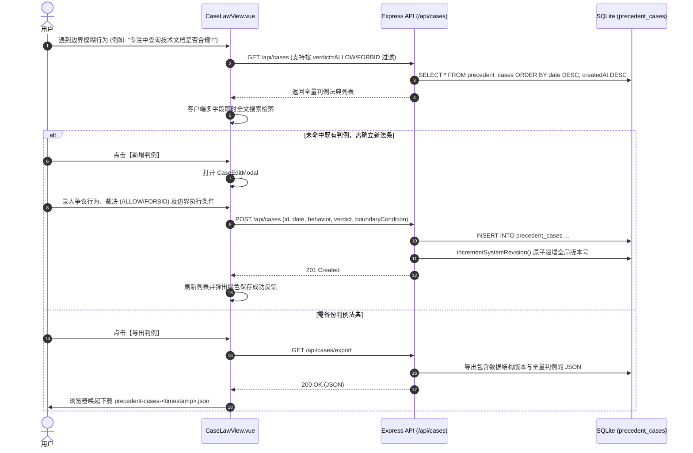
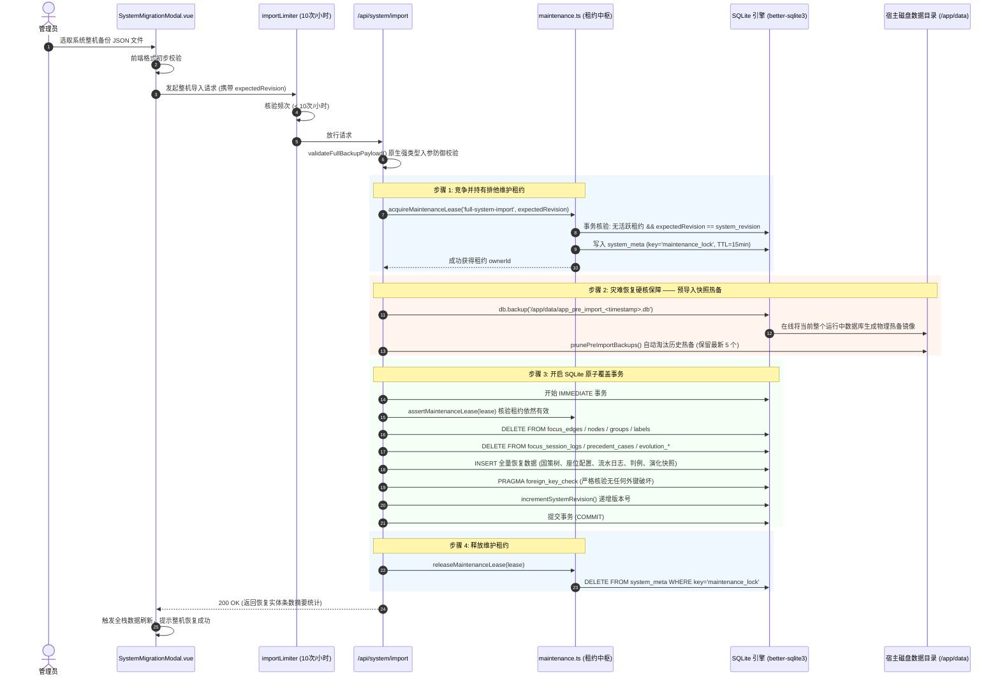

# 03-全链路业务流转与核心时序

本文档包含 **Sacred Focus（神圣自控中枢）** 4 大核心业务链路的交互机制、状态迁移动作与高精 Mermaid 泳道时序图，忠实还原当前前后端真实代码逻辑。

---

## 1. 神圣座位专注流 (Sacred Seat Flow)

该流转覆盖：信物启动 -> 激活沉浸式全屏 -> 30 秒物理时钟后悔药免责保护 -> 静默顺水推舟超额专注 -> 唤醒冻结时长与深潜结算。

### 1.1 业务流转时序图
对应前端源码：[`frontend/src/views/SacredSeatView.vue`](file:///d:/Codes/Projects/sacred-focus/frontend/src/views/SacredSeatView.vue)、后端路由：[`backend/src/routes/sacredSeat.ts`](file:///d:/Codes/Projects/sacred-focus/backend/src/routes/sacredSeat.ts)。

### 1.2 核心工程防御点
1. **真实物理时钟差值防漂移 (P1-LOG-01)**：
   - 传统定时器在浏览器最小化或移动端息屏时，会被浏览器内核节流降频至数秒甚至数分钟触发一次。
   - 系统所有保护期判定和耗时计算，均调用 `Date.now() - sessionStartTime.getTime()` 读取系统物理毫秒时钟，彻底杜绝切后台导致的后悔药保护期无限拉长。
2. **离线双音调水晶磬音 (P3-AUDIO)**：
   - `playChimeSound()` 使用原生 HTML5 `AudioContext` 现场合成 $D_5$ (587.33Hz)、$A_5$ (880.0Hz)、$D_6$ (1174.66Hz) 双音调和弦与振动反馈（`navigator.vibrate`），离线零依赖、零音频加载延迟。
3. **网络故障重试队列 (P1-005)**：
   - 若提交日志时网络异常，前端捕获异常并在内存挂起 `pendingFailedLog`，界面提供【重试保存】按钮，避免用户辛勤专注的记录因偶发网络颠簸丢失。

---

## 2. 国策树拓扑流与沙盒编辑 (Focus Tree Pipeline)

该流转覆盖：展示模式打卡/反悔 -> 沙盒编辑模式 -> 拖拽布局与撤销重做 -> 保存排版前的差异比对 (Diff) 与乐观锁原子提交。

### 2.1 业务流转时序图
对应前端源码：[`frontend/src/views/FocusCanvasView.vue`](file:///d:/Codes/Projects/sacred-focus/frontend/src/views/FocusCanvasView.vue)、后端路由：[`backend/src/routes/focusTree.ts`](file:///d:/Codes/Projects/sacred-focus/backend/src/routes/focusTree.ts)。

### 2.2 核心工程防御点
1. **Proxy 深拷贝克隆防内存污染**：
   - Vue 3 默认对 Store 的数组对象进行深层 Proxy 封装。若使用原生 `structuredClone` 会由于无法克隆 Proxy 对象而报错。
   - 系统历史栈与草稿初始化严格使用 `JSON.parse(JSON.stringify(...))`，确保撤销栈、草稿沙盒与持久态完全物理隔离。
2. **两步点击连接 (Click-to-Connect)**：
   - 针对移动端触摸屏或密集画布下难以精准拖拽连线的问题，实现了连接桩点击激活态（`activeConnectingHandle`）。用户先轻触起点锚点，再点击目标锚点，即可建立正交连接线，大幅降低误触率。
3. **差异比对物理删除二次审计 (`DeletionAuditModal`)**：
   - 用户在画布上误按 Backspace/Delete 删除了节点或外框，在点击保存排版时，前端会自动比对草稿与持久层的数据差集。
   - 若发现有节点或分组缺失，立即弹窗展示所有受影响的节点名称及将要级联删除的连线条数，获得用户显式确认后方可发往服务端覆写。

---

## 3. 判例法典定性裁决流 (Case Law Adjudication)

该流转覆盖：争议行为出现 -> 检索判例历史库 -> 法律裁决与定性 -> 系统广播版本推进。

### 3.1 业务流转时序图
对应前端源码：[`frontend/src/views/CaseLawView.vue`](file:///d:/Codes/Projects/sacred-focus/frontend/src/views/CaseLawView.vue)、后端路由：[`backend/src/routes/cases.ts`](file:///d:/Codes/Projects/sacred-focus/backend/src/routes/cases.ts)。

---

## 4. 整机冷备导入与灾难恢复全链路时序 (Full System Disaster Recovery)

整机恢复属于**最高风险级别**的系统维护操作，涉及覆写 9 大业务数据表。系统为此设计了“排他维护租约 + 预热备自动容灾 + 事务级外键终验”全链路防护。

### 4.1 业务流转时序图
对应前端源码：[`frontend/src/components/common/SystemMigrationModal.vue`](file:///d:/Codes/Projects/sacred-focus/frontend/src/components/common/SystemMigrationModal.vue)、后端路由：[`backend/src/routes/system.ts`](file:///d:/Codes/Projects/sacred-focus/backend/src/routes/system.ts)。

### 4.2 灾难回退保障细节
* **导入前热备失败阻断 (P1-002)**：如果因为磁盘空间不足等原因导致 `db.backup()` 抛错，系统**立刻终止导入流程并主动释放维护租约**，严禁在没有安全快照的情况下执行破坏性覆写。
* **物理热备回退手册**：若导入了包含逻辑错误的数据包，宿主管理员只需进入 `/app/data/` 目录，将生成的 `app_pre_import_<timestamp>.db` 复制替换回 `app.db` 并重启容器，即可 100% 毫发无损地回退到恢复发起前的绝对状态。

---

## 5. 本文档涉及的真实源码文件映射

* 神圣座位业务视图：[`frontend/src/views/SacredSeatView.vue`](file:///d:/Codes/Projects/sacred-focus/frontend/src/views/SacredSeatView.vue)
* Web Audio 音效合成：[`frontend/src/utils/audio.ts`](file:///d:/Codes/Projects/sacred-focus/frontend/src/utils/audio.ts)
* 国策画布核心视图：[`frontend/src/views/FocusCanvasView.vue`](file:///d:/Codes/Projects/sacred-focus/frontend/src/views/FocusCanvasView.vue)
* 差异比对审计弹窗：[`frontend/src/components/canvas/DeletionAuditModal.vue`](file:///d:/Codes/Projects/sacred-focus/frontend/src/components/canvas/DeletionAuditModal.vue)
* 判例法典核心视图：[`frontend/src/views/CaseLawView.vue`](file:///d:/Codes/Projects/sacred-focus/frontend/src/views/CaseLawView.vue)
* 全系统整机恢复路由：[`backend/src/routes/system.ts`](file:///d:/Codes/Projects/sacred-focus/backend/src/routes/system.ts)
* 排他维护租约控制：[`backend/src/db/maintenance.ts`](file:///d:/Codes/Projects/sacred-focus/backend/src/db/maintenance.ts)
