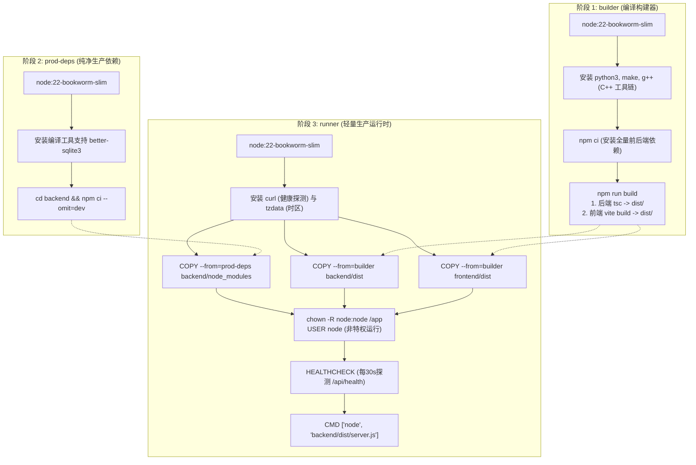

# 05-容器化部署与运维交付规范

本文档系统性规定 **Sacred Focus（神圣自控中枢）** 在生产环境的 Docker 多阶段构建原理解析、Docker Compose 编排规范、Nginx 企业级 TLS 反向代理与运维灾难恢复实操手册。

---

## 1. Dockerfile 多阶段构建深度解析

Sacred Focus 采用了生产级 **三阶段流水线构建（Three-Stage Pipeline）**，源代码见根目录 [`Dockerfile`](file:///d:/Codes/Projects/sacred-focus/Dockerfile)。



### 1.1 阶段 1：构建器 (`builder`)
* **基础镜像选型**：`node:22-bookworm-slim`。
  - **重要技术决策**：**坚决不采用 Alpine**。由于 `better-sqlite3` 包含底层 C++ 原生 SQLite 绑定，Alpine 采用的 `musl libc` 极易出现编译符号缺失、运行时段错误（Segmentation Fault）及内存碎片问题。采用基于 Debian 的 `bookworm-slim` 兼顾了极致精简体积（基础层仅 ~70MB）与 `glibc` 原生 C++ 编译器的绝对稳定性。
* **构建任务**：安装 `python3`, `make`, `g++` 编译原生拓展，执行 `npm ci` 并运行 `npm run build`，同时生成后端编译输出 `backend/dist` 与前端优化静态包 `frontend/dist`。

### 1.2 阶段 2：生产依赖隔离器 (`prod-deps`)
* 再次构建原生拓展，但执行 `npm ci --omit=dev`，**彻底剥离** Vite、TypeScript 编译器、Vue-tsc 及测试工具链，确保最终生产镜像零开发依赖残留。

### 1.3 阶段 3：轻量生产运行时 (`runner`)
* **系统加固**：
  - 仅安装最小化运维工具：`curl`（用于健康检查）与 `tzdata`（保障东八区 UTC+8 业务日时间对齐）；
  - **最小特权原则 (Least Privilege)**：在镜像内部创建 `/app/data` 目录后，执行 `chown -R node:node /app`，并将运行账户切换为非特权用户 `USER node`，彻底杜绝容器逃逸与 root 提权风险。
* **一体化分发**：
  - 后端直接托管前端静态资源：后端通过静态中间件托管 `/app/frontend/dist`，SPA 路由直接命中，单镜像即可跑通全套系统。

---

## 2. Docker Compose 生产编排与持久化

应用服务定义于根目录 [`docker-compose.yml`](file:///d:/Codes/Projects/sacred-focus/docker-compose.yml)：

```yaml
services:
  sacred-focus:
    image: sacred-focus:${APP_VERSION:-latest}
    build:
      context: .
      dockerfile: Dockerfile
    container_name: sacred-focus
    restart: unless-stopped
    ports:
      - "${PORT:-3000}:3000"
    environment:
      - NODE_ENV=production
      - PORT=3000
      - HOST=0.0.0.0
      - DATA_DIR=/app/data
      - TZ=${TZ:-Asia/Shanghai}
      - JWT_SECRET=${JWT_SECRET}
      - ADMIN_PASSWORD=${ADMIN_PASSWORD}
      - TRUSTED_IPS=${TRUSTED_IPS:-}
      - ALLOWED_ORIGINS=${ALLOWED_ORIGINS:-http://localhost:3000,http://127.0.0.1:3000}
    volumes:
      # SQLite WAL 数据库与备份文件持久化挂载
      - ${HOST_DATA_DIR:-./data}:/app/data
    logging:
      # 限制容器日志体积，避免虚拟机磁盘被长期日志撑满
      driver: "json-file"
      options:
        max-size: "20m"
        max-file: "3"
    healthcheck:
      test: ["CMD", "curl", "-f", "http://127.0.0.1:3000/api/health"]
      interval: 30s
      timeout: 5s
      retries: 3
      start_period: 10s
```

### 2.1 关键环境变量矩阵
生产环境必须基于 `.env.production.example` 建立受保护的 `.env` 文件：

| 环境变量 | 必需 | 生产安全约束与设计目的 |
| :--- | :---: | :--- |
| `NODE_ENV` | 是 | 必须设为 `production`。系统会自动激活严格 CSP 安全头、报错堆栈隐藏与密钥熔断检查。 |
| `PORT` | 否 | 容器内监听端口，固定为 `3000`。 |
| `DATA_DIR` | 否 | 持久化数据目录，固定为 `/app/data`。 |
| `TZ` | 否 | 时区，默认 `Asia/Shanghai`。 |
| **`JWT_SECRET`** | **是** | **生产硬性红线**：长度必须 $\ge 32$ 字符，且严禁包含 `changeme`, `placeholder`, `example` 等弱口令特征，否则系统拒绝启动。 |
| **`ADMIN_PASSWORD`** | **是** | **生产硬性红线**：管理员初始密码长度必须 $\ge 8$ 字符，严禁为 `admin123456`, `123456` 等弱口令，否则系统拒绝启动。 |
| `ADMIN_PASSWORD_HASH`| 否 | 已生成的 bcrypt 密码哈希。若配置则优先于 `ADMIN_PASSWORD`。 |
| `TRUSTED_IPS` | 否 | 豁免限流的特定受信局域网/公网 IP（以逗号分隔）。杜绝盲目信任所有私网网段。 |
| `ALLOWED_ORIGINS` | 否 | CORS 跨域白名单（逗号分隔），默认仅放行本地及容器端口。 |

### 2.2 挂载卷持久化与日志滚动加固
* **数据目录持久化**：挂载 `${HOST_DATA_DIR:-./data}:/app/data`。该目录承载：
  - `app.db`（SQLite 主数据库）；
  - `app.db-wal` 与 `app.db-shm`（预写日志与共享内存）；
  - `app_pre_import_*.db`（整机导入前自动生成的物理热备快照）。
* **日志防撑满加固**：Docker 默认无日志上限。配置 `max-size: "20m"` 和 `max-file: "3"`，将单个容器日志严格限制在 60MB 以内，彻底消除云服务器磁盘被日志耗尽的隐患。

---

## 3. Nginx 企业级 TLS 网关与反向代理

为了对外提供标准 HTTPS 安全连接并满足浏览器对 `Secure` Cookie 的最高严谨要求，系统提供了 [`docker-compose.nginx.yml`](file:///d:/Codes/Projects/sacred-focus/docker-compose.nginx.yml) 与 [`nginx/conf.d/default.conf`](file:///d:/Codes/Projects/sacred-focus/nginx/conf.d/default.conf)。

### 3.1 组合编排架构
```bash
# 联合编排启动
docker compose -f docker-compose.yml -f docker-compose.nginx.yml up -d
```
* **端口隐藏 (`ports: !override []`)**：在 Nginx 组合编排下，`sacred-focus` 容器撤销直接对外暴露的 3000 端口，转由 Docker 内部桥接网络 `sacred-network` 流通。
* **依赖健康状态 (`condition: service_healthy`)**：Nginx 网关等待应用容器健康检查完全通过后方才接收公网流量。

### 3.2 Nginx 安全加固核心配置解析
```nginx
# 1. HTTP 流量监听 (强制跳转 HTTPS，放行容器内部健康探测)
server {
    listen 80;
    server_name _;

    location /api/health {
        proxy_pass http://sacred-focus:3000/api/health;
        proxy_set_header Host $host;
        proxy_set_header X-Real-IP $remote_addr;
        proxy_set_header X-Forwarded-For $proxy_add_x_forwarded_for;
    }

    location / {
        return 301 https://$host$request_uri;
    }
}

# 2. HTTPS 安全传输监听
server {
    listen 443 ssl;
    server_name _;

    ssl_certificate /etc/nginx/ssl/server.crt;
    ssl_certificate_key /etc/nginx/ssl/server.key;
    ssl_protocols TLSv1.2 TLSv1.3;
    ssl_ciphers HIGH:!aNULL:!MD5;
    ssl_prefer_server_ciphers on;
    ssl_session_cache shared:SSL:10m;
    ssl_session_timeout 1d;

    # Gzip 高性能压缩
    gzip on;
    gzip_vary on;
    gzip_proxied any;
    gzip_comp_level 6;
    gzip_types text/plain text/css application/json application/javascript image/svg+xml;

    # 放行整机备份恢复上传包 (上限 20MB)
    client_max_body_size 20M;

    location / {
        proxy_pass http://sacred-focus:3000;
        proxy_http_version 1.1;

        # WebSocket 支持
        proxy_set_header Upgrade $http_upgrade;
        proxy_set_header Connection "upgrade";

        # 真实客户端 IP 与协议传递 (保障 Secure Cookie 正确下发)
        proxy_set_header Host $host;
        proxy_set_header X-Real-IP $remote_addr;
        proxy_set_header X-Forwarded-For $proxy_add_x_forwarded_for;
        proxy_set_header X-Forwarded-Proto https;

        proxy_connect_timeout 60s;
        proxy_send_timeout 60s;
        proxy_read_timeout 60s;
    }
}
```

---

## 4. 生产巡检与灾难恢复手册

### 4.1 容器健康状态巡检
```bash
# 1. 查看容器运行健康状态 (STATUS 须呈现 healthy)
docker ps --filter "name=sacred-focus"

# 2. 宿主机直连测试内部健康检查端点
curl -s http://127.0.0.1:3000/api/health | jq .

# 预期响应：
# {
#   "status": "ok",
#   "version": "1.0.0",
#   "timestamp": "2026-09-14T12:00:00.000Z",
#   "service": "sacred-focus-backend"
# }
```

### 4.2 生产启动弱口令拦截应急排查
若容器启动后立刻异常退出（Exit 1），可通过日志排查是否触发了启动熔断机制：
```bash
docker logs sacred-focus
```
* **报错 A**：`[FATAL] JWT_SECRET 未配置、包含已知预设/占位符弱口令或长度不足 32 位，生产模式拒绝启动`
  - **解法**：在 `.env` 中使用 OpenSSL 生成高熵随机字符串：`openssl rand -base64 32` 并填入 `JWT_SECRET`。
* **报错 B**：`[FATAL] 生产环境下 ADMIN_PASSWORD 未配置、包含已知默认弱口令或示例占位符，生产模式拒绝启动`
  - **解法**：在 `.env` 中设置大于等于 8 位且非通用弱口令的 `ADMIN_PASSWORD`。

### 4.3 灾难恢复：预导入热备回滚实操
当整机恢复导入了错误的数据包时，系统已自动在宿主机挂载目录留下热备镜像：
```bash
# 1. 进入宿主机持久化目录
cd ./data

# 2. 列出系统在覆写前自动生成的预热备快照文件
ls -lh app_pre_import_*.db
# 输出示例: app_pre_import_2026-09-14T10-30-00-000Z.db

# 3. 停止应用服务
docker compose stop sacred-focus

# 4. 覆盖还原主数据库文件
cp app_pre_import_2026-09-14T10-30-00-000Z.db app.db
# 清理可能残留的 WAL 差异文件
rm -f app.db-wal app.db-shm

# 5. 重启应用容器
docker compose start sacred-focus
```
系统将 100% 毫发无损地回退至执行破坏性导入前的绝对时间点。

---

## 5. 本文档涉及的真实源码文件映射

* 多阶段构建 Dockerfile：[`Dockerfile`](file:///d:/Codes/Projects/sacred-focus/Dockerfile)
* Docker Compose 主编排：[`docker-compose.yml`](file:///d:/Codes/Projects/sacred-focus/docker-compose.yml)
* Nginx 网关组合编排：[`docker-compose.nginx.yml`](file:///d:/Codes/Projects/sacred-focus/docker-compose.nginx.yml)
* Nginx 配置文件：[`nginx/conf.d/default.conf`](file:///d:/Codes/Projects/sacred-focus/nginx/conf.d/default.conf)
* 生产环境安全拦截校验：[`backend/src/config.ts`](file:///d:/Codes/Projects/sacred-focus/backend/src/config.ts)
* 生产环境变量模板：[`.env.production.example`](file:///d:/Codes/Projects/sacred-focus/.env.production.example)
