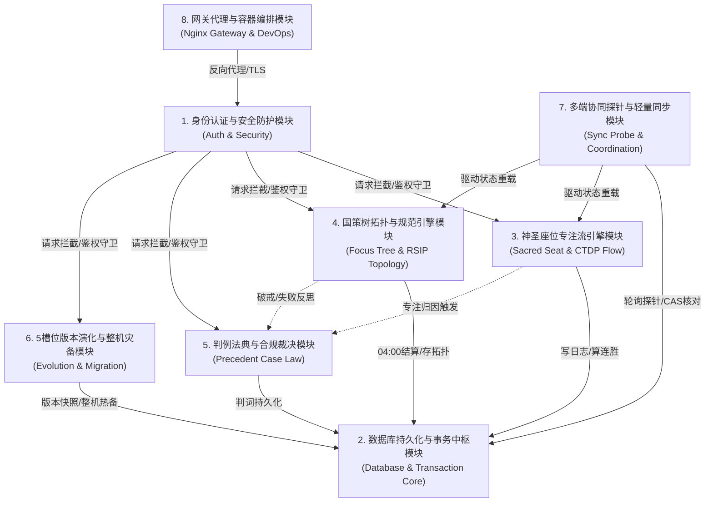
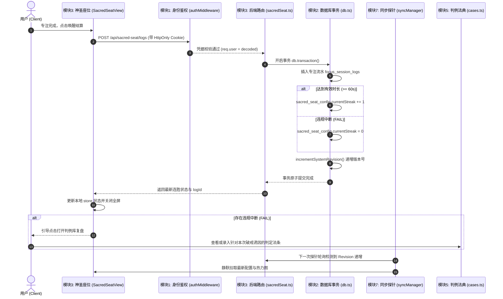
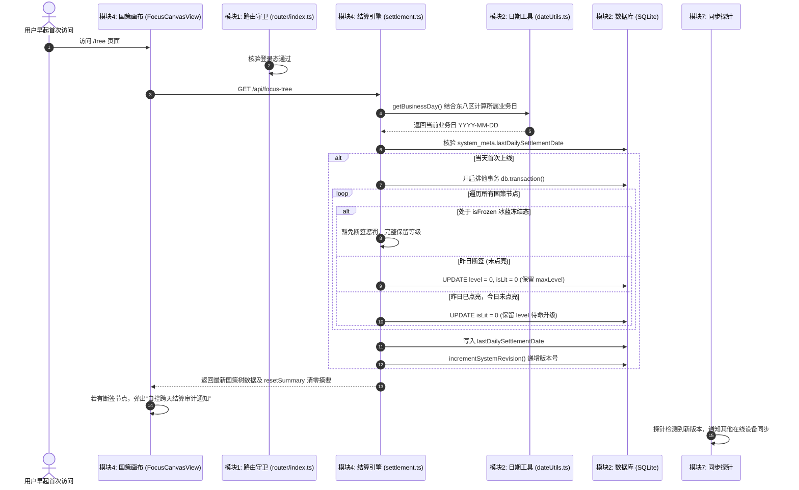
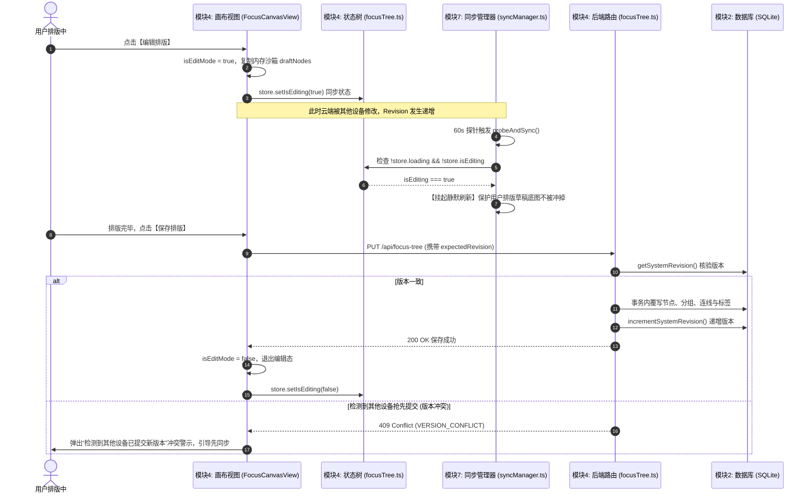
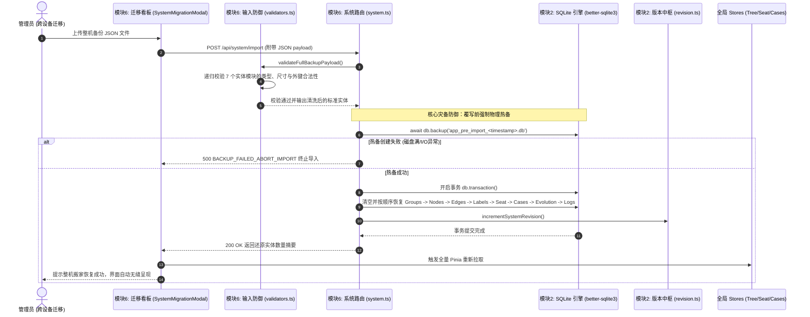

# 🧩 Sacred Focus 全系统核心业务模块划分与跨模块联动全景文档

> **基准版本：** v2.0  
> **文档定位：** 梳理 Sacred Focus（神圣座位与国策树）全栈源码的模块边界、职责定义、核心源文件清单与全链路联动协作机制。

---

## 一、 系统模块划分全景图

系统采用**单体轻量全栈架构**与**本地优先（Local-First）**设计理念，整体解耦划分为 **7 个核心业务与工程模块**：

---

## 二、 核心模块拆解与源文件清单

### 1. 🔐 身份认证与安全防护模块 (Authentication & Security)

#### 1.1 模块职责与能力
- **身份认证**：基于强加盐哈希（`bcryptjs`）核验管理员密码，签发 30 天有效期、携带独立 `jti` 的 JWT 凭据；
- **凭据管理**：纯 `HttpOnly` Cookie（动态根据协议设置 `Secure` 与 `SameSite`）与 `Authorization: Bearer` 双轨兼容；
- **防爆破与分级频控**：登录接口严格频控（15 分钟 10 次），敏感接口（导出/导入）分级限流；
- **安全过滤与蜜罐诱捕**：拦截敏感路径（`/.env`, `/.git`, `/phpmyadmin` 等）并持久化封禁恶意 IP 72 小时；
- **前端路由安全**：Vue Router 全局前置守卫，根据会话状态控制受保护视图重定向。

#### 1.2 核心源文件路径
- **后端中间件**：
  - [`backend/src/middleware/auth.ts`](file:///d:/Codes/Projects/sacred-focus/backend/src/middleware/auth.ts)（JWT 校验、jti 黑名单检查与自动过期淘汰）
  - [`backend/src/middleware/ipRules.ts`](file:///d:/Codes/Projects/sacred-focus/backend/src/middleware/ipRules.ts)（客户端真实 IP 提取与受信任 IP 判定）
  - [`backend/src/middleware/rateLimiter.ts`](file:///d:/Codes/Projects/sacred-focus/backend/src/middleware/rateLimiter.ts)（多级接口频控策略）
  - [`backend/src/middleware/security.ts`](file:///d:/Codes/Projects/sacred-focus/backend/src/middleware/security.ts)（蜜罐诱捕、恶意 UA 过滤与 IP 封禁缓存）
- **后端路由**：
  - [`backend/src/routes/auth.ts`](file:///d:/Codes/Projects/sacred-focus/backend/src/routes/auth.ts)（登录、登出、会话状态查询）
- **前端状态与视图**：
  - [`frontend/src/stores/auth.ts`](file:///d:/Codes/Projects/sacred-focus/frontend/src/stores/auth.ts)（登录状态维护与异步状态核验）
  - [`frontend/src/router/index.ts`](file:///d:/Codes/Projects/sacred-focus/frontend/src/router/index.ts)（全局路由守卫）
  - [`frontend/src/views/LoginView.vue`](file:///d:/Codes/Projects/sacred-focus/frontend/src/views/LoginView.vue)（暗黑极简管理员认证界面）

---

### 2. 🗄️ 数据库持久化与事务中枢模块 (Database Persistence & Transaction Core)

#### 2.1 模块职责与能力
- **单引擎持久化**：采用 Node.js 嵌入式 `better-sqlite3`，单文件存储（`./data/app.db`），零外部数据库中间件依赖；
- **高性能 WAL 模式**：开启 Write-Ahead Logging 模式，实现读写无锁并发，配合定时空闲 `wal_checkpoint(PASSIVE)` 防范日志膨胀；
- **高内聚职责拆分**：彻底摒弃千行 God Object，将连接、Schema、迁移、种子、日期运算、版本号独立为纯函数子模块；
- **原子事务保障**：所有状态变更（跨天断签结算、节点连线全量覆盖、整机导入）全部运行于 `db.transaction()` 内，保证 ACID 完整性。

#### 2.2 核心源文件路径
- [`backend/src/db.ts`](file:///d:/Codes/Projects/sacred-focus/backend/src/db.ts)（模块聚合统一导出接口）
- [`backend/src/db/connection.ts`](file:///d:/Codes/Projects/sacred-focus/backend/src/db/connection.ts)（SQLite 实例连接、目录创建与 PRAGMA 配置）
- [`backend/src/db/schema.ts`](file:///d:/Codes/Projects/sacred-focus/backend/src/db/schema.ts)（9 大核心数据表 DDL 与高频查询复合索引）
- [`backend/src/db/migrations.ts`](file:///d:/Codes/Projects/sacred-focus/backend/src/db/migrations.ts)（表结构平滑升级与兼容字段补齐）
- [`backend/src/db/seed.ts`](file:///d:/Codes/Projects/sacred-focus/backend/src/db/seed.ts)（初始国策节点、外框与默认配置种子数据）
- [`backend/src/db/dateUtils.ts`](file:///d:/Codes/Projects/sacred-focus/backend/src/db/dateUtils.ts)（东八区 UTC+8 凌晨 04:00 业务日计算算法）
- [`backend/src/db/revision.ts`](file:///d:/Codes/Projects/sacred-focus/backend/src/db/revision.ts)（系统 CAS 原子递增版本号管理）

---

### 3. 🪑 神圣座位专注流管理模块 (Sacred Seat & Flow Execution)

#### 3.1 模块职责与能力
- **自控仪式与准入**：输入神圣信物（Sacred Token）与启动信号（Reservation Signal），构建进入心流的心理防线；
- **30 秒无痛后悔药（CTDP 协议）**：启动 30 秒内允许无感撤退（`REGRET` 退出），保护主链连胜完整性，杜绝沉没成本绑架；
- **超时顺水推舟与零打扰结算**：倒计时归零绝不触发刺耳警报，保持专注沉浸，直到用户首次主动操作才进行延时结算；
- **物理时钟保真**：基于真实时间戳毫秒差值计算耗时，彻底杜绝息屏与切后台定时器节流导致的时间失真；
- **效能热力矩阵与连胜惩罚**：中途违规中断强制清零主链节点，后端 SQLite 原生聚合 52 周专注密度热力图。

#### 3.2 核心源文件路径
- **后端服务**：
  - [`backend/src/routes/sacredSeat.ts`](file:///d:/Codes/Projects/sacred-focus/backend/src/routes/sacredSeat.ts)（配置修改、连线结算、热力图聚合查询、日志批量导入导出）
- **前端状态与视图**：
  - [`frontend/src/stores/sacredSeat.ts`](file:///d:/Codes/Projects/sacred-focus/frontend/src/stores/sacredSeat.ts)（座位配置、全屏沉浸管理与日志拉取）
  - [`frontend/src/views/SacredSeatView.vue`](file:///d:/Codes/Projects/sacred-focus/frontend/src/views/SacredSeatView.vue)（五态心流专注控制台与热力图视图）
  - [`frontend/src/components/seat/SeatHeatmap.vue`](file:///d:/Codes/Projects/sacred-focus/frontend/src/components/seat/SeatHeatmap.vue)（GitHub 风格 52 周热力矩阵组件）
  - [`frontend/src/components/seat/StreakWarningModal.vue`](file:///d:/Codes/Projects/sacred-focus/frontend/src/components/seat/StreakWarningModal.vue)（超过后悔药窗口放弃时的破坏性清零二次确认弹窗）
  - [`frontend/src/components/seat/FocusHistoryModal.vue`](file:///d:/Codes/Projects/sacred-focus/frontend/src/components/seat/FocusHistoryModal.vue)（专注流水明细日志看板）

---

### 4. 🗺️ 国策树拓扑与规范引擎模块 (Focus Tree & Canvas Topology)

#### 4.1 模块职责与能力
- **双模交互隔离**：展示模式（单击打卡点亮、双击沉浸弹窗）与编辑模式（内存沙箱排版、正交连线连接桩）彻底解耦；
- **有向无环图拓扑（DAG）**：基于 `@vue-flow/core` 构建节点、分组外框、说明标签与正交避障折线；
- **凌晨 04:00 业务日跨天状态机**：
  - 每日首次上线自动结算：昨日未点亮且非“冰蓝冻结”态的节点等级归零重置；
  - 点亮与反悔：连续打卡升星升级，反悔时精确恢复 `previousLevel` 与 `previousLastLitDate`，彻底封堵刷级作弊；
- **集中删除审计**：删除分组或节点前执行 Diff 审计，提示级联受影响的拓扑关系；
- **基准排版与列表排序**：支持列表视图多维度排序与无时间节点智能沉底。

#### 4.2 核心源文件路径
- **后端引擎与查询**：
  - [`backend/src/routes/focusTree.ts`](file:///d:/Codes/Projects/sacred-focus/backend/src/routes/focusTree.ts)（国策树增删改查、单点点亮状态机、排序更新）
  - [`backend/src/db/queries/focusTree.ts`](file:///d:/Codes/Projects/sacred-focus/backend/src/db/queries/focusTree.ts)（预编译 `upsertFocusNode` 与全量拓扑查询）
  - [`backend/src/db/queries/settlement.ts`](file:///d:/Codes/Projects/sacred-focus/backend/src/db/queries/settlement.ts)（每日首次上线断签清零与冰蓝冻结核查引擎）
- **前端视图与组件**：
  - [`frontend/src/stores/focusTree.ts`](file:///d:/Codes/Projects/sacred-focus/frontend/src/stores/focusTree.ts)（节点/连线/分组响应式状态树与撤销/重做栈）
  - [`frontend/src/views/FocusCanvasView.vue`](file:///d:/Codes/Projects/sacred-focus/frontend/src/views/FocusCanvasView.vue)（交互式国策树拓扑画布）
  - [`frontend/src/views/FocusListView.vue`](file:///d:/Codes/Projects/sacred-focus/frontend/src/views/FocusListView.vue)（全天候时空国策列表管理与基准排序器）
  - [`frontend/src/components/canvas/FocusNodeCard.vue`](file:///d:/Codes/Projects/sacred-focus/frontend/src/components/canvas/FocusNodeCard.vue)（自适应等级国策节点卡片）
  - [`frontend/src/components/canvas/FocusGroupFrame.vue`](file:///d:/Codes/Projects/sacred-focus/frontend/src/components/canvas/FocusGroupFrame.vue)（8 向尺寸拖拽缩放分组外框）
  - [`frontend/src/components/canvas/OrthogonalEdge.vue`](file:///d:/Codes/Projects/sacred-focus/frontend/src/components/canvas/OrthogonalEdge.vue)（曼哈顿自动正交折线避障连线）
  - [`frontend/src/components/canvas/NodeSpecModal.vue`](file:///d:/Codes/Projects/sacred-focus/frontend/src/components/canvas/NodeSpecModal.vue)（四维规范卡沉浸查看器）

---

### 5. ⚖️ 判例法典与合规裁决模块 (Precedent Case Law)

#### 5.1 模块职责与能力
- **自控法制化（下必为例）**：针对日常行为中的灰色地带（如“熬夜看技术文档算不算破戒”）进行司法判例化裁决（`ALLOW` 允许 / `FORBID` 禁止）；
- **判词与边界条件**：记录严格的前提约束与判词解析，堵死“下不为例”的自我欺骗心理借口；
- **即时存证与复盘**：神圣座位专注破戒记录或反悔退出时，可关联法典判例快速复盘。

#### 5.2 核心源文件路径
- **后端服务**：
  - [`backend/src/routes/cases.ts`](file:///d:/Codes/Projects/sacred-focus/backend/src/routes/cases.ts)（判例的 CRUD、批量导出与恢复）
- **前端视图**：
  - [`frontend/src/views/CaseLawView.vue`](file:///d:/Codes/Projects/sacred-focus/frontend/src/views/CaseLawView.vue)（下必为例判例法典库与裁决录入控制台）

---

### 6. 🔄 5 槽位版本演化与整机灾备模块 (Evolution & System Migration)

#### 6.1 模块职责与能力
- **5 槽位环形快照（RSIP 宏观协议）**：
  - 维护 Slot 0 ~ 4 的 5 个环形快照槽位，自动语义化递增版本号（`v1.0` -> `v1.1` 或 `v2.0` 重大里程碑）；
  - 支持锁定任意快照历史一键原子回滚，重构国策树拓扑；
- **全系统整机镜像冷备（Export）**：
  - 导出包含国策树、神圣座位配置、流水日志、判例法典、演化快照的全量 JSON 加密归档；
- **原子热备灾备恢复（Import）**：
  - 导入前强制生成 SQLite 原生热备 `app_pre_import_*.db`；
  - 若备份失败立即阻断覆写，杜绝数据损坏；通过近 400 行原生强类型 Schema 门禁清洗数据。

#### 6.2 核心源文件路径
- **后端服务与校验**：
  - [`backend/src/routes/evolution.ts`](file:///d:/Codes/Projects/sacred-focus/backend/src/routes/evolution.ts)（5 槽位快照管理与槽位指针回滚）
  - [`backend/src/routes/system.ts`](file:///d:/Codes/Projects/sacred-focus/backend/src/routes/system.ts)（整机全量导出与带预热备的事务恢复）
  - [`backend/src/utils/validators.ts`](file:///d:/Codes/Projects/sacred-focus/backend/src/utils/validators.ts)（系统级 Schema 递归强类型校验门禁）
- **前端组件**：
  - [`frontend/src/components/canvas/EvolutionModal.vue`](file:///d:/Codes/Projects/sacred-focus/frontend/src/components/canvas/EvolutionModal.vue)（演化快照生成与槽位原子回滚模态框）
  - [`frontend/src/components/common/SystemMigrationModal.vue`](file:///d:/Codes/Projects/sacred-focus/frontend/src/components/common/SystemMigrationModal.vue)（整机数据冷备导出与安全恢复看板）

---

### 7. 📡 多端协同探针与轻量同步模块 (Sync Probe & Coordination)

#### 7.1 模块职责与能力
- **极轻量心跳探针**：客户端每 60 秒轮询 `/api/sync/status`，响应体积 `< 100 字节`，极低网络与 CPU 开销；
- **CAS 乐观并发版本号**：基于全局原子递增的 `system_revision` 判断多端数据一致性；
- **页面生命周期监听**：监听 `visibilitychange` 与窗口 `focus` 事件，移动端息屏唤醒或切回前台时主动探针校准；
- **草稿编辑态互斥保护**：当用户在国策树画布中处于编辑排版态（`isEditing: true`）时，探针自动延迟静默刷新，防止冲掉未保存的画布排版。

#### 7.2 核心源文件路径
- **后端服务**：
  - [`backend/src/routes/sync.ts`](file:///d:/Codes/Projects/sacred-focus/backend/src/routes/sync.ts)（轻量同步探针端点）
- **前端调度**：
  - [`frontend/src/utils/syncManager.ts`](file:///d:/Codes/Projects/sacred-focus/frontend/src/utils/syncManager.ts)（探针轮询调度器、前台唤醒监听与版本号比对）
  - [`frontend/src/utils/api.ts`](file:///d:/Codes/Projects/sacred-focus/frontend/src/utils/api.ts)（封装带凭据与 401 自动拦截跳转的通用请求通道）

---

### 8. 🌐 网关代理与容器编排模块 (Gateway, Docker & DevOps)

#### 8.1 模块职责与能力
- **容器多阶段分层构建**：`builder` -> `prod-deps` -> `runner` 3 阶段解耦，基于 Alpine/Slim 镜像；
- **非 root 降权运行**：容器使用 `USER node` 运行，规避特权逃逸风险；
- **Nginx 反向代理与 TLS**：强制 HTTP 301 重定向至 HTTPS（健康检查探针 `/api/health` 豁免），支持 TLS 1.3 与 Gzip 压缩；
- **日志轮转与健康探测**：Docker 容器配置 `max-size: 20m` 日志轮转，配置自动化 `healthcheck` 探针。

#### 8.2 核心源文件路径
- [`Dockerfile`](file:///d:/Codes/Projects/sacred-focus/Dockerfile)（生产容器多阶段构建定义）
- [`docker-compose.yml`](file:///d:/Codes/Projects/sacred-focus/docker-compose.yml)（应用服务容器编排与持久化挂载）
- [`docker-compose.nginx.yml`](file:///d:/Codes/Projects/sacred-focus/docker-compose.nginx.yml)（网关组合编排定义）
- [`nginx/conf.d/default.conf`](file:///d:/Codes/Projects/sacred-focus/nginx/conf.d/default.conf)（Nginx 安全代理、SSL 与静态资源缓存规则）
- [`nginx/ssl/`](file:///d:/Codes/Projects/sacred-focus/nginx/ssl/)（SSL 证书目录与多平台自签证书生成脚本）

---

## 三、 模块间联动协同机制

系统各模块并非孤立运行，而是通过**严格的数据流、状态机流转、CAS 版本锁与事件驱动**形成高度契合的整体闭环。以下是 4 大核心跨模块联动场景：

### 联动场景 1：专注结算与主链连胜联动链路 (神圣座位 -> 数据库事务 -> 同步探针 -> 判例法典)

---

### 联动场景 2：凌晨 04:00 跨天自控业务日结算联动链路 (国策树 -> 数据库引擎 -> 全局探针)

---

### 联动场景 3：国策画布排版草稿隔离与并发冲突防御 (画布沙盒 -> 同步探针 -> CAS 锁)

---

### 联动场景 4：整机镜像热备恢复与灾备兜底联动 (系统灾备 -> 验证器 -> 数据库备份 -> 状态树)

---

## 四、 核心数据模型在各模块间的映射矩阵

| 数据实体 | 归属主模块 | 关联从属模块 | 关联键 / 业务语义 |
|---|---|---|---|
| `focus_groups` | 4. 国策拓扑模块 | 6. 版本演化 / 7. 系统迁移 | 拓扑分组外框坐标、尺寸与色彩 |
| `focus_nodes` | 4. 国策拓扑模块 | 2. 跨天结算 / 5. 判例法典 | `groupId` 关联外框，`lastLitDate` 记录打卡业务日 |
| `focus_edges` | 4. 国策拓扑模块 | 4. 曼哈顿正交避障 | `sourceId` / `targetId` 有向无环连接关系 |
| `focus_session_logs` | 3. 神圣座位模块 | 2. 索引聚合 / 5. 判例法典 | 专注流水、30s 后悔药记录、破戒中断归因 |
| `sacred_seat_config` | 3. 神圣座位模块 | 1. 安全配置 / 7. 轻量探针 | 神圣信物、预约暗号、当前连胜、最大连胜 |
| `precedent_cases` | 5. 判例法典模块 | 3. 破戒复盘 / 6. 镜像备份 | 行为、允许/禁止裁决、生效前置边界条件 |
| `evolution_snapshots` | 6. 版本演化模块 | 4. 画布拓扑 / 2. 版本中枢 | 5 槽位环形快照，完整封存国策拓扑历史快照 |
| `system_meta` | 2. 数据库中枢 | 1. 鉴权 / 4. 结算 / 7. 探针 | `system_revision` CAS 乐观锁版本号、`revoked_jti` 黑名单 |

---

## 五、 总结

通过上述解耦划分与协同机制，Sacred Focus 构建了一套具备**高度自治性与严密一致性**的系统架构：
1. **边界清晰**：每一个模块（如鉴权、座位、国策树、判例、演化）职责严格单一，源文件边界明确；
2. **状态机自愈**：通过凌晨 04:00 业务日算法、CAS 乐观锁版本机制与探针调度，解决了多端并发编辑与跨日断签的复杂竞态；
3. **安全闭环**：结合 HttpOnly Cookie、动态协议探测、预热备灾备与参数化查询，在轻量单机环境下达到了企业级防御水准。
