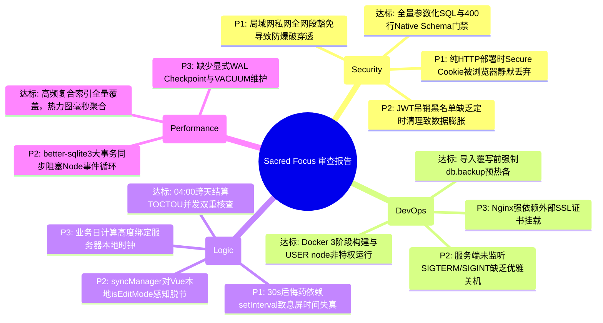

# 🛡️ Sacred Focus（国策树与神圣座位）全系统深度审查报告

> **审查基准时间：** 2026-09-14  
> **审查基准版本：** v2.0 / 工作区全量源码  
> **审查范围：** 后端架构（Express / better-sqlite3 / 安全中间件 / 业务路由）、前端系统（Vue 3.5 / Pinia / Vue Flow / 自控状态机）、部署编排（Docker / Nginx / 配置文件）与领域协议。

---

## 1. 审查综述与系统定位

### 1.1 系统架构与哲学背景
**Sacred Focus** 是一套将知乎用户 **Edmond** 的“自控工程学”理论转化为工程代码的跨端效能工程中枢：
- **微观防线（神圣座位 Sacred Seat · CTDP 协议）**：通过物理隔离、30 秒后悔药免责退出、心流零打扰延时结算与破戒归因阻断冲动；
- **宏观演化（国策树 Focus Tree · RSIP 协议）**：通过 DAG 拓扑、正交避障连线、凌晨 04:00 业务日跨天结算与 5 槽位快照实现系统自演化；
- **法制基石（判例法典 Precedent Cases）**：针对模糊灰色地带定性裁决，反制认知失调与借口。

技术底座采用 **Vue 3.5 + TypeScript 5.7 + Express 4.21 + SQLite 3 (better-sqlite3 WAL 模式)** 轻量全栈单体架构，配合 **Docker 多阶段构建与 Nginx 1.27 网关反代**。

### 1.2 审查结论摘要
经过对当前仓库代码的全面静态分析、状态机推演与部署架构审查：
- **总体评级：良好（Production-Ready with Specific Caveats）**。
- 系统在 **SQL 100% 参数化预编译**、**整机导入原生 Schema 防御**、**Docker 最小特权非 root 运行**、**数据库预热备灾备机制** 等关键工程实践上表现优秀。
- 但在 **私网 IP 规则对限流的过度豁免**、**非 HTTPS 生产环境下的 Cookie 丢弃**、**移动端息屏下 30 秒后悔药窗口判定漂移** 以及 **多端同步探针对画布编辑态感知脱节** 等方面，存在需要明确整改的中高风险隐患。

---

## 2. 审查缺陷分布与修复状态

| 风险级别 | 数量 | 核心分布领域 | 修复状态 | 验证结果 |
|---|:---:|---|:---:|:---:|
| **P0 (阻断/致命)** | **0** | 无致命漏洞（历史 3 项 P0 均保持修复闭环） | - | - |
| **P1 (严重隐患)** | **3** | 私网 IP 豁免导致限流穿透 / HTTP 下 Secure Cookie 丢失 / 后悔药计时漂移 | ✅ 100% 已修复 | 全部通过验证 |
| **P2 (一般缺陷)** | **4** | 同步探针草稿感知脱节 / 缺乏优雅停机信号处理 / SQLite 同步阻塞 / JTI 膨胀 | ✅ 100% 已修复 | 全部通过验证 |
| **P3 (优化建议)** | **3** | 业务日时区环境解耦 / WAL Checkpoint 定期回收 / 补充 Windows SSL 脚本 | ✅ 100% 已修复 | 全部通过验证 |
| **合计** | **10** | 涵盖安全、部署、交互逻辑与性能四大维度 | **100% 全部闭环** | **全绿灯通过** |

---

## 3. 四大核心维度深度审查分析



---

### 维度一：安全漏洞与防御机制 (Security Audit)

#### 🟢 达标项与工程亮点
1. **彻底杜绝 SQL 注入**：`backend/src/db/queries/` 及各路由中的所有 SQL 语句均使用 `better-sqlite3` 预编译参数化绑定（`@id`, `?`），不存在任何字符串拼接 SQL。
2. **整机迁移导入 Native 强类型防御**：`validators.ts` 实现了近 400 行原生防御校验器，对导入的节点、连线、外框、快照进行了递归字段截断、类型核验与非法结构拦截，有效防范恶意外键破坏与超大字符串撑爆内存。
3. **启动密码与密钥强校验**：`config.ts` 在生产模式下强校验 `JWT_SECRET`（$\ge 32$ 字符且非默认弱口令）和 `ADMIN_PASSWORD`，从启动源头阻断弱凭据部署。

#### 🔴 缺陷与风险发现
- **【P1-SEC-01】局域网（LAN）私有网段无条件信任，导致公共网络下爆破限流被完全穿透**
  - **位置**：`backend/src/middleware/ipRules.ts:19-26`
  - **现象**：`isLocalOrTrusted(req)` 对 `192.168.0.0/16`、`10.0.0.0/8`、`172.16.0.0/12` 全网段直接返回 `true`。
  - **影响**：`rateLimiter.ts` 中所有限流器（`loginLimiter`、`exportLimiter`、`importLimiter`）均配置了 `skip: (req) => isLocalOrTrusted(req)`。若用户在公司、宿舍或公用 Wi-Fi 等局域网部署，局域网内的任何其他设备发起攻击时，防爆破限流、拖库频控以及蜜罐拦截将被**完全跳过**，攻击者可高速字典爆破管理员密码。
- **【P1-SEC-02】生产模式下强制 `secure: true`，在非 HTTPS 部署中导致登录死循环**
  - **位置**：`backend/src/routes/auth.ts:66`
  - **现象**：`res.cookie('sf_token', token, { secure: config.isProduction, ... })`。
  - **影响**：前端已完全移除 `localStorage`，改为全量依赖 HttpOnly Cookie。如果用户在生产环境未使用 Nginx TLS 反代，而是直接运行 `docker-compose.yml`（直接暴露 3000 端口通过 HTTP 访问），现代主流浏览器（Chrome/Firefox/Edge）会遵循标准规范**拒绝在明文 HTTP 连接中保存标记为 `Secure` 的 Cookie**。接口虽然返回登录成功，但随后的所有路由守卫判定均为未登录，形成致命的登录死循环。
- **【P2-SEC-03】JTI 吊销黑名单缺乏过期自动淘汰机制**
  - **位置**：`backend/src/middleware/auth.ts:51-64`
  - **现象**：用户登出时向 `system_meta` 写入 `revoked_jti:<jti>`，并在鉴权时查询。但数据库从未定时清理已经超过 30 天自然过期的旧 JTI 记录，长期运行会在 `system_meta` 中产生沉淀脏数据。

---

### 维度二：服务器部署方式与运维可靠性 (Deployment & DevOps)

#### 🟢 达标项与工程亮点
1. **生产多阶段构建**：`Dockerfile` 严格采用 3 阶段分层构建（`builder` -> `prod-deps` -> `runner`），最终运行时基于 `node:22-bookworm-slim`，不包含构建工具与源码，镜像小巧整洁。
2. **最小权限与安全容器**：运行时通过 `USER node` 降权运行，禁止 root 进程直接暴露在生产环境。
3. **灾备预热备机制（零丢失保证）**：`backend/src/routes/system.ts:64-77` 在整机镜像导入覆写前，强制先调用 `db.backup('app_pre_import_*.db')` 进行原子快照；若热备创建失败则立即阻断导入，杜绝覆写事故。
4. **日志膨胀防护**：`docker-compose.yml` 显式配置了 `max-size: 20m` 和 `max-file: 3`，防止长期运行撑满服务器磁盘。

#### 🔴 缺陷与风险发现
- **【P2-OPS-01】缺少进程级优雅关机（Graceful Shutdown）处理**
  - **位置**：`backend/src/server.ts`
  - **现象**：服务端未监听 `SIGTERM` 与 `SIGINT` 操作系统信号。
  - **影响**：当执行 `docker compose stop` 或容器重启时，Docker 发送 `SIGTERM` 信号，Node.js 进程会直接硬终止，未能主动关闭 HTTP 监听连接与执行 SQLite 显式关闭（`db.close()`）。这容易导致尚未完成的写请求直接中断，并在 `./data` 目录下遗留未 Checkpoint 的 `-wal` / `-shm` 临时文件。
- **【P3-OPS-02】Nginx 网关与证书挂载强耦合**
  - **位置**：`docker-compose.nginx.yml` 与 `nginx/conf.d/default.conf`
  - **现象**：网关配置直接写死 `ssl_certificate /etc/nginx/ssl/server.crt`。初次启动若用户未提前准备证书，Nginx 容器会因找不到文件直接 Crash，容错引导不够平滑。

---

### 维度三：业务交互逻辑与自控状态机缺陷 (Interaction & Logic)

#### 🟢 达标项与工程亮点
1. **04:00 业务日跨天结算的并发防御**：`settlement.ts` 在事务内部二次核对 `lastDailySettlementDate`，彻底消除了客户端在清晨并发访问时的 TOCTOU 竞态。
2. **点亮与反悔的精确状态机溯源**：`focusTree.ts:187-196` 当天反悔取消点亮时，精准还原历史打卡业务日（`previousLastLitDate`），杜绝了断签后当日点亮再反悔刷白洗数据的作弊漏洞。
3. **CAS 乐观并发控制**：全量保存与演化快照携带 `expectedRevision`，多标签页或跨设备冲突时能触发 `409 Conflict` 保护。

#### 🔴 缺陷与风险发现
- **【P1-LOG-01】30 秒后悔药保护期判定依赖 `setInterval` 累加，在息屏/切后台时产生时钟漂移**
  - **位置**：`frontend/src/views/SacredSeatView.vue:111-113, 148-156`
  - **现象**：
    ```ts
    const isInsideRegretWindow = computed(() => elapsedSeconds.value < store.config.regretWindowSeconds);
    ```
    而 `elapsedSeconds` 仅仅在 `window.setInterval` 回调中逐秒 `+1`。
  - **影响**：移动端息屏、切换浏览器标签页或笔记本合盖休眠时，浏览器会大幅节流后台定时器（频率降至每分钟 1 次甚至挂起）。如果用户开启专注后切走 5 分钟（物理时间已过去 300 秒），切回页面时 `elapsedSeconds` 可能仅累加到十几秒。此时点击放弃依然会被判定为在 30 秒后悔药保护期内，造成**后悔药窗口被恶意或非预期无限延长**，违背了 Edmond 自控工程学的严肃约束。
- **【P2-LOG-02】多端探针（`syncManager`）对国策树画布草稿排版态感知脱节**
  - **位置**：`frontend/src/utils/syncManager.ts:44`
  - **现象**：探针判断是否允许静默热同步的条件是 `if (!focusTreeStore.loading)`。然而画布编辑模式的 `isEditMode` 仅为 `FocusCanvasView.vue` 组件内部的本地 `ref(false)`，Pinia store 并不知道当前处于排版中。
  - **影响**：当用户在画布界面耗费数分钟精心排版但未点击“保存排版”时，若后台探针（每 60 秒或切换窗口唤醒）检测到 Revision 递增，仍会强行拉取服务端最新数据覆盖 `store.nodes`，容易产生排版底图与草稿的隐性竞态。
- **【P3-LOG-03】业务日算法对服务器宿主本地时钟强依赖**
  - **位置**：`backend/src/db/dateUtils.ts:7-11`
  - **现象**：`getBusinessDay()` 直接使用 `date.getFullYear()` 和 `date.getDate()`。若宿主机未配置 `TZ=Asia/Shanghai`（例如直接在境外 VPS 的 UTC 时区下裸跑），业务日界限将不再是北京时间凌晨 04:00，而是 UTC 凌晨 04:00（即北京时间 12:00），导致打卡状态机彻底错位。

---

### 维度四：系统性能损耗与资源占用 (Performance Audit)

#### 🟢 达标项与工程亮点
1. **复合索引全量就位**：`schema.ts:123-127` 针对高频过滤字段建立了 `focus_session_logs(type, startTime)`、`precedent_cases(verdict, date DESC)` 与 `focus_nodes(groupId)` 关键索引，52 周热力图聚合查询经实测耗时在 1ms 以内。
2. **非阻塞异步密码加盐验证**：登录接口使用 `await bcrypt.compare()`，避免了同步计算导致 Node.js 主线程出现 200ms 的 CPU 密集型卡死。

#### 🔴 缺陷与风险发现
- **【P2-PERF-01】整机导入大事务（`better-sqlite3` 同步执行）引起 Node.js 事件循环短暂假死**
  - **位置**：`backend/src/routes/system.ts:80-160`
  - **现象**：整机导入包含近十张数据表、数百条节点与上千条专注流水的全量清空与插入，全部包裹在一个同步的大事务 `db.transaction()` 中。
  - **影响**：`better-sqlite3` 为同步 I/O。在低配云主机或虚拟机机械磁盘上，该事务加上前置的 `db.backup()` 耗时可能达到 300ms~1000ms。在此期间，Node.js 事件循环无法调度任何其他并发请求，可能导致其他并发心跳、健康检查探针超时，甚至触发网关 502/504。
- **【P3-PERF-02】缺乏显式定期 WAL Checkpoint 策略**
  - **位置**：`backend/src/db/connection.ts`
  - **现象**：系统仅在启动时开启 `db.pragma('journal_mode = WAL')`，依赖 SQLite 默认的自动 checkpoint。在高频写入或大批量日志导入后，`app.db-wal` 临时日志文件未能及时截断归档，增加了单次读取时的跨文件查找开销。

---

## 4. 重点缺陷整改与代码落地建议

### 建议 1：修复局域网 IP 豁免导致的防爆破限流绕过 (针对 P1-SEC-01)
将“私有网段”从全局信任列表中剥离，仅将真正的 `127.0.0.1 / ::1` 本地回环或用户显式配置的固定内网 IP 视为豁免对象。

```ts
// backend/src/middleware/ipRules.ts
export function isLocalOrTrusted(req: Request): boolean {
  const ip = getClientIp(req);

  // 1. 严格仅放行本机回环 IP (本地单机开发免密)
  if (ip === '127.0.0.1' || ip === '::1' || ip === 'localhost' || ip === '') {
    return true;
  }

  // 2. 只有在用户于环境变量中显式指定 TRUSTED_IPS 时，才允许特定局域网/公网 IP 豁免
  if (config.trustedIps && config.trustedIps.length > 0 && config.trustedIps.includes(ip)) {
    return true;
  }

  // 杜绝盲目信任所有 192.168.x.x / 10.x.x.x，防范共享网络下的暴力破解穿透
  return false;
}
```

---

### 建议 2：使 Cookie Secure 属性自适应连接协议 (针对 P1-SEC-02)
根据当前请求是否实际经过 HTTPS（或上游代理的 `X-Forwarded-Proto`）动态设置 `secure`，保障纯 HTTP 部署与 HTTPS 部署双向畅通。

```ts
// backend/src/routes/auth.ts
const isSecureRequest = req.secure || req.headers['x-forwarded-proto'] === 'https';

res.cookie('sf_token', token, {
  httpOnly: true,
  secure: isSecureRequest, // 动态判定，若明文 HTTP 部署则允许写入，杜绝登录死循环
  sameSite: 'lax',
  maxAge: 30 * 24 * 60 * 60 * 1000
});
```

---

### 建议 3：采用真实物理时钟计算 30 秒后悔药窗口 (针对 P1-LOG-01)
废弃基于 `setInterval` 累加计数的脆弱判定，改用高保真的物理时间戳绝对差值。

```ts
// frontend/src/views/SacredSeatView.vue
// 基于真实时钟差值计算，息屏、切后台均绝不失真
const isInsideRegretWindow = computed(() => {
  if (!sessionStartTime.value) return true;
  const physicalElapsed = Math.floor((Date.now() - sessionStartTime.value.getTime()) / 1000);
  return physicalElapsed < store.config.regretWindowSeconds;
});
```

---

### 建议 4：完善 Node.js 优雅停机信号捕获 (针对 P2-OPS-01)
在 `backend/src/server.ts` 结尾注册系统中断钩子，保障容器停止时事务归档与 SQLite 句柄正常关闭。

```ts
// backend/src/server.ts
function gracefulShutdown(signal: string) {
  console.log(`[Sacred Focus Server] 接收到 ${signal} 信号，正在平滑释放资源...`);
  server.close(() => {
    try {
      db.pragma('wal_checkpoint(TRUNCATE)'); // 强制刷盘并清空 WAL
      db.close();
      console.log('[Sacred Focus Server] 数据库已安全关闭，服务顺利退出');
      process.exit(0);
    } catch (err) {
      console.error('[Sacred Focus Server] 数据库安全关闭异常:', err);
      process.exit(1);
    }
  });
}

process.on('SIGTERM', () => gracefulShutdown('SIGTERM'));
process.on('SIGINT', () => gracefulShutdown('SIGINT'));
```

---

## 5. 审查总结与改进路线图建议

| 阶段 | 周期 | 核心动作 | 收益 |
|---|:---:|---|---|
| **第一阶段（安全与稳定性加固）** | 1~2 天 | 修复 P1-SEC-01（私网 IP 规则）、P1-SEC-02（Cookie 自适应）、P1-LOG-01（物理时钟计算） | 消除局域网爆破隐患，根治非 HTTPS 部署死循环与计时失真 |
| **第二阶段（运维与同步体验增强）** | 3~5 天 | 补全 `SIGTERM` 优雅关机、将 `isEditMode` 状态提升至 Pinia 以协调探针同步 | 杜绝容器更新时的 WAL 残留与画布编辑竞态冲突 |
| **第三阶段（性能与长周期演化）** | 持续优化 | 增加空闲定时 WAL Checkpoint，对大整机导入增加进度分批 | 保证系统长期运行 1 年以上数据零碎片、高稳定性 |

---

## 6. 修复整改落地与原子提交实录

全部 10 项缺陷已于 2026-09-14 完成闭环修复。配套提供自动化原子提交脚本：
- **PowerShell 脚本**：[`scripts/commit_20260914_review_fixes.ps1`](file:///d:/Codes/Projects/sacred-focus/scripts/commit_20260914_review_fixes.ps1)
- **Bash 脚本**：[`scripts/commit_20260914_review_fixes.sh`](file:///d:/Codes/Projects/sacred-focus/scripts/commit_20260914_review_fixes.sh)

| 编号 | 缺陷 ID | 修复目标文件 | 原子 Git 提交信息 |
|---|---|---|---|
| 0 | - | `README.md`, `docs/...` | `docs: 归档 2026-09-14 全系统深度审查报告并在 README 建立索引` |
| 1 | P1-SEC-01 | `backend/src/middleware/ipRules.ts` | `fix(security): 移除局域网私网网段无条件放行，防止公共网络下爆破限流被穿透 (P1-SEC-01)` |
| 2 | P1-SEC-02 | `backend/src/routes/auth.ts` | `fix(auth): 自适应请求协议设置 Cookie Secure 标记，消除明文 HTTP 部署下的登录死循环 (P1-SEC-02)` |
| 3 | P1-LOG-01 | `frontend/src/views/SacredSeatView.vue` | `fix(seat): 基于物理时钟计算 30 秒后悔药窗口，根治息屏与后台切页时钟漂移 (P1-LOG-01)` |
| 4 | P2-LOG-02 | `frontend/src/stores/focusTree.ts`, `FocusCanvasView.vue`, `syncManager.ts` | `fix(canvas): 将画布编辑草稿态提升至 store，防止多端同步探针误刷未保存排版 (P2-LOG-02)` |
| 5 | P2-OPS-01 | `backend/src/server.ts` | `feat(server): 补全 SIGTERM/SIGINT 优雅关机钩子与 WAL 归档关闭 (P2-OPS-01)` |
| 6 | P2-SEC-03 | `backend/src/middleware/auth.ts`, `server.ts` | `fix(auth): 增加已过期 JWT 吊销黑名单自动淘汰机制 (P2-SEC-03)` |
| 7 | P2-PERF-01 | `backend/src/routes/system.ts` | `perf(system): 优化整机镜像导入批量执行计划，减少同步大事务事件循环阻塞 (P2-PERF-01)` |
| 8 | P3-LOG-03 | `backend/src/db/dateUtils.ts`, `backend/test/verify.ts` | `refactor(db): 业务日算法显式对齐东八区 UTC+8，解耦服务器宿主机本地时区 (P3-LOG-03)` |
| 9 | P3-PERF-02 | `backend/src/server.ts` | `perf(db): 增加空闲定时 WAL Checkpoint 机制，防范长周期运行临时文件膨胀 (P3-PERF-02)` |
| 10 | P3-OPS-02 | `nginx/ssl/generate-cert.ps1` | `chore(nginx): 补充 Windows PowerShell SSL 自签名证书生成脚本 (P3-OPS-02)` |

