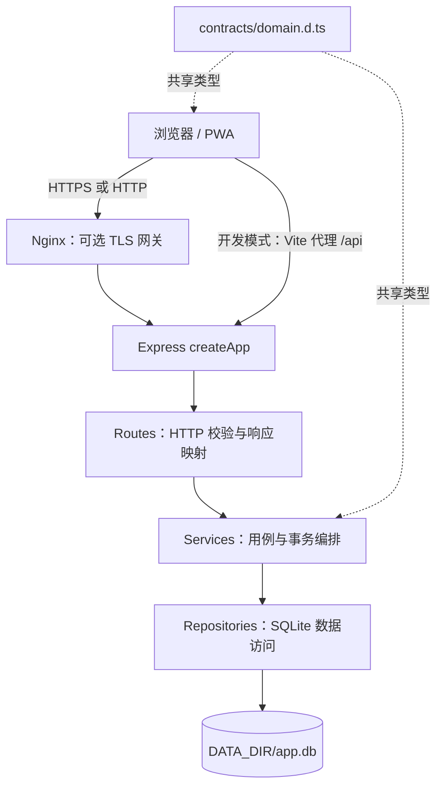

# 系统架构

## 运行形态

Sacred Focus 是单体 Web/PWA：浏览器前端通过 `/api` 调用 Express，Express 使用同进程 SQLite 持久化数据。生产环境中 Express 同时托管 `frontend/dist`；可选 Nginx Compose overlay 在前面提供 HTTPS。

## 分层与依赖规则

| 层 | 位置 | 职责 | 不应承担 |
|---|---|---|---|
| 共享契约 | `contracts/` | 前后端可通过 HTTP 传递的领域类型。 | SQLite 行、Express/Vue/Pinia 对象、运行时代码。 |
| 前端应用 | `frontend/src/application/` | API client、领域 gateway、同步协调和纯错误处理。 | 组件渲染、浏览器全局副作用。 |
| 前端平台 | `frontend/src/platform/browser/` | 将 fetch、主题、全屏、音频、下载和事件接入浏览器。 | 领域状态规则。 |
| 前端界面 | `views/`、`components/`、`stores/` | 视图呈现、交互和 UI 状态。 | 手写 HTTP 协议或直接数据库访问。 |
| HTTP 接入 | `backend/src/app.ts`、`routes/`、`middleware/` | 组装应用、输入检查、鉴权、限流、HTTP 状态映射。 | SQL 与跨表业务算法。 |
| 业务服务 | `backend/src/services/` | 用例、revision 编排、业务日/同步等领域规则。 | Express 与 SQLite 单例依赖。 |
| 数据访问 | `backend/src/repositories/` | 查询、写入和受控 SQLite 事务。 | HTTP 响应和浏览器行为。 |
| 基础设施 | `backend/src/db/`、`domain/`、`http/` | 数据库初始化、迁移、兼容门面、纯业务日/校验及错误响应。 | UI 或路由职责。 |

旧路径如 `frontend/src/utils/*`、`backend/src/db/dateUtils.ts` 和部分 `backend/src/db/queries/*` 仅作为兼容门面存在；新实现应依赖它们导向的共享、领域或 repository 边界，而非把新逻辑写回旧入口。

## 启动与请求流程

1. `backend/src/server.ts` 调用 `initDatabase()`，清理过期的已吊销 JWT，再用 `createApp()` 创建监听实例。
2. `backend/src/app.ts` 依次装配 Helmet、CORS、Cookie、15 MB JSON body、安全过滤、认证、维护写保护、通用限流和业务路由。
3. 前端 `main.ts` 恢复主题，安装 Pinia 和 router，注册未授权跳转与登出导航适配器。
4. router 首次进入受保护页面时由 auth store 校验 Cookie 会话；页面/Pinia 通过领域 gateway 发起 API 调用。
5. route 完成输入与 HTTP 映射，service 编排用例，repository 读取或写入 SQLite。

## 关键一致性边界

- **系统 revision**：树全量保存、演化和整机恢复等共享写操作携带 `expectedRevision`。前置版本不一致时返回 409 `VERSION_CONFLICT`，客户端应同步后再提交。
- **业务日**：国策树点亮与日结使用 `domain/calendar/businessDay.ts` 的凌晨 04:00 规则，而非简单自然日。
- **演化快照**：树版本采用 0–4 共 5 个槽位的环形快照；回滚与架构导入在受控事务中完成。
- **整机恢复**：先取得维护租约、创建预导入热备，再在 SQLite 事务中恢复；失败时恢复应保持数据库不变，并在 finally 中释放租约。
- **会话幂等**：专注日志以客户端提供的 `id` 为主键，重复提交不会重复累计。

## 安全边界

- 管理员会话存储在 HttpOnly Cookie；前端不持久化 JWT。
- Helmet、CORS、IP/UA 安全过滤、认证、写维护锁和不同粒度的限流在 `/api` 边界执行。
- 生产环境中未知异常响应经过脱敏；详细异常只进入服务端日志。
- 基础 Compose 仅绑定回环地址；Nginx overlay 才公开 80/443 并显式设置 `TRUST_PROXY=1`。
