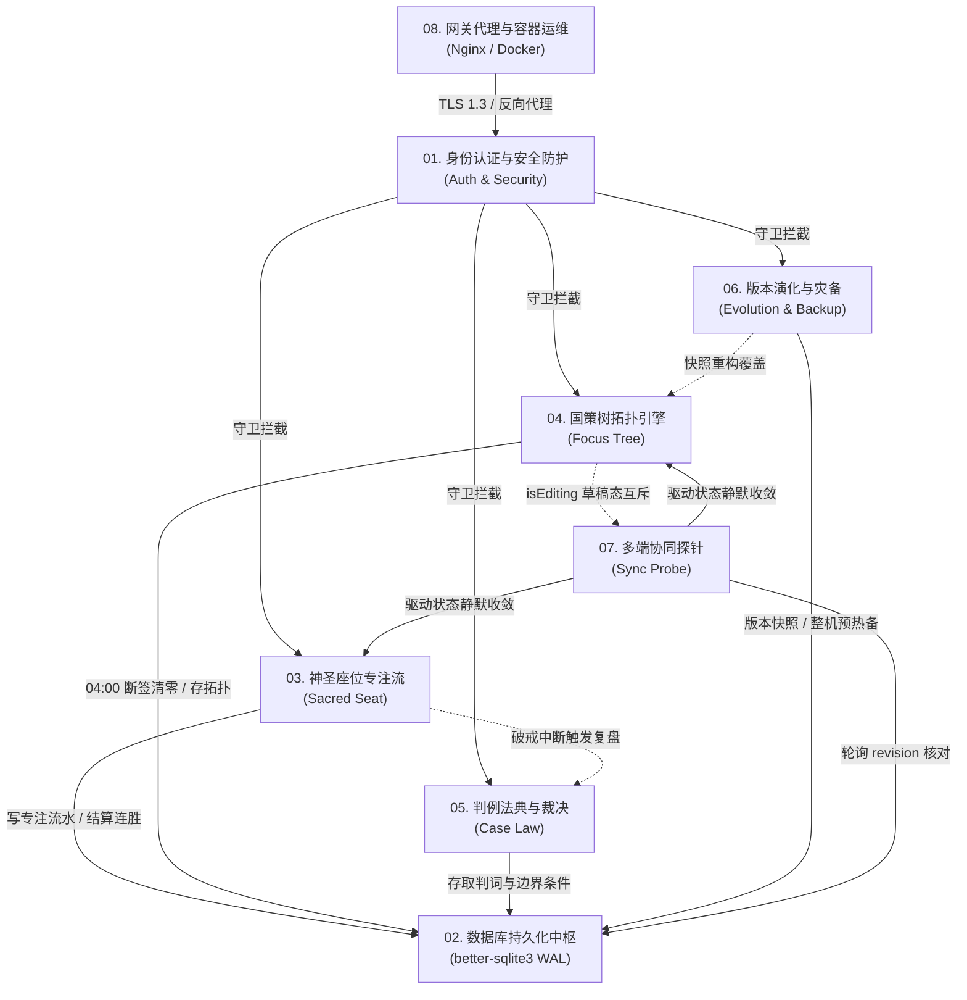

# 00-模块总览与设计规范 (Architecture & Module Index)

> **设计草案索引：** 00  
> **所属系统：** Sacred Focus（国策树与神圣座位）效能工程中枢  
> **基准版本：** v2.0 / Modular Draft Suite  

---

## 1. 模块化工程体系总览

Sacred Focus 将自控工程学（知乎 Edmond 理论体系）与轻量单体全栈架构深度融合，划分为 **8 个高内聚、低耦合的核心业务与基础设施模块**。各模块均具备清晰的职责边界、严谨的状态机模型与强类型契约。

### 模块草案导航索引表

| 模块序号 | 模块名称与核心协议 | 核心领域职责 | 详细设计文档链接 |
|:---:|---|---|:---:|
| **01** | **身份认证与安全防护模块** `Authentication & Security` | 管理员 bcryptjs 加盐认证、30天 HttpOnly Cookie / Bearer 双轨鉴权、多级接口限流、蜜罐诱捕与防爆破 | [01-身份认证与安全防护模块.md](01-身份认证与安全防护模块.md) |
| **02** | **数据库持久化与事务中枢模块** `Database & Transaction Core` | 嵌入式 SQLite WAL 高并发模式、9 大核心表 DDL 与复合索引、东八区凌晨 04:00 业务日算法、CAS 原子版本号 | [02-数据库持久化与事务中枢模块.md](02-数据库持久化与事务中枢模块.md) |
| **03** | **神圣座位专注流管理模块** `Sacred Seat & Flow Execution` | CTDP 链式时延协议、神圣信物/预约暗号仪式、30 秒无痛后悔药免责退出、静默顺水推舟超时深潜、物理时钟保真、52 周热力图 | [03-神圣座位专注流管理模块.md](03-神圣座位专注流管理模块.md) |
| **04** | **国策树拓扑与规范引擎模块** `Focus Tree & RSIP Topology` | RSIP 递归稳态协议、DAG 拓扑画布、曼哈顿正交折线避障、展示/沙盒编辑双模隔离、凌晨 04:00 断签结算、四维规范卡 | [04-国策树拓扑与规范引擎模块.md](04-国策树拓扑与规范引擎模块.md) |
| **05** | **判例法典与合规裁决模块** `Precedent Case Law` | 下必为例自控司法体系、模糊灰色地带定性裁决（ALLOW/FORBID）、生效前置边界条件存证、破戒即时复盘 | [05-判例法典与合规裁决模块.md](05-判例法典与合规裁决模块.md) |
| **06** | **版本演化与整机灾备模块** `Evolution & System Migration` | 5 槽位环形版本快照与原子无损回滚、全系统加密 JSON 冷备导出、覆写前强制物理预热备、400 行原生强类型 Schema 门禁 | [06-版本演化与整机灾备模块.md](06-版本演化与整机灾备模块.md) |
| **07** | **多端协同探针与轻量同步模块** `Sync Probe & Coordination` | 极轻量 HTTP 心跳探针（< 100 bytes）、切回前台生命周期监听、CAS revision 乐观锁核对、画布排版草稿互斥保护 | [07-多端协同探针与轻量同步模块.md](07-多端协同探针与轻量同步模块.md) |
| **08** | **网关代理与容器运维模块** `Gateway, Docker & DevOps` | Docker 3 阶段构建、USER node 最小特权、Nginx HTTP 转 HTTPS 301 重定向、TLS 1.3 密码套件、自动化健康自愈 | [08-网关代理与容器运维模块.md](08-网关代理与容器运维模块.md) |

---

## 2. 模块协作与全局通信拓扑

---

## 3. 全局通用设计原则

1. **本地优先与数据主权 (Local-First)**：所有状态、拓扑与流水完全收口于本地单文件 SQLite 数据库，不依赖任何第三方云端外部服务；
2. **零脏数据与沙盒隔离**：编辑操作（画布排版、节点增删连线）全量运行于前端内存 Pinia 沙盒，用户未主动点击保存前绝不产生脏数据库事务；
3. **确定性状态机**：无论是 30 秒后悔药窗口判定，还是凌晨 04:00 业务日跨天打卡，均基于真实绝对时间戳（东八区 UTC+8）运算，杜绝客户端时钟篡改与定时器节流漂移；
4. **防御性编程与自愈熔断**：整机镜像导入强制预热备，热备失败立即阻断；所有 SQL 100% 参数化预编译；接口多级防爆破。
