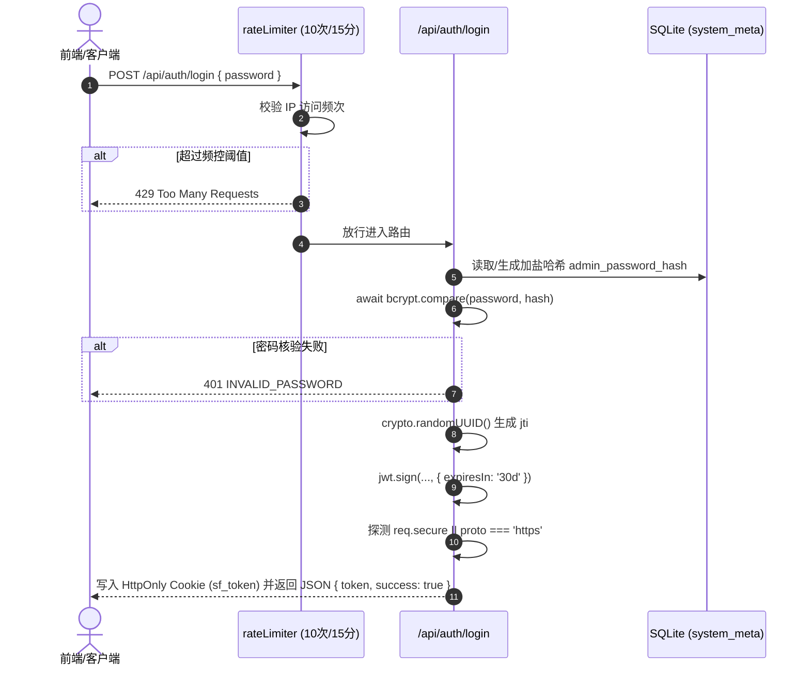

# 01-身份认证与安全防护模块 (Authentication & Security)

> **模块编号：** 01  
> **设计草案版本：** v1.0 / Draft  
> **所属系统：** Sacred Focus（国策树与神圣座位）效能工程中枢  
> **对齐协议：** 契约准入防线 & 企业级接口安全基线

---

## 1. 模块概述与业务职责

### 1.1 模块定位
本模块是整个 Sacred Focus 系统的**第一道安全边界与访问守卫中枢**。系统设计为面向个人或私有团队的高安全性自控效能平台，杜绝公网弱口令爆破、会话劫持、爬虫扫描与恶意数据嗅探。

### 1.2 核心业务职责
1. **统一凭据认证**：基于 `bcryptjs` 加盐哈希核验管理员密码，签发带有唯一 `jti`（JWT ID）与 30 天有效期的 JWT 访问凭证；
2. **双轨凭据传输**：
   - **优先轨（Web 端）**：采用 `HttpOnly` Cookie（Cookie 名 `sf_token`），自适应协议（HTTPS 启用 `Secure=true; SameSite=strict`，明文 HTTP 启用 `Secure=false; SameSite=lax`）；
   - **备用轨（API/移动/脚本端）**：支持 `Authorization: Bearer <token>` 或 `X-Access-Token` 请求头，向下兼容恒定时间比对的静态令牌（`APP_ACCESS_TOKEN`）；
3. **会话吊销与黑名单淘汰**：支持主动注销登录，将 `jti` 写入 `system_meta` 黑名单，并在鉴权与定时任务中自动淘汰已自然超期的黑名单记录；
4. **多级接口限流（Rate Limiting）**：
   - 登录接口：15 分钟 10 次限制，防暴力字典破解；
   - 敏感导出/导入接口：15 次/10 分钟与 10 次/小时严格频控；
   - 通用 API：已认证用户 1000 次/分，未认证用户 60 次/分；
5. **蜜罐诱捕与反爬防御**：实时诱捕 `/.env`、`/.git`、`wp-login.php` 等扫描探针，持久化封禁恶意 IP 72 小时；
6. **前端路由守护**：Vue Router 全局前置守卫，未认证请求自动拦截并携带 `redirect` 参数重定向至登录页。

---

## 2. 核心源文件清单

| 文件路径 | 层次架构 | 核心职责说明 |
|---|---|---|
| [`backend/src/middleware/auth.ts`](file:///d:/Codes/Projects/sacred-focus/backend/src/middleware/auth.ts) | 后端中间件 | JWT 验证、jti 黑名单拦截、安全常量时间比较与过期吊销淘汰 |
| [`backend/src/middleware/ipRules.ts`](file:///d:/Codes/Projects/sacred-focus/backend/src/middleware/ipRules.ts) | 后端中间件 | 基于 `req.ip` 提取真实客户端 IP，判断本机回环与受信任 IP 白名单 |
| [`backend/src/middleware/rateLimiter.ts`](file:///d:/Codes/Projects/sacred-focus/backend/src/middleware/rateLimiter.ts) | 后端中间件 | 登录、整机导出、整机恢复及全局 API 分级请求频控策略 |
| [`backend/src/middleware/security.ts`](file:///d:/Codes/Projects/sacred-focus/backend/src/middleware/security.ts) | 后端中间件 | 蜜罐路径拦截、恶意爬虫 UA 过滤与 IP 72 小时持久化封禁 |
| [`backend/src/routes/auth.ts`](file:///d:/Codes/Projects/sacred-focus/backend/src/routes/auth.ts) | 后端路由 | 登录认证、登出清理、会话状态探测 RESTful 接口 |
| [`backend/src/config.ts`](file:///d:/Codes/Projects/sacred-focus/backend/src/config.ts) | 配置中枢 | 生产环境下强熵值校验（JWT_SECRET 长度与默认密码拦截） |
| [`frontend/src/stores/auth.ts`](file:///d:/Codes/Projects/sacred-focus/frontend/src/stores/auth.ts) | 前端 Store | 管理员认证响应式状态树、登录/登出与异步状态核验 |
| [`frontend/src/router/index.ts`](file:///d:/Codes/Projects/sacred-focus/frontend/src/router/index.ts) | 前端路由 | 全局路由鉴权守卫，白名单路由放行与受保护视图拦截 |
| [`frontend/src/views/LoginView.vue`](file:///d:/Codes/Projects/sacred-focus/frontend/src/views/LoginView.vue) | 前端视图 | 极简高对比度管理员密码核验控制台 |

---

## 3. 数据模型与契约定义

### 3.1 数据库元数据契约 (`system_meta` 表映射)
```sql
-- 1. 管理员密码加盐哈希
INSERT OR REPLACE INTO system_meta (key, value) VALUES ('admin_password_hash', '$2a$12$...');

-- 2. 吊销的 JWT jti 黑名单与自然过期时间戳 (毫秒)
INSERT OR REPLACE INTO system_meta (key, value) VALUES ('revoked_jti:550e8400-e29b-41d4-a716-446655440000', '1789420800000');

-- 3. 触发蜜罐封禁的 IP 与解封时间戳 (毫秒)
INSERT OR REPLACE INTO system_meta (key, value) VALUES ('ip_ban:203.0.113.195', '1789680000000');
```

### 3.2 JWT 载荷强类型契约
```ts
// backend/src/types.ts
export interface AuthJwtPayload {
  role: 'admin';
  jti: string;            // UUID v4，防重放攻击与支持原子吊销
  timestamp: number;      // 签发毫秒时间戳
  exp?: number;           // JWT 标准到期时间 (秒)
  iat?: number;           // JWT 标准签发时间 (秒)
}
```

---

## 4. 关键业务流转与逻辑架构

### 4.1 登录与自适应凭证签发时序


### 4.2 中间件拦截管道执行顺序
在 [`backend/src/server.ts`](file:///d:/Codes/Projects/sacred-focus/backend/src/server.ts) 中，请求按以下严格顺序逐层过滤：
1. `app.set('trust proxy', 1)`：确保从 Nginx 等反代获取正确客户端 IP；
2. `helmet(...)`：注入 CSP 沙盒、隐藏 `X-Powered-By`、设置 `X-Frame-Options: DENY`；
3. `cors(...)`：仅放行同源请求及 `ALLOWED_ORIGINS` 配置的受信任域名；
4. `cookieParser()` & `express.json({ limit: '15mb' })`；
5. `securityFilter`：蜜罐路径诱捕与 IP 黑名单校验；
6. `authMiddleware`：前置解析身份，放行白名单（`/health`, `/auth/login`, `/auth/status`, `/sync/status`）；
7. `apiGeneralLimiter`：通用 API 限流器；
8. 挂载领域业务路由。

---

## 5. 对外接口协议清单

| 方法 | 路径 | 鉴权要求 | 限流规则 | 描述 |
|---|---|:---:|:---:|---|
| `POST` | `/api/auth/login` | 公开 | 10次/15分钟 | 管理员密码登录，签发 Cookie 与 Token |
| `GET` | `/api/auth/status` | 公开 | 60次/分钟 | 探测当前客户端是否具备有效管理员身份 |
| `POST` | `/api/auth/logout` | 已认证 | 60次/分钟 | 清除 Cookie，并将当前 Token jti 写入黑名单 |

---

## 6. 跨模块联动与协同关系

1. **与【02-数据库模块】联动**：
   - 依赖 `system_meta` 表持久化管理员密码哈希、IP 封禁黑名单与 JWT 吊销记录；
   - 服务启动和空闲定时器调用 `purgeExpiredRevokedJtis()` 自动淘汰过期键值。
2. **与【03-神圣座位】、【04-国策树】、【05-判例法典】联动**：
   - 保护所有写入与修改接口（`PUT /api/focus-tree`, `POST /api/sacred-seat/logs` 等），拒绝匿名越权；
   - 为后续路由的 `req.user` 提供可信上下文。
3. **与【08-网关与运维模块】联动**：
   - 与 Nginx 协同解析 `X-Forwarded-For` 与 `X-Forwarded-Proto`，确保在 TLS 反代场景下动态开启 `Secure` Cookie。
