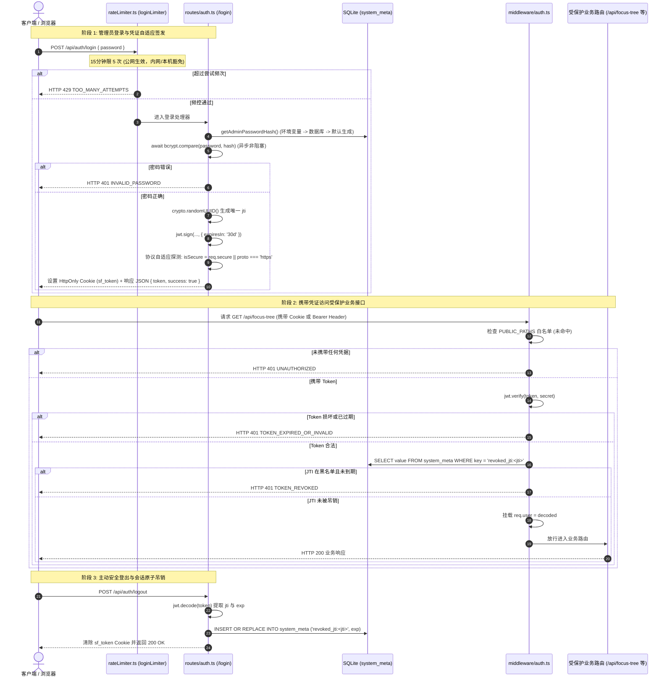

# 01-身份认证与安全防护模块 逻辑流程与时序架构详细设计 (Draft)

> **文档定位：** 模块 01 真实源代码逻辑执行流深度审计与工程实现草案  
> **对齐版本：** v1.1 (基于 `backend/src/routes/auth.ts`、`backend/src/middleware/auth.ts`、`backend/src/config.ts`、`frontend/src/stores/auth.ts` 等实际源码)  
> **审查基准：** 全量 API 入口校验、内部时序链路、会话生命周期、异常吞咽审计、四大边界条件（空值/重复登录与吊销/超时管理/并发爆破与时序防御）

---

## 1. 入口与路由全量矩阵（API & 校验规则审计）

模块 01 的对外服务路由挂载在 [`backend/src/server.ts`](file:///d:/Codes/Projects/sacred-focus/backend/src/server.ts#L87) 的 `/api/auth` 路径前缀下，同时在中间件层提供核心访问控制网关 [`authMiddleware`](file:///d:/Codes/Projects/sacred-focus/backend/src/middleware/auth.ts)。  
全模块共有 **3 个专属 API 端点** 与 **1 个全局统一鉴权拦截器**。经源码审计，本模块**【未引入 Zod 校验库】**，全部依托原生 JavaScript/TypeScript 类型检查、非空判断及常量时间比较。

### 1.1 API 端点与参数校验全景表

| 序号 | HTTP 方法 | 路由路径 | 接收参数 (Params / Query / Body / Headers) | 校验类型 | 实际生效的校验规则与边界约束 | 风险与缺陷标注 |
|---|---|---|---|---|---|---|
| 1 | `POST` | `/api/auth/login` | **Body (JSON)**:<br>- `password?: string`<br>**Headers**:<br>- `x-forwarded-proto?: string` | 原生非空与类型校验 + 频控限流 | 1. 频控保护：`loginLimiter` 限制 15 分钟 5 次错误尝试（本机/可信 IP 豁免）<br>2. 密码必填校验：`if (!password \|\| typeof password !== 'string')` 返回 `400`<br>3. 异步密码核验：`await bcrypt.compare(password, hash)` -> 错误返回 `401`。 | **【未做 Zod 校验】**<br>**【未做密码空白字符 trim 校验】**（纯空格 `"   "` 可绕过非空判断，进入 bcrypt 比对并失败抛出 401）。 |
| 2 | `GET` | `/api/auth/status` | **Headers**:<br>- `authorization?: string`<br>- `x-access-token?: string`<br>**Cookies**:<br>- `sf_token?: string` | 原生 Token 提取与 JWT 解密校验 | 1. 静态令牌比对：`safeCompare(token, config.appAccessToken)`<br>2. Token 存在性：未携带直接返回 `{ isAuthenticated: false }`<br>3. JWT 签名校验：`jwt.verify(token, config.jwtSecret)`<br>4. JTI 吊销黑名单核查：查询 `system_meta` 中 `revoked_jti:${decoded.jti}`。 | **【未做参数校验】**（只读探测探针）。<br>属于免鉴权白名单路径。 |
| 3 | `POST` | `/api/auth/logout` | **Headers / Cookies**:<br>- 提取当前登录凭证 | 原生 Token 解码 | 1. 提取 Token 并执行 `jwt.decode(token)` 提取 `jti` 与 `exp`<br>2. 写入 SQLite 吊销黑名单表：`INSERT OR REPLACE INTO system_meta`<br>3. 清理安全 HttpOnly Cookie。 | **【未做参数校验】**。<br>即便未携带有效 Token，登出接口亦正常清理 Cookie 并响应成功（具备幂等性）。 |
| 4 | - | `authMiddleware` | 全局 API 请求拦截器 (挂载于 `/api`) | 白名单与 JWT 全量门禁 | 1. 白名单免检放行：`/health`, `/auth/login`, `/auth/status`, `/sync/status`<br>2. 静态令牌恒定时间校验：`safeCompare`<br>3. 缺失 Token：拦截返回 `401 UNAUTHORIZED`<br>4. 凭据吊销：拦截返回 `401 TOKEN_REVOKED`<br>5. 凭据无效/过期：拦截返回 `401 TOKEN_EXPIRED_OR_INVALID`。 | 全局受保护路由守卫。 |

---

## 2. 内部执行时序与生命周期审计

### 2.1 全链路执行时序模型

模块 01 承担全系统的身份准入中枢，覆盖**凭据签发**、**协议自适应 Cookie**、**全局受保护路由拦截**与**原子吊销**四大阶段：



### 2.2 核心环节详细剖析

#### 1. 登录密码核验与异步非阻塞比对 (P2-003 治理)
在 [`backend/src/routes/auth.ts:L43-L52`](file:///d:/Codes/Projects/sacred-focus/backend/src/routes/auth.ts#L43-L52) 中：
```ts
const hash = getAdminPasswordHash();
// P2-003 治理：采用异步 bcrypt.compare，杜绝同步 compareSync 占用事件循环 150~300ms 造成主线程假死
const isValid = await bcrypt.compare(password, hash);
if (!isValid) {
  return res.status(401).json({
    error: 'INVALID_PASSWORD',
    message: '神圣契约拒绝访问：密码错误，请核验后重试'
  });
}
```
- **密码哈希来源优先级**：
  1. 环境变量优先：`config.adminPasswordHash`（适合 CI/CD 或 Docker 密钥注入）；
  2. 数据库持久化其次：`SELECT value FROM system_meta WHERE key = 'admin_password_hash'`；
  3. 兜底初始化并落库：首次部署未设置时，基于 `config.initialAdminPassword`（默认 `admin123456`）加盐 12 轮生成哈希并 `INSERT OR REPLACE` 写入 `system_meta`。

#### 2. 双轨凭据传输与自适应 Cookie 机制 (P1-SEC-02 治理)
- **双轨凭据提取**：
  ```ts
  const authHeader = req.headers['authorization'] || '';
  const headerToken = authHeader.replace(/^Bearer\s+/i, '').trim() || (req.headers['x-access-token'] as string);
  const cookieToken = req.cookies ? req.cookies['sf_token'] : undefined;
  const token = headerToken || cookieToken;
  ```
  优先使用 Web 端透明携带的 Cookie；备用支持原生客户端、Shell 脚本通过请求头携带。
- **协议自适应标记 (Protocol Adaptive Cookie)**：
  ```ts
  const isSecure = req.secure || req.headers['x-forwarded-proto'] === 'https';
  res.cookie('sf_token', token, {
    httpOnly: true,
    secure: isSecure,
    sameSite: isSecure ? 'strict' : 'lax',
    maxAge: 30 * 24 * 60 * 60 * 1000 // 30 天
  });
  ```
  - 若处于 HTTPS/TLS 网关下：启用 `secure: true, sameSite: 'strict'`，防止中间人嗅探；
  - 若在内网开发使用明文 HTTP：自动降级为 `secure: false, sameSite: 'lax'`，**彻底消除生产环境明文部署下因强制 secure 导致浏览器拒收 Cookie 的登录死循环缺陷**。

#### 3. 会话吊销与黑名单过期淘汰机制 (P2-SEC-03 治理)
传统 JWT 无法在签发后被主动作废，本系统通过“UUID jti + SQLite 吊销表 + 动态淘汰”构建了完整的会话吊销闭环：
- **登出即吊销**：在 [`POST /api/auth/logout`](file:///d:/Codes/Projects/sacred-focus/backend/src/routes/auth.ts#L125-L128) 中将 `revoked_jti:${decoded.jti}` 写入 `system_meta`，其值为有效截止毫秒戳；
- **鉴权动态淘汰**：在 [`authMiddleware`](file:///d:/Codes/Projects/sacred-focus/backend/src/middleware/auth.ts#L62-L66) 中，若发现被吊销的 Token 自身其实已经超过了自然过期时间（`Date.now() >= exp`），直接在数据库中 `DELETE` 该条黑名单记录；
- **定时批量淘汰 (`purgeExpiredRevokedJtis`)**：
  ```ts
  const purgeTx = db.transaction(() => {
    for (const r of rows) {
      const exp = parseInt(r.value, 10);
      if (!isNaN(exp) && now >= exp) {
        deleteStmt.run(r.key);
        purgedCount++;
      }
    }
  });
  purgeTx();
  ```
  防止长期运行造成 `system_meta` 黑名单记录无限膨胀。

#### 4. 常量时间静态令牌比对防时序攻击 (Timing Attack Defense)
在 [`backend/src/middleware/auth.ts:L16-L22`](file:///d:/Codes/Projects/sacred-focus/backend/src/middleware/auth.ts#L16-L22) 中：
```ts
export function safeCompare(a: string, b: string): boolean {
  if (typeof a !== 'string' || typeof b !== 'string') return false;
  const bufA = Buffer.from(a);
  const bufB = Buffer.from(b);
  if (bufA.length !== bufB.length) return false;
  return timingSafeEqual(bufA, bufB);
}
```
对向下兼容的静态令牌 `config.appAccessToken`，采用 Node.js 原生 `crypto.timingSafeEqual` 进行字符级恒定时间核验，彻底阻断黑客利用 CPU 比较耗时差异推导密钥字符的时序侧信道攻击。

### 2.3 异常吞咽审计（是否存在 Try-Catch 吞异常？）

1. **`POST /api/auth/login`**：
   - **完全未包裹 try-catch**！
   - 审计结论：未处理异常自然冒泡至 `server.ts` 全局中间件响应 500。
2. **`GET /api/auth/status`**：
   ```ts
   try {
     const decoded = jwt.verify(token, config.jwtSecret) as AuthJwtPayload;
     // ...
     return res.json({ isAuthenticated: true, user: decoded });
   } catch (e) {
     return res.json({ isAuthenticated: false });
   }
   ```
   - 审计结论：捕获 JWT 验签失败（如篡改、超期），安全返回 `{ isAuthenticated: false }`，**属于预期的状态探测设计，未吞掉业务故障**。
3. **`POST /api/auth/logout`**：
   ```ts
   try {
     const decoded = jwt.decode(token) as ...;
     if (decoded?.jti) { ... }
   } catch (e) {
     // 忽略解析错误
   }
   ```
   - 审计结论：对于已损坏或伪造的 Token，登出操作忽略解析错误并继续清理 Cookie，确保用户始终能退出登录。
4. **`authMiddleware`**：
   ```ts
   try {
     const decoded = jwt.verify(token, config.jwtSecret) as AuthJwtPayload;
     // ...
     return next();
   } catch (err: any) {
     if (isPublic) return next();
     return res.status(401).json({
       error: 'TOKEN_EXPIRED_OR_INVALID',
       message: '登录凭证已过期或无效，请重新登录'
     });
   }
   ```
   - 审计结论：精准捕获验签异常并向未授权客户端抛出 `401 TOKEN_EXPIRED_OR_INVALID`，**未吞掉未授权异常**。

### 2.4 HTTP 状态码与业务错误码速查表

| HTTP 状态码 | 业务错误代码 (`error`) | 触发代码位置 | 场景说明 |
|---|---|---|---|
| `400 Bad Request` | `PASSWORD_REQUIRED` | `auth.ts:L40` | 登录时未提交密码或密码字段非字符串类型 |
| `401 Unauthorized` | `INVALID_PASSWORD` | `auth.ts:L49` | 提交的管理员访问密码与哈希不匹配 |
| `401 Unauthorized` | `UNAUTHORIZED` | `middleware/auth.ts:L42` | 请求受保护的业务 API 时未携带 Token 或 Cookie |
| `401 Unauthorized` | `TOKEN_REVOKED` | `middleware/auth.ts:L59` | 携带的凭证已在登出时被主动吊销入黑名单 |
| `401 Unauthorized` | `TOKEN_EXPIRED_OR_INVALID` | `middleware/auth.ts:L77` | 凭证格式被破坏、篡改或已自然超期（> 30天） |
| `429 Too Many Requests` | `TOO_MANY_ATTEMPTS` | `rateLimiter.ts:L10` | 登录连续错误尝试超过 5 次，触发 15 分钟临时锁定 |
| `500 Internal Server Error` | `INTERNAL_SERVER_ERROR` | `server.ts:L116` | 数据库文件离线等底层故障由全局错误拦截器捕获 |

---

## 3. 边界处理专项深度审计

依据实际源代码，严密复核**空值**、**重复操作与吊销幂等**、**超时管理**、**并发爆破与防时序**四大边界。凡代码未做判断的，显式标注为 `【未做判断】`。

### 3.1 空值处理 (Null / Undefined / Empty)

#### (1) 登录密码参数空值
- 源码位置：[`backend/src/routes/auth.ts:L37-L41`](file:///d:/Codes/Projects/sacred-focus/backend/src/routes/auth.ts#L37-L41)
  ```ts
  const { password } = req.body || {};
  if (!password || typeof password !== 'string') {
    return res.status(400).json({ error: 'PASSWORD_REQUIRED', message: '请输入管理员访问密码' });
  }
  ```
- **审计结论**：
  - 处理了 `req.body` 为 undefined 或 null 的情况；
  - 拦截了空字符串 `""`、数值型密码等非法参数；
  - **【未做空白字符 trim 判断】**：若传入纯空格 `"   "`，`!"   "` 为 false，能够通过本行校验，进入 `bcrypt.compare` 后比对失败抛出 401。

#### (2) Token 提取空值与解密空值
- 源码位置：[`backend/src/middleware/auth.ts:L31-L45`](file:///d:/Codes/Projects/sacred-focus/backend/src/middleware/auth.ts#L31-L45)
  ```ts
  const token = headerToken || cookieToken;
  if (!token) {
    if (isPublic) return next();
    return res.status(401).json({ error: 'UNAUTHORIZED', ... });
  }
  ```
- **审计结论**：健全。在白名单路径下空 Token 视为匿名放行，受保护路径下空 Token 直接抛出 401。

#### (3) 生产环境配置强熵值空值拦截 (`P0-001` 治理)
在 [`backend/src/config.ts:L54-L65`](file:///d:/Codes/Projects/sacred-focus/backend/src/config.ts#L54-L65) 中：
- 若 `isProduction === true`，强制要求 `JWT_SECRET` 不能为空、不能是示例占位符且长度必须 $\ge 32$；
- 强制要求 `ADMIN_PASSWORD` 不能为空且长度必须 $\ge 8$；
- **审计结论**：空值或弱口令直接导致进程 `throw new Error('[FATAL] ...')` 拒绝启动，在进程生命周期的最早期切断安全隐患。

---

### 3.2 重复操作与吊销幂等性 (Duplicate & Idempotency)

#### (1) 多终端重复并发登录
- 每次登录调用都会生成一个**全新的 `jti = crypto.randomUUID()`**；
- 签发的新 JWT 拥有独立的 JTI，彼此互不干扰；
- 系统支持在多个终端（PC、手机、平板）同时登录保持 30 天会话，旧设备不会因新设备登录而发生抢登被踢下线。

#### (2) 主动登出与重复登出幂等性
- 源码位置：[`POST /api/auth/logout`](file:///d:/Codes/Projects/sacred-focus/backend/src/routes/auth.ts#L115-L141)
  - 使用 `INSERT OR REPLACE INTO system_meta`，若同一 Token 被重复提交登出，仅幂等更新相同的失效时间戳；
  - 若客户端在未登录或已登出状态下再次调用 `/logout`，`clearCookie` 同样幂等执行并返回 `200 { success: true }`，具备**绝对幂等性**。

---

### 3.3 超时管理与过期双重校验 (Timeout Handling)

#### (1) JWT 访问凭证双重超期机制
- **第一重（JWT 自身算法到期）**：签发时指定 `{ expiresIn: '30d' }`，生成标准的 `exp` 声明。`jwt.verify()` 内部自动比对当前 UTC 时间戳，超期自动抛出 `TokenExpiredError`，被捕获后返回 `401 TOKEN_EXPIRED_OR_INVALID`；
- **第二重（Cookie 容器到期）**：写入浏览器时指定 `maxAge: 30 * 24 * 60 * 60 * 1000`，30 天后浏览器物理清除该 Cookie；
- **第三重（黑名单记录到期淘汰）**：已吊销记录持久化保存至其原本的 `exp` 时间戳，超过自然失效期后系统自动执行 `DELETE` 彻底物理回收。

#### (2) 异步密码哈希耗时边界 (Async Bcrypt)
- 采用非阻塞异步 `await bcrypt.compare()`，Node.js 内部将其交由 libuv 线程池执行，不再独占 JavaScript 主线程事件循环，保证高并发认证时不卡死其他正常 API 请求。

---

### 3.4 并发爆破与时序防御 (Concurrency & Anti-Timing Attack)

#### (1) 暴力破解限流并发防御
在 [`backend/src/middleware/rateLimiter.ts:L4-L15`](file:///d:/Codes/Projects/sacred-focus/backend/src/middleware/rateLimiter.ts#L4-L15) 中：
```ts
export const loginLimiter = rateLimit({
  windowMs: 15 * 60 * 1000,
  max: 5,
  skip: (req) => isLocalOrTrusted(req),
  message: {
    error: 'TOO_MANY_ATTEMPTS',
    message: '触发安全防爆破保护：连续错误尝试过多，请 15 分钟后再试'
  }
});
```
- 基于内存令牌桶滑动窗口，以真实 IP 为键；
- 遭遇多线程字典并发爆破时，第 6 次尝试将被毫秒级拦截并响应 `429 TOO_MANY_ATTEMPTS`。

#### (2) 常量时间比较防御时序侧信道
- 针对静态 `APP_ACCESS_TOKEN`，使用 `crypto.timingSafeEqual` 校验，即使黑客利用万兆内网并发探测不同字符前缀的纳秒级执行时间差，也无法获取任何有效信息。

---

## 4. 架构改进建议与演化待办 (Actionable Backlog)

1. **登录密码增加 `.trim()` 净化**：
   - 过滤输入前后的多余空格，防止移动端输入法自动追加空格导致的比对失败；
2. **支持刷新令牌双 Token 架构 (Access/Refresh Token)**：
   - 当前采用单一 30 天长效 JWT，后续可演进为 2 小时短期 Access Token + 30 天 Refresh Token 自动轮转机制，进一步收窄凭证泄露窗口期；
3. **管理密码修改接口规范化**：
   - 补充 `POST /api/auth/change-password` 接口，要求提供旧密码与新密码，并在修改成功后自动吊销该账号既往所有的旧 Token。
