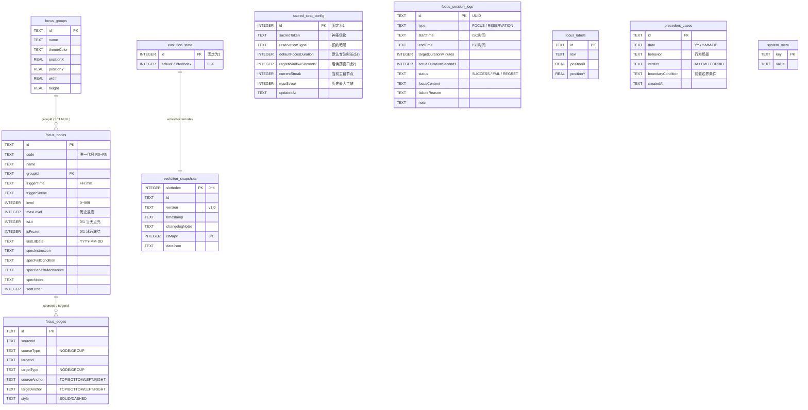

# 02-数据库持久化与事务中枢模块 (Database Persistence & Transaction Core)

> **模块编号：** 02  
> **设计草案版本：** v1.0 / Draft  
> **所属系统：** Sacred Focus（国策树与神圣座位）效能工程中枢  
> **对齐协议：** SQLite WAL 高性能并发规范 & 单机本地优先 (Local-First) 架构

---

## 1. 模块概述与业务职责

### 1.1 模块定位
本模块是系统的**持久化根基与并发事务仲裁中枢**。系统坚持“数据主权归属个人”的工程哲学，完全采用嵌入式 SQLite 数据库，单文件落盘持久化，杜绝了引入庞大外部数据库集群（MySQL / PostgreSQL）带来的运维摩擦。

### 1.2 核心业务职责
1. **单文件零依赖持久化**：使用 `better-sqlite3` 直接在本地磁盘操作单文件数据库（`./data/app.db`）；
2. **高性能并发 WAL 模式**：初始化配置 `PRAGMA journal_mode = WAL` 与 `PRAGMA foreign_keys = ON`，实现读写互不阻塞的并发吞吐能力；
3. **高内聚单职责拆分**：将历史单文件 1089 行 God Object 彻底拆解为连接、表结构、平滑升级、种子配置、日期运算、版本号与查询层 7 个高内聚子模块；
4. **ACID 事务与防雪崩**：所有跨表写入、全量国策树覆盖、跨天断签审计均由 `db.transaction()` 包裹，确保全链路原子性；
5. **系统版本号（CAS）推进**：维护原子单调递增版本号 `system_revision`，向各业务端提供乐观并发控制与多端数据同步凭据；
6. **时区解耦业务日算法**：显式采用东八区（UTC+8）时间戳偏移量计算凌晨 04:00 自控跨天分界线，解耦服务器宿主系统本地时区。

---

## 2. 核心源文件清单

| 文件路径 | 架构角色 | 核心职责说明 |
|---|---|---|
| [`backend/src/db.ts`](file:///d:/Codes/Projects/sacred-focus/backend/src/db.ts) | 统一门面 (Facade) | 统一聚合导出连接实例、版本号函数与领域查询接口 |
| [`backend/src/db/connection.ts`](file:///d:/Codes/Projects/sacred-focus/backend/src/db/connection.ts) | 连接与配置 | 数据库目录初始化、SQLite 句柄实例化及 WAL/外键约束 PRAGMA 开启 |
| [`backend/src/db/schema.ts`](file:///d:/Codes/Projects/sacred-focus/backend/src/db/schema.ts) | DDL 架构规范 | 9 大核心数据表创建 DDL 与 5 大高频复合检索索引定义 |
| [`backend/src/db/migrations.ts`](file:///d:/Codes/Projects/sacred-focus/backend/src/db/migrations.ts) | 平滑版本迁移 | 跨版本表结构升级、动态列补全与向下兼容处理 |
| [`backend/src/db/seed.ts`](file:///d:/Codes/Projects/sacred-focus/backend/src/db/seed.ts) | 初始基线装载 | 首次安装时自动注入默认国策树、基石分组与演化槽位种子数据 |
| [`backend/src/db/dateUtils.ts`](file:///d:/Codes/Projects/sacred-focus/backend/src/db/dateUtils.ts) | 业务日纯函数 | 凌晨 04:00 业务日界限计算与前一业务日计算（东八区保真） |
| [`backend/src/db/revision.ts`](file:///d:/Codes/Projects/sacred-focus/backend/src/db/revision.ts) | CAS 版本中枢 | 读取与原子自增全局 `system_revision` 并同步刷新时间戳 |

---

## 3. 数据表架构规范 (DDL)



---

## 4. 关键算法与机制实现

### 4.1 业务日计算算法 (东八区凌晨 04:00 边界)
自控工程学要求以“起床”为一天的实际起点，因此以凌晨 04:00 作为分水岭。
- **计算逻辑**：
  $$\text{Shifted Time} = \text{UTC Time} + (8 - 4) \times 3600 \times 1000\text{ ms}$$
  对该偏移后的时间戳提取 UTC 年月日：
  - 03:59:59 对应前一自然日；
  - 04:00:00 准时跨入新自控业务日。

### 4.2 CAS 乐观锁原子版本号流转
```ts
// backend/src/db/revision.ts
export function incrementSystemRevision(): number {
  const row = db.prepare("SELECT value FROM system_meta WHERE key = 'system_revision'").get();
  const current = row ? parseInt(row.value, 10) : 1;
  const next = current + 1;
  db.prepare("INSERT OR REPLACE INTO system_meta (key, value) VALUES ('system_revision', ?)").run(String(next));
  db.prepare("INSERT OR REPLACE INTO system_meta (key, value) VALUES ('last_sync_timestamp', ?)").run(new Date().toISOString());
  return next;
}
```

### 4.3 WAL 定期截断与优雅释放
- **运行时定期维护**：在 `server.ts` 中每 30 分钟触发 `db.pragma('wal_checkpoint(PASSIVE)')`，将 WAL 事务合流回主数据库文件；
- **优雅停机归档**：捕获 `SIGTERM` 信号后触发 `db.pragma('wal_checkpoint(TRUNCATE)')` 并安全执行 `db.close()`，确保关机后不遗留脏日志。

---

## 5. 跨模块联动机制

1. **为【03-神圣座位】提供聚合支撑**：
   - 依赖 `idx_logs_type_starttime` 复合索引，毫秒级聚合 52 周专注热力矩阵；
2. **为【04-国策树拓扑】提供结算事务**：
   - 在每日首次上线时由结算引擎执行事务级核对，自动清零断签节点等级并递增 Revision；
3. **为【06-版本演化与迁移】提供底层预热备接口**：
   - 在整机导入时调用 `db.backup(backupPath)` 生成物理快照，失败立即熔断事务；
4. **为【07-多端协同探针】提供版本凭据**：
   - `/api/sync/status` 直接读取 `system_revision` 向客户端返回毫秒级轻量探针响应。
