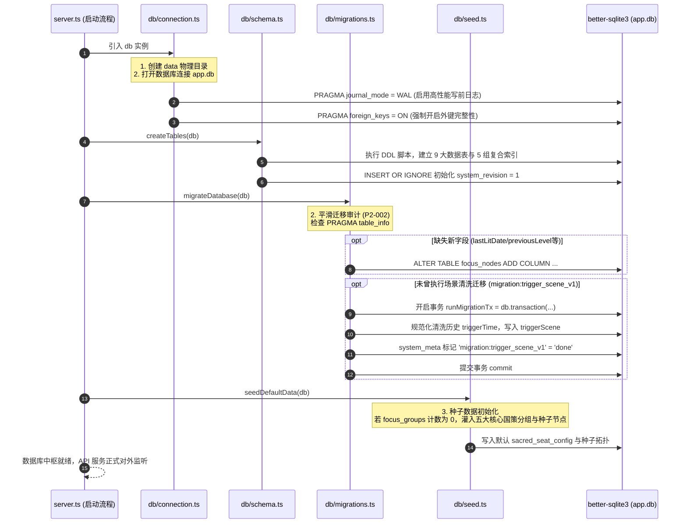

# 02-数据库持久化与事务中枢模块 逻辑流程与时序架构详细设计 (Draft)

> **文档定位：** 模块 02 真实源代码逻辑执行流深度审计与工程实现草案  
> **对齐版本：** v1.1 (基于 `backend/src/db/` 架构子模块：`connection.ts`、`schema.ts`、`migrations.ts`、`seed.ts`、`revision.ts`、`dateUtils.ts`、`queries/` 等实际源码)  
> **审查基准：** 全量 DAL 契约与 DDL 约束矩阵、内部时序链路、WAL 事务模型、异常吞咽审计、四大边界条件（空值/迁移幂等/超时锁等待/并发TOCTOU防竞态）

---

## 1. 入口与数据契约全量矩阵（DAL & DDL 约束审计）

模块 02 是全系统的**底层持久化中枢与数据底座**。在经历系统代码重构（`D-2` 治理）后，原 1089 行 God Object 已解耦为高内聚的 8 个单职责子模块。  
本模块不直接暴露外部 HTTP 路由，而是通过导出的 **DAL (Data Access Layer) 函数库**与 **SQLite DDL 模式约束**为其他所有模块提供强类型、事务级的数据持久化服务。全模块**【未引入 Zod 等 Schema 库】**，由 SQLite 原生 `CHECK` 约束、`FOREIGN KEY` 级联规则及 TypeScript 原生类型提供多重约束。

### 1.1 9 大核心数据表 DDL 约束全景表

| 序号 | 数据表名 (`Table`) | 主键定义 (`Primary Key`) | 外键与级联 (`Foreign Key`) | 原生 CHECK 约束规则 | 关键索引 (`Index`) | 业务职责 |
|---|---|---|---|---|---|---|
| 1 | `sacred_seat_config` | `id INTEGER PK CHECK (id = 1)` | 无 | 强制单行约束：`id = 1` | - | 神圣座位专属信物、暗号、倒计时与连胜记录 |
| 2 | `focus_session_logs` | `id TEXT PK` (UUID) | 无 | `type IN ('FOCUS', 'RESERVATION')`<br>`status IN ('SUCCESS', 'FAIL', 'REGRET')` | `idx_logs_type_starttime`<br>`(type, startTime)` | 专注与预留专注时段流水明细 |
| 3 | `precedent_cases` | `id TEXT PK` (UUID) | 无 | `verdict IN ('ALLOW', 'FORBID')` | `idx_cases_verdict_date`<br>`(verdict, date DESC)` | 下必为例判例法典裁判存证 |
| 4 | `focus_groups` | `id TEXT PK` | 无 | 无 | - | 国策树 8 向缩放分组外框框架 |
| 5 | `focus_nodes` | `id TEXT PK` | `FOREIGN KEY (groupId)`<br>`REFERENCES focus_groups(id)`<br>`ON DELETE SET NULL` | 无 | `idx_nodes_group`<br>`(groupId)` | 国策树核心行为节点、四维规范卡与打卡等级状态机 |
| 6 | `focus_edges` | `id TEXT PK` | 无 (软关联节点/分组) | `sourceType IN ('NODE', 'GROUP')`<br>`targetType IN ('NODE', 'GROUP')`<br>`sourceAnchor IN ('TOP','BOTTOM','LEFT','RIGHT')`<br>`targetAnchor IN ('TOP','BOTTOM','LEFT','RIGHT')`<br>`style IN ('SOLID', 'DASHED')` | `idx_edges_source (sourceId)`<br>`idx_edges_target (targetId)` | DAG 有向拓扑避障折线连线 |
| 7 | `focus_labels` | `id TEXT PK` | 无 | 无 | - | 画布极简纯文本流转说明标签 |
| 8 | `evolution_snapshots` | `slotIndex INTEGER PK` | 无 | `CHECK (slotIndex >= 0 AND slotIndex <= 4)` | - | 5 槽位防震荡环形版本演化快照 |
| 9 | `evolution_state` | `id INTEGER PK CHECK (id = 1)` | 无 | 强制单行约束：`id = 1` | - | 当前演化活跃槽位指针状态 |
| 10 | `system_meta` | `key TEXT PK` | 无 | 无 | - | 系统元数据（版本号、同步时间戳、结算标记、JTI黑名单、IP封禁） |

### 1.2 核心 DAL 接口契约矩阵

| 函数名 / 接口 | 所在文件 | 接收参数与类型 | 返回类型 | 内部生效的校验与约束逻辑 | 校验技术方案 |
|---|---|---|---|---|---|
| `upsertFocusNode` | `queries/focusTree.ts` | `node: FocusNode`<br>`sortOrder?: number` | `FocusNode` | 1. 正则清洗时间：`/^(\d{1,2})[:：](\d{2})$/`<br>2. 换算分钟：`timeValueMinutes = h * 60 + m`<br>3. 场景降级：`triggerScene.trim() \|\| finalTime \|\| '全天候'`<br>4. 默认值兜底：`specCard` 字段判空。 | 原生正则与三元表达式<br>**【未做 Zod 校验】** |
| `getFullFocusTreeData` | `queries/focusTree.ts` | 无 | `FocusTreeData` | 全量查出 4 张拓扑表，将 SQLite 扁平字段组装为嵌套对象（如 `position: {x, y}`, `specCard: {...}`）。 | 原生属性映射 |
| `settleFocusTreeDailyState` | `queries/settlement.ts` | 无 | `{ resetNodes, settlementDate } \| null` | 1. 业务日比对：`metaRow.value === today`<br>2. 冰蓝保全：`node.isFrozen` 豁免清零<br>3. 断签判定：`!isLitToday && !isLitYesterday`。 | 原生条件判断与事务隔离 |
| `getSystemRevision` | `revision.ts` | 无 | `number` | 查询 `system_meta` 表中 `system_revision`，缺失保底为 `1`。 | 原生类型转换 |
| `incrementSystemRevision` | `revision.ts` | 无 | `number` | 短事务内原子计算 `CAST(system_meta.value AS INTEGER) + 1`，更新时间戳并返回最新版本。 | 原生 SQL 原语 |
| `getBusinessDay` | `dateUtils.ts` | `date?: Date`<br>`timezoneOffsetHours?: number` | `string` (`YYYY-MM-DD`) | 强行对齐东八区 (UTC+8)，减去凌晨 04:00 阈值（净偏移 +4h），解耦宿主机物理时区。 | 原生 UTC 时间戳计算 |
| `getPreviousBusinessDay` | `dateUtils.ts` | `businessDay: string` | `string` (`YYYY-MM-DD`) | 解析 `YYYY-MM-DD` 并减去 1 日，跨月与跨年自动安全进位。 | 原生 UTC Date 计算 |

---

## 2. 内部执行时序与生命周期审计

### 2.1 全链路执行时序模型

模块 02 贯穿系统生命周期的两端：**服务启动期的“底座初始化与幂等迁移”**，以及**运行时业务操作的“事务原子护航”**：



### 2.2 核心环节详细剖析

#### 1. 高性能连接配置与物理完整性 (Connection Baseline)
在 [`backend/src/db/connection.ts`](file:///d:/Codes/Projects/sacred-focus/backend/src/db/connection.ts) 中：
```ts
export const db: DatabaseType = new Database(config.dbPath);
db.pragma('journal_mode = WAL');
db.pragma('foreign_keys = ON');
```
- **WAL 模式 (Write-Ahead Logging)**：
  - 使得读取操作不阻塞写入，写入操作不阻塞读取；
  - 极大提升多终端探针高频查询下的并发吞吐量，读请求几乎实现 $0\text{ms}$ 等待。
- **外键约束强制开启**：
  - SQLite 默认关闭外键约束。系统通过显式开启 `foreign_keys = ON`，驱动 `focus_nodes.groupId` 的 `ON DELETE SET NULL` 级联行为生效。

#### 2. 平滑幂等迁移架构 (P2-002 治理)
在 [`backend/src/db/migrations.ts`](file:///d:/Codes/Projects/sacred-focus/backend/src/db/migrations.ts) 中：
- **动态列探测**：通过 `PRAGMA table_info(focus_nodes)` 动态检查表结构，仅当列不存在时才执行 `ALTER TABLE ADD COLUMN`，防止重复建列抛错；
- **版本化事务迁移标记**：
  ```ts
  const migrationApplied = db.prepare("SELECT value FROM system_meta WHERE key = 'migration:trigger_scene_v1'").get();
  if (!migrationApplied) {
    const runMigrationTx = db.transaction(() => {
      // 循环清洗并写入...
      db.prepare("INSERT OR REPLACE INTO system_meta (key, value) VALUES ('migration:trigger_scene_v1', 'done')").run();
    });
    runMigrationTx();
  }
  ```
  **彻底消除早期版本每次启动都全量扫描更新节点导致磁盘无意义磨损的缺陷**。

#### 3. 业务日与切日算法解耦 (P3-LOG-03 治理)
在 [`backend/src/db/dateUtils.ts`](file:///d:/Codes/Projects/sacred-focus/backend/src/db/dateUtils.ts) 中：
```ts
export function getBusinessDay(date: Date = new Date(), timezoneOffsetHours = 8): string {
  // 东八区偏移 +8h，减去 04:00 业务日阈值 -4h，总相对 UTC 净偏移量为 +4h
  const netShiftMs = (timezoneOffsetHours - 4) * 60 * 60 * 1000;
  const shifted = new Date(date.getTime() + netShiftMs);
  const y = shifted.getUTCFullYear();
  const m = String(shifted.getUTCMonth() + 1).padStart(2, '0');
  const d = String(shifted.getUTCDate()).padStart(2, '0');
  return `${y}-${m}-${d}`;
}
```
- **核心工程学价值**：
  - 基于物理 UTC 时间戳直接换算，**解耦操作系统本地时区**；
  - 无论部署在欧洲（UTC+0）、北美（UTC-5）还是国内主机，打卡判定严格恒定以东八区凌晨 04:00 为分界点。

### 2.3 异常吞咽审计（是否存在 Try-Catch 吞异常？）

对模块 02 全量代码进行排查：
1. **`schema.ts`、`connection.ts`、`seed.ts`、`revision.ts`、`dateUtils.ts`**：
   - **完全未包裹 try-catch**！
   - 审计结论：DDL 语法错误、磁盘写满或权限受阻将直接抛出致命异常中断启动，**绝不带病启动，未吞掉任何异常**。
2. **`queries/settlement.ts` 结算引擎**：
   - 内部排他事务执行失败直接向外抛出，冒泡至上游路由，**未做异常隐藏**。
3. **`migrations.ts` 迁移引擎**：
   - 事务抛错直接终止 Node.js 启动，保证数据库迁移要么 100% 成功，要么回滚保持原状。

### 2.4 底层错误码与业务状态码映射速查表

| SQLite 底层错误码 | 业务触发场景 | 映射 HTTP 状态码 | 典型报错信息 / 业务错误码 |
|---|---|:---:|---|
| `SQLITE_CONSTRAINT_CHECK` | 插入了非规范的裁决、连线锚点或单行表尝试插入非 1 的 ID | `500` | `SqliteError: CHECK constraint failed` |
| `SQLITE_CONSTRAINT_PRIMARYKEY` | 新增判例或快照时传入了已存在的主键 ID | `500` | `SqliteError: UNIQUE constraint failed: precedent_cases.id` |
| `SQLITE_CONSTRAINT_FOREIGNKEY` | 插入不存在的 groupId 且未做空值兼容 | `500` | `SqliteError: FOREIGN KEY constraint failed` |
| `SQLITE_BUSY` | 多进程或多线程争抢写锁超过等待时间 | `500` | `SqliteError: database is locked / busy` |
| `SQLITE_READONLY` | Docker 容器挂载目录无写权限或物理只读 | `500` | `SqliteError: attempt to write a readonly database` |

---

## 3. 边界处理专项深度审计

依据实际源代码，复核**空值**、**迁移幂等**、**超时与锁等待**、**并发TOCTOU竞态**四大边界。凡代码未处理逻辑，显式标注为 `【未做判断】`。

### 3.1 空值处理 (Null / Undefined / Empty)

#### (1) 元数据点查空值
- 源码位置：[`backend/src/db/revision.ts:L5-L6`](file:///d:/Codes/Projects/sacred-focus/backend/src/db/revision.ts#L5-L6)
  ```ts
  const row = db.prepare("SELECT value FROM system_meta WHERE key = 'system_revision'").get();
  return row ? parseInt(row.value, 10) : 1;
  ```
- **审计结论**：健全。未初始化或键值被误删时保底返回 `1`。

#### (2) 节点入库可选字段空值清洗
- 源码位置：[`backend/src/db/queries/focusTree.ts:L61-L78`](file:///d:/Codes/Projects/sacred-focus/backend/src/db/queries/focusTree.ts#L61-L78)
  ```ts
  groupId: node.groupId || null, // 空字符转 null 保护外键
  level: node.level ?? 0,
  maxLevel: node.maxLevel ?? 0,
  previousLevel: node.previousLevel ?? 0,
  positionX: node.position?.x ?? 0,
  positionY: node.position?.y ?? 0,
  specNotes: node.specCard?.notes ?? null
  ```
- **审计结论**：健全。全面采用 `??` 与空值合并，防范前端传入 `undefined` 导致 SQLite 字段写入报错。

---

### 3.2 迁移与种子数据幂等性 (Idempotency)

#### (1) DDL 与元数据初始化幂等
- `CREATE TABLE IF NOT EXISTS` 与 `CREATE INDEX IF NOT EXISTS`：多次调用绝不报错；
- `INSERT OR IGNORE INTO system_meta (key, value) VALUES ('system_revision', '1')`：系统版本号仅在不存在时插入，绝不重置既有递增版本号。

#### (2) 种子节点注入幂等
- 源码位置：[`backend/src/db/seed.ts:L21-L22`](file:///d:/Codes/Projects/sacred-focus/backend/src/db/seed.ts#L21-L22)
  ```ts
  const groupCount = db.prepare('SELECT count(*) as count FROM focus_groups').get();
  if (groupCount.count === 0) {
    // 仅在完全为空的崭新库中灌入种子数据
  }
  ```
- **审计结论**：具备严格幂等性。生产运行中的系统重启绝对不会破坏用户既有排版与节点。

---

### 3.3 超时与锁等待边界 (Timeout & Lock Contention)

#### (1) WAL 模式并发能力
- SQLite 在 WAL 模式下将日志写入独立的 `app.db-wal` 文件，实现了**单写入者 + 多并发读取者**，彻底消除了常规读操作的锁等待超时。

#### (2) ⚠️ 数据库繁忙等待超时隐患 (Busy Timeout Audit)
- 源码审计发现：在 [`backend/src/db/connection.ts`](file:///d:/Codes/Projects/sacred-focus/backend/src/db/connection.ts) 中配置了 `journal_mode = WAL` 与 `foreign_keys = ON`，但**【未显式配置 `busy_timeout`】**！
- **风险分析**：若宿主机在执行备份（如 `sqlite3 .backup`）、整机导入大事务或外部进程读取锁定时，新发起的写请求可能因为立即获取不到锁而抛出 `SqliteError: database is locked`。建议补充显式声明 `db.pragma('busy_timeout = 5000')`，给予 5 秒排队缓冲期。

---

### 3.4 并发与 TOCTOU 竞态防范 (Concurrency & TOCTOU)

#### (1) 每日跨天结算的双重核查锁 (D-4 治理)
在冷启动高并发场景下，若多个终端同时触发探针或加载，可能同时进入 `settleFocusTreeDailyState()`。源码在 [`backend/src/db/queries/settlement.ts:L13-L26`](file:///d:/Codes/Projects/sacred-focus/backend/src/db/queries/settlement.ts#L13-L26) 实现了经典的两阶段锁校验：
```ts
// 阶段 1：事务外无锁快速探查
const metaRow = db.prepare('SELECT value FROM system_meta WHERE key = ?').get('lastDailySettlementDate');
if (metaRow && metaRow.value === today) return null;

// 阶段 2：排他事务内的二次锁定核验 (Double-Checked Locking)
const settleTx = db.transaction(() => {
  const lockedMeta = db.prepare('SELECT value FROM system_meta WHERE key = ?').get('lastDailySettlementDate');
  if (lockedMeta && lockedMeta.value === today) {
    return false; // 并发竞态中已被其他线程处理完成，安全退出
  }
  // 执行断签清零与冰蓝豁免...
  db.prepare('INSERT OR REPLACE INTO system_meta (key, value) VALUES (?, ?)').run('lastDailySettlementDate', today);
  return true;
});
```
- **审计结论**：彻底消除冷启动多并发请求下的 TOCTOU 竞态，防止节点被重复扣除等级或版本号被多次无意义自增。

#### (2) 系统全局版本号原子递增的数据库原语
在 [`backend/src/db/revision.ts:L13-L17`](file:///d:/Codes/Projects/sacred-focus/backend/src/db/revision.ts#L13-L17) 中：
```sql
INSERT INTO system_meta (key, value)
VALUES ('system_revision', '1')
ON CONFLICT(key) DO UPDATE SET value = CAST(CAST(system_meta.value AS INTEGER) + 1 AS TEXT);
```
- **审计结论**：利用 SQLite 原生原子计算，避免在 Node.js 内存中“读出、+1、写回”造成的读-改-写竞态漏洞。

---

## 4. 架构改进建议与演化待办 (Actionable Backlog)

1. **显式配置连接池繁忙超时 (Busy Timeout)**：
   - 在 `connection.ts` 中补充 `db.pragma('busy_timeout = 5000');`，提升高写入并发与备份竞争下的鲁棒性；
2. **定期 WAL 检查点收缩 (WAL Checkpoint)**：
   - 增加低频定时器或停机钩子执行 `PRAGMA wal_checkpoint(TRUNCATE)`，防止长期运行下 `app.db-wal` 文件体积单调膨胀；
3. **关键主键增加前置规范校验**：
   - 为各表写入封装统一的 UUID 格式校验，防止异常字符串传入。
