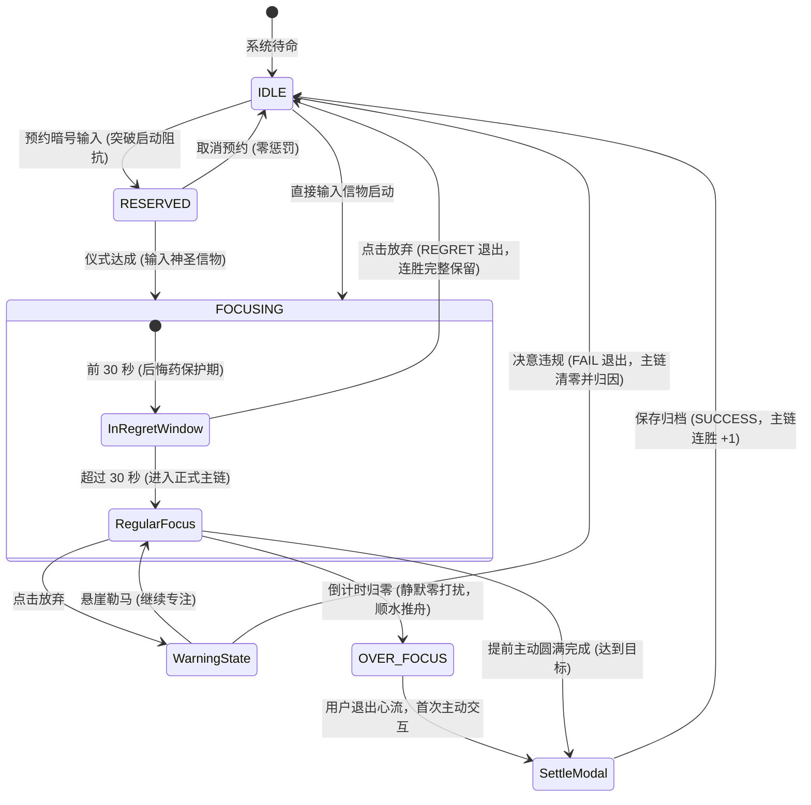

# 03-神圣座位专注流管理模块 (Sacred Seat & Flow Execution)

> **模块编号：** 03  
> **设计草案版本：** v1.0 / Draft  
> **所属系统：** Sacred Focus（国策树与神圣座位）效能工程中枢  
> **对齐协议：** CTDP 链式时延协议 (Chain Time Delay Protocol)

---

## 1. 模块概述与业务职责

### 1.1 模块定位
神圣座位是系统**微观即时冲动阻断与深度心流保护中枢**。依据知乎 Edmond 的自控工程学体系，冲动与拖延来源于启动阻抗与注意力涣散，神圣座位通过“信物仪式”、“时延协议”与“后悔药机制”构建确定性的心流屏障。

### 1.2 核心业务职责
1. **仪式化准入屏障**：必须输入或校验“神圣信物”（Sacred Token）与“预约暗号”（Reservation Signal），完成心理与物理仪式转换后方可开启专注；
2. **30 秒无痛后悔药（CTDP 协议）**：
   - 专注开启前 30 秒内允许无感撤退（状态为 `REGRET`）；
   - 绝不惩罚连胜天数（Streak），不中断主链完整性，杜绝沉没成本绑架；
3. **违规清零与严正警告**：
   - 超过 30 秒后悔药窗口点击放弃，弹出严正警告弹窗；
   - 二次确认后强制将主链连胜重置为 0，记录 `FAIL` 违规日志与失败归因；
4. **顺水推舟超时深潜（Over Focus）**：
   - 预设时长归零后，**绝不播放刺耳警报**，界面进入静默顺水推舟态继续正向计时；
   - 直至用户从深度心流中退出并首次主动点击/触屏，方冻结物理时长并触发结算；
5. **真实物理时钟保真**：
   - 全链路基于 `(Date.now() - sessionStartTime)` 计算真实毫秒差值，杜绝手机息屏、合盖休眠或切后台定时器节流造成的计时漂移；
6. **52 周效能热力图**：
   - 原生聚合展示全年度专注矩阵，量化稳态习惯沉淀。

---

## 2. 核心源文件清单

| 文件路径 | 架构角色 | 核心职责说明 |
|---|---|---|
| [`backend/src/routes/sacredSeat.ts`](file:///d:/Codes/Projects/sacred-focus/backend/src/routes/sacredSeat.ts) | 后端路由 | 座位配置增改、连胜清零、流水日志写入与热力图聚合查询 |
| [`frontend/src/stores/sacredSeat.ts`](file:///d:/Codes/Projects/sacred-focus/frontend/src/stores/sacredSeat.ts) | 前端 Store | 座位配置状态树、全屏沉浸控制与会话日志提交 |
| [`frontend/src/views/SacredSeatView.vue`](file:///d:/Codes/Projects/sacred-focus/frontend/src/views/SacredSeatView.vue) | 核心视图 | 五态专注交互状态机、全屏倒计时、唤醒结算控制器 |
| [`frontend/src/components/seat/SeatHeatmap.vue`](file:///d:/Codes/Projects/sacred-focus/frontend/src/components/seat/SeatHeatmap.vue) | UI 组件 | GitHub 风格 52 周专注密度热力图渲染组件 |
| [`frontend/src/components/seat/StreakWarningModal.vue`](file:///d:/Codes/Projects/sacred-focus/frontend/src/components/seat/StreakWarningModal.vue) | 交互弹窗 | 破坏性连胜清零二次确认警示弹窗 |
| [`frontend/src/components/seat/FocusHistoryModal.vue`](file:///d:/Codes/Projects/sacred-focus/frontend/src/components/seat/FocusHistoryModal.vue) | 交互弹窗 | 历史专注流水归档与明细复盘看板 |

---

## 3. 核心运行状态机 (CTDP 五态拓扑)



---

## 4. 关键算法与业务实现要点

### 4.1 物理时间保真与后悔药判定算法
```ts
// frontend/src/views/SacredSeatView.vue
// 1. 精确计算物理时长 (毫秒级保真)
function calculateActualSeconds(): number {
  if (sessionStartTime.value) {
    const diff = Math.round((Date.now() - sessionStartTime.value.getTime()) / 1000);
    return Math.max(1, diff);
  }
  return Math.max(1, elapsedSeconds.value);
}

// 2. 绝对物理时钟判定后悔药窗口 (息屏防节流漂移)
const isInsideRegretWindow = computed(() => {
  if (sessionStartTime.value) {
    const physicalElapsed = Math.floor((Date.now() - sessionStartTime.value.getTime()) / 1000);
    return physicalElapsed < store.config.regretWindowSeconds;
  }
  return elapsedSeconds.value < store.config.regretWindowSeconds;
});
```

### 4.2 连胜累加与违规清零结算规则
- **有效时长门槛**：会话类型为 `FOCUS` 且实际时长 $\ge 60$ 秒方可视为有效完成；
- **状态转移**：
  - `status === 'SUCCESS'`：当前主链连胜 `currentStreak += 1`，若超过历史最高则同步抬升 `maxStreak`；
  - `status === 'FAIL'`：当前主链连胜 `currentStreak = 0`；
  - `status === 'REGRET'`：主链连胜保持不变。

---

## 5. 对外接口协议清单

| 方法 | 路径 | 鉴权要求 | 描述 |
|---|---|:---:|---|
| `GET` | `/api/sacred-seat/config` | 已认证 | 获取神圣座位配置与当前连胜天数 |
| `PUT` | `/api/sacred-seat/config` | 已认证 | 更新神圣信物、预约暗号、默认时长等参数 |
| `POST` | `/api/sacred-seat/logs` | 已认证 | 提交专注流水日志并原子结算连胜天数 |
| `GET` | `/api/sacred-seat/logs` | 已认证 | 分页获取近期专注流水（默认 50 条） |
| `GET` | `/api/sacred-seat/heatmap` | 已认证 | 获取 52 周热力图日级聚合统计数据 |
| `POST` | `/api/sacred-seat/reset-streak` | 已认证 | 手动将当前主链连胜归零 |

---

## 6. 跨模块协同关系

1. **与【02-数据库模块】联动**：
   - 专注记录写入由排他事务保证，完成后调用 `incrementSystemRevision()` 推进版本号；
2. **与【05-判例法典模块】联动**：
   - 当发生破戒中断（`FAIL`）时，系统引导用户跳转至判例法典，对破坏心流的行为场景进行“下必为例”司法定性；
3. **与【07-多端同步模块】联动**：
   - 专注完成后版本号递增，在线的其他设备探针捕获后静默拉取最新连胜状态与热力图。
