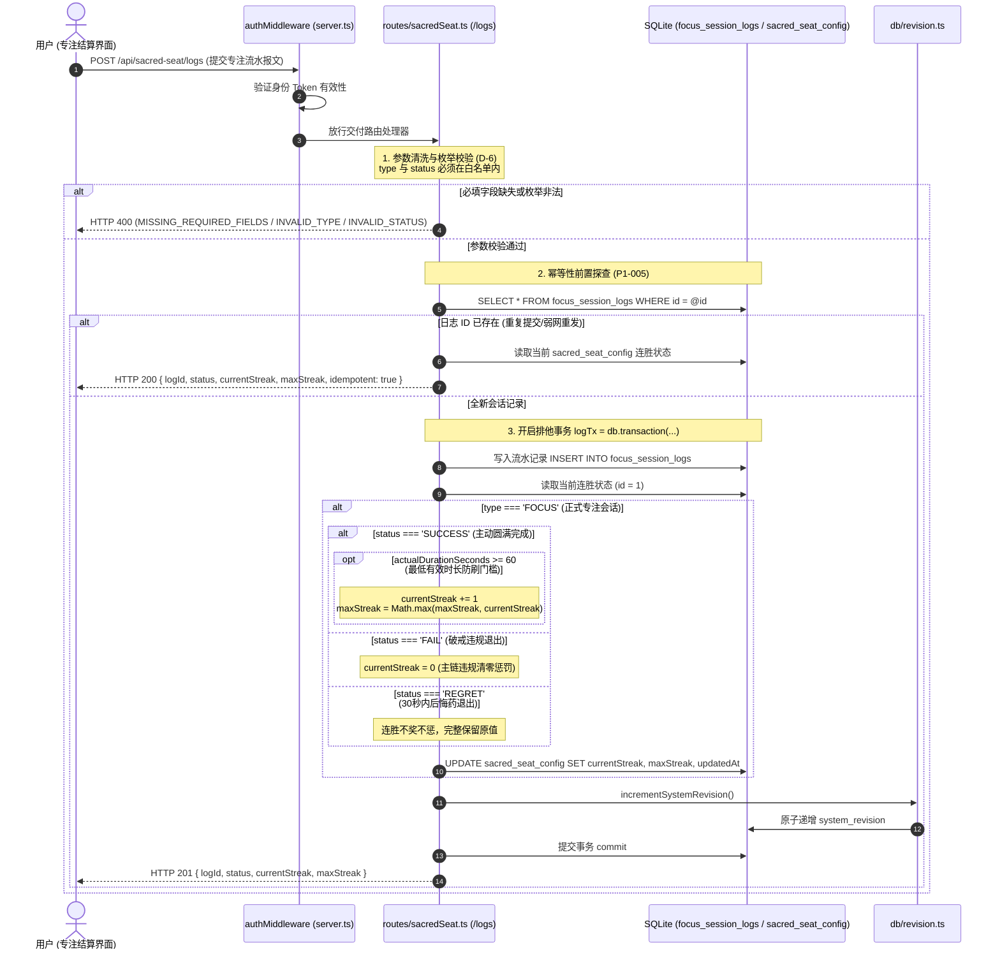

# 03-神圣座位专注流管理模块 逻辑流程与时序架构详细设计 (Draft)

> **文档定位：** 模块 03 真实源代码逻辑执行流深度审计与工程实现草案  
> **对齐版本：** v1.1 (基于 `backend/src/routes/sacredSeat.ts`、`frontend/src/stores/sacredSeat.ts`、`frontend/src/views/SacredSeatView.vue` 等实际源码)  
> **审查基准：** 全量 API 入口校验、内部时序链路、CTDP 状态机、事务边界、异常吞咽审计、四大边界条件（空值/重复提交幂等/超时心流保真/并发与连胜结算）

---

## 1. 入口与路由全量矩阵（API & 校验规则审计）

模块 03 的路由统一挂载在 [`backend/src/server.ts`](file:///d:/Codes/Projects/sacred-focus/backend/src/server.ts#L89) 的 `/api/sacred-seat` 路径前缀下。  
全模块共有 **8 个对外服务接口**。经源码审计，本模块**【未引入 Zod 校验库】**，在经历系统安全审查（`P2-006` 与 `D-6` 治理）后，全面采用了严密的**原生强类型与数值边界防御校验**。

### 1.1 API 端点与参数校验全景表

| 序号 | HTTP 方法 | 路由路径 | 接收参数 (Params / Query / Body) | 校验类型 | 实际生效的校验规则与边界约束 | 风险与缺陷标注 |
|---|---|---|---|---|---|---|
| 1 | `GET` | `/api/sacred-seat/config` | 无 | 无 | 无入参校验。查询 `sacred_seat_config WHERE id = 1`，缺失返回 `404`。 | - |
| 2 | `PUT` | `/api/sacred-seat/config` | **Body (JSON)**:<br>- `sacredToken?: string`<br>- `reservationSignal?: string`<br>- `defaultFocusDuration?: number`<br>- `regretWindowSeconds?: number`<br>- `currentStreak?: number`<br>- `maxStreak?: number` | 原生类型与边界强校验 (P2-006) | 1. 字符串防空与超长：`typeof === 'string' && trim().length > 0 && length <= 128`<br>2. 专注时长：`Number.isInteger(dur) && dur >= 1 && dur <= 1440` (1~1440分钟)<br>3. 后悔药窗口：`Number.isInteger(reg) && reg >= 5 && reg <= 300` (5~300秒)<br>4. 连胜非负整数：`Number.isInteger && val >= 0`<br>5. 连胜范围约束：`targetCurrentStreak <= targetMaxStreak`。 | **【未做 Zod 校验】**（采用等效原生防御）。各字段非法时抛出对应的 `400 INVALID_*` 业务错误。 |
| 3 | `POST` | `/api/sacred-seat/reset-streak` | 无 | 无 | 无入参校验。原子清空主链连胜 `currentStreak = 0`。 | - |
| 4 | `GET` | `/api/sacred-seat/logs` | **Query**:<br>- `limit?: string` | 原生整数转换与配额截断 (P2-006) | `parseInt(String(req.query.limit \|\| '50'), 10)`：非数或 `< 1` 兜底为 50，上限截断为 `Math.min(rawLimit, 500)`。 | **【未做 Zod 校验】**。防范大分页把内存打满。 |
| 5 | `GET` | `/api/sacred-seat/logs/export` | 无 | 无 | 无入参校验。导出全量流水日志。 | - |
| 6 | `POST` | `/api/sacred-seat/logs/import` | **Body (JSON)**:<br>`FocusSessionLog[]` 或 `{ logs: FocusSessionLog[] }` | 原生结构识别与循环清洗过滤 | 1. 结构解包：兼容数组或 `{ logs: [] }`<br>2. 非空与数组校验：`if (!rawLogs \|\| !Array.isArray(rawLogs))` 返回 `400`<br>3. 元素白名单清洗：`if (!log.id \|\| !log.type \|\| !log.startTime \|\| !log.status) continue`。 | **【未做 Zod 校验】**<br>通过 `ON CONFLICT(id) DO UPDATE` 幂等合并。 |
| 7 | `GET` | `/api/sacred-seat/heatmap` | **Query**:<br>- `days?: string` | 原生类型解析与范围约束 | 1. `days === 'all' \|\| '0'`：全周期聚合查询（`days = 0`）<br>2. 默认值：365 天<br>3. 最大范围：`Math.min(parsed, 3650)`（最多 10 年）。 | **【未做 Zod 校验】**。防范 SQL 拼接与畸形参数。 |
| 8 | `POST` | `/api/sacred-seat/logs` | **Body (JSON)**:<br>- `id: string`<br>- `type: 'FOCUS' \| 'RESERVATION'`<br>- `startTime: string`<br>- `endTime: string`<br>- `targetDurationMinutes?: number`<br>- `actualDurationSeconds?: number`<br>- `status: 'SUCCESS' \| 'FAIL' \| 'REGRET'`<br>- `focusContent?: string`<br>- `failureReason?: string`<br>- `note?: string` | 原生必填与枚举强校验 (D-6) + 幂等前置核验 | 1. 必填字段校验：`if (!id \|\| !type \|\| !startTime \|\| !endTime \|\| !status)` 返回 `400 MISSING_REQUIRED_FIELDS`<br>2. 类型枚举白名单：`VALID_LOG_TYPES.includes(type)`，非法返回 `400 INVALID_TYPE`<br>3. 状态枚举白名单：`VALID_LOG_STATUSES.includes(status)`，非法返回 `400 INVALID_STATUS`<br>4. 幂等拦截 (P1-005)：若 `id` 已存在直接返回 `200`，不重复结算。 | **【未做 Zod 校验】**（采用等效原生防御）。 |

---

## 2. 内部执行时序与生命周期审计

### 2.1 全链路执行时序模型

模块 03 驱动自控工程学的 CTDP（链式时延协议）专注闭环，在专注结束保存流水时，执行**“幂等前置核查”**与**“日志落库 + 连胜结算 + 版本自增”原子事务**：



### 2.2 核心环节详细剖析

#### 1. 前端物理时钟保真与顺水推舟超时深潜 (Physical Clock & Over Focus)
在 [`frontend/src/views/SacredSeatView.vue:L81-L98`](file:///d:/Codes/Projects/sacred-focus/frontend/src/views/SacredSeatView.vue#L81-L98) 中：
- **物理时钟保真**：
  ```ts
  function calculateActualSeconds(): number {
    if (sessionStartTime.value) {
      const diff = Math.round((Date.now() - sessionStartTime.value.getTime()) / 1000);
      return Math.max(1, diff);
    }
    return Math.max(1, elapsedSeconds.value);
  }
  ```
  不单纯依赖 `setInterval(tick, 1000)`，而是每次计算均与会话物理起点 `sessionStartTime` 求绝对时间差，**彻底消除移动端息屏休眠、后台节流造成的时长缩水漂移**；
- **顺水推舟超时深潜（Over Focus）**：
  当预设倒计时到达 00:00 时，系统**绝不播放刺耳警报**，不打断深度心流状态，界面无缝转为正向计时；直至用户主动点击或触屏时，冻结实际物理时长并唤起结算弹窗。

#### 2. 后悔药窗口判定与主链惩罚机制 (CTDP 30秒窗口)
- **后悔药保护期（$\le 30$ 秒）**：
  计算 `physicalElapsed < config.regretWindowSeconds`。若在 30 秒内点击放弃，状态记为 `REGRET`，后端事务结算时**不增加连胜，亦绝不清零连胜**；
- **破戒违规（$> 30$ 秒）**：
  点击放弃时弹出 `StreakWarningModal` 严正警示；若用户二次确认放弃，状态记为 `FAIL`，进入结算事务执行 `currentStreak = 0`，主链彻底归零，并强制记录 `failureReason`。

#### 3. 最低有效时长防刷分门槛 (Minimum Duration Barrier)
在 [`backend/src/routes/sacredSeat.ts:L356-L362`](file:///d:/Codes/Projects/sacred-focus/backend/src/routes/sacredSeat.ts#L356-L362) 中：
```ts
if (status === 'SUCCESS') {
  // 最低有效时长校验：至少专注满 60 秒方可累积神圣座位连胜，防止异常刷分
  if (safeActualDuration >= 60) {
    newCurrentStreak += 1;
    if (newCurrentStreak > newMaxStreak) {
      newMaxStreak = newCurrentStreak;
    }
  }
}
```
即便客户端通过脚本直接调用 API 伪造 `status = SUCCESS`，若 `actualDurationSeconds < 60`，后端事务**拒绝增加连胜**，捍卫自控工程学的客观真实性。

#### 4. 数据库事务开启与提交点 (Transactions)
- **`POST /api/sacred-seat/logs` 会话结算事务**：
  - 开启：[`sacredSeat.ts:L334`](file:///d:/Codes/Projects/sacred-focus/backend/src/routes/sacredSeat.ts#L334)（`const logTx = db.transaction(() => { ... })`）；
  - 操作：写入流水日志 $\rightarrow$ 计算连胜 $\rightarrow$ 更新座位配置 $\rightarrow$ 递增全局版本号；
  - 提交：`logTx()` 执行成功；若流水写入报错或更新配置失败，整个事务原子回滚，连胜不发生误扣。
- **`POST /api/sacred-seat/logs/import` 批量导入事务**：
  - 开启：[`sacredSeat.ts:L213`](file:///d:/Codes/Projects/sacred-focus/backend/src/routes/sacredSeat.ts#L213)（`const importTx = db.transaction(...)`）；
  - 操作：循环执行预编译的 `upsertStmt.run(...)` 批量幂等落库，最后自增版本号。

### 2.3 异常吞咽审计（是否存在 Try-Catch 吞异常？）

1. **`POST /api/sacred-seat/logs`（会话提交）**：
   ```ts
   try {
     logTx();
     res.status(201).json({ ... });
   } catch (err: any) {
     console.error('Failed to save session log:', err);
     res.status(500).json({
       error: 'LOG_SAVE_FAILED',
       message: '专注会话日志保存失败',
       details: err?.message || String(err)
     });
   }
   ```
   - **审计结论**：**未吞掉异常**。捕获底层写入错误后向控制台输出错误栈，并向客户端规范抛出 `500 LOG_SAVE_FAILED`。
2. **`POST /api/sacred-seat/logs/import`（批量导入）**：
   - 包含显式 `try-catch`，捕获异常后返回 `500 Failed to import logs: ...`，**未吞掉异常**。
3. **其余接口（`GET /config`, `PUT /config`, `POST /reset-streak`, `GET /logs`, `GET /heatmap`）**：
   - **完全未包裹 try-catch**！未处理异常直接冒泡至全局中间件，**不存在掩盖或静默吞掉异常的代码**。

### 2.4 HTTP 状态码与业务错误码速查表

| HTTP 状态码 | 业务错误代码 (`error`) | 触发代码位置 | 场景说明 |
|---|---|---|---|
| `400 Bad Request` | `INVALID_SACRED_TOKEN` | `sacredSeat.ts:L44` | 神圣信物为空或超过 128 字符 |
| `400 Bad Request` | `INVALID_RESERVATION_SIGNAL` | `sacredSeat.ts:L48` | 预约暗号为空或超过 128 字符 |
| `400 Bad Request` | `INVALID_FOCUS_DURATION` | `sacredSeat.ts:L54` | 默认专注时长非有效整数或不在 [1, 1440] 分钟内 |
| `400 Bad Request` | `INVALID_REGRET_WINDOW` | `sacredSeat.ts:L61` | 后悔药窗口非有效整数或不在 [5, 300] 秒内 |
| `400 Bad Request` | `INVALID_CURRENT_STREAK` | `sacredSeat.ts:L69` | 当前连胜天数非有效非负整数 |
| `400 Bad Request` | `INVALID_MAX_STREAK` | `sacredSeat.ts:L73` | 最大连胜天数非有效非负整数 |
| `400 Bad Request` | `INVALID_STREAK_RANGE` | `sacredSeat.ts:L77` | 尝试设置当前连胜大于历史最大连胜 |
| `400 Bad Request` | `MISSING_REQUIRED_FIELDS` | `sacredSeat.ts:L301` | 提交专注日志时缺少 `id`, `type`, `startTime`, `endTime`, `status` 等必填字段 |
| `400 Bad Request` | `INVALID_TYPE` | `sacredSeat.ts:L305` | 会话类型非 `'FOCUS'` 亦非 `'RESERVATION'` |
| `400 Bad Request` | `INVALID_STATUS` | `sacredSeat.ts:L309` | 会话状态非 `'SUCCESS'`、`'FAIL'` 或 `'REGRET'` |
| `404 Not Found` | `Config not found` | `sacredSeat.ts:L18`<br>`sacredSeat.ts:L39` | 数据库 `sacred_seat_config` 表中不存在 `id = 1` 记录 |
| `500 Internal Server Error` | `LOG_SAVE_FAILED` | `sacredSeat.ts:L392` | 专注日志落库或连胜结算事务发生底层数据库错误 |

---

## 3. 边界处理专项深度审计

依据实际源代码，严密复核**空值**、**重复提交与幂等**、**超时心流保真**、**并发与连胜结算**四大边界。凡代码未做判断的，显式标注为 `【未做判断】`。

### 3.1 空值处理 (Null / Undefined / Empty)

#### (1) 配置表单字段按需局部更新
在 [`PUT /api/sacred-seat/config`](file:///d:/Codes/Projects/sacred-focus/backend/src/routes/sacredSeat.ts#L34-L97) 中：
- 每个字段均带有严格的 `!== undefined` 分支守卫；
- 若某字段未传，优雅保留原数据库字段值（如 `currentStreak: targetCurrentStreak`）；
- 对字符串执行 `.trim()` 清洗，拦截纯空白字符。

#### (2) 流水日志可选字段空值清洗
在 [`POST /api/sacred-seat/logs`](file:///d:/Codes/Projects/sacred-focus/backend/src/routes/sacredSeat.ts#L343-L345) 中：
```ts
focusContent: focusContent || null,
failureReason: failureReason || null,
note: note || null
```
- **审计结论**：健全。空字符串或 undefined 统一转为 SQL `null` 存储，杜绝脏字符串污染。

#### (3) 列表分页参数空值与异常值防爆
在 [`GET /api/sacred-seat/logs:L133-L134`](file:///d:/Codes/Projects/sacred-focus/backend/src/routes/sacredSeat.ts#L133-L134) 中：
```ts
const rawLimit = parseInt(String(req.query.limit || '50'), 10);
const limit = isNaN(rawLimit) || rawLimit < 1 ? 50 : Math.min(rawLimit, 500);
```
- **审计结论**：健全。空值默认 50，非法字符兜底 50，超过 500 强制截断至 500。

---

### 3.2 重复提交与日志幂等性处理 (Idempotency)

#### (1) 会话日志提交幂等性保障 (P1-005 治理项)
移动端网络极易在请求发出后因信号抖动触发重复重发，或者用户短时间内多次点击结算按钮。源码在 [`sacredSeat.ts:L313-L323`](file:///d:/Codes/Projects/sacred-focus/backend/src/routes/sacredSeat.ts#L313-L323) 实现了严格的幂等拦截：
```ts
const existing = db.prepare('SELECT * FROM focus_session_logs WHERE id = ?').get(id);
if (existing) {
  const currentConfig = db.prepare('SELECT currentStreak, maxStreak FROM sacred_seat_config WHERE id = 1').get();
  return res.status(200).json({
    logId: existing.id,
    status: existing.status,
    currentStreak: currentConfig?.currentStreak ?? 0,
    maxStreak: currentConfig?.maxStreak ?? 0,
    idempotent: true
  });
}
```
- **核心价值**：
  - 若相同 `id` 的记录已被持久化，**绝不执行二次插入（防 SQLite UNIQUE 约束报错 500）**；
  - **绝不重复对连胜天数做 `+1` 累加**；
  - 返回状态码 `200` 并明确携带 `idempotent: true` 标记，前端无缝感知并平稳过渡。

#### (2) 批量导入流水幂等合并
- 使用 `INSERT INTO focus_session_logs ... ON CONFLICT(id) DO UPDATE SET ...`，多次导入相同备份文件具备严格幂等性。

---

### 3.3 超时管理与心流保真 (Timeout & Flow Preservation)

#### (1) 绝对物理时钟判定后悔药
- 传统方案使用 `elapsedSeconds < 30`，若手机在开始专注第 5 秒时息屏休眠 10 分钟，息屏期间 JS 定时器挂起，点亮屏幕时 `elapsedSeconds` 可能仍然停留在第 5 秒，导致后悔药窗口被恶意卡出。
- **本系统解法**：基于 `Date.now() - sessionStartTime.getTime()`，哪怕手机休眠 1 小时，唤醒瞬间计算出的物理时钟已超过 3600 秒，**后悔药窗口瞬间关闭，杜绝利用休眠作弊逃避主链惩罚**。

#### (2) 顺水推舟超时深潜 (Over Focus)
- 预设时长倒数完毕后不发声响，正向记录额外心流时长，直至用户首次主动交互才做结算。
- **【未做最大心流时长硬性超时强断判断】**：若用户开启专注后忘记停止并离开电脑一整天，计时器将持续正向累加至数十小时。建议后续补充最长 8 小时强制自动收敛机制。

---

### 3.4 并发与单行配置锁定 (Concurrency & Config Locking)

#### (1) 单行配置表行锁
- `sacred_seat_config` 表有 `CHECK(id = 1)` 强制约束；
- 更新配置与重置连胜均定向更新 `WHERE id = 1`；
- 在 SQLite WAL 模式下，写事务自动获取单行排他锁，并发写操作串行执行。

#### (2) 连胜计算与落库原子一致性
- 流水写入与连胜计算完全被封装在同一个 `logTx` 事务内部；
- 读出 `currentStreak` $\rightarrow$ 内存计算 $\rightarrow$ 写回 `sacred_seat_config` 全程受到事务写锁保护，**彻底杜绝两个并发会话结算导致的连胜覆盖脏写**。

#### (3) 多端协同推进
- 无论配置修改、连胜重置还是流水写入，事务成功后统一触发：
  ```ts
  incrementSystemRevision();
  ```
- 协同保证局域网内的其他协同终端探针在下次轮询时，自动刷新连胜看板与热力图。

---

## 4. 架构改进建议与演化待办 (Actionable Backlog)

1. **超长心流自动切断保护 (Over-Focus Ceiling)**：
   - 当实际专注时长超过 8 小时（480 分钟）未交互时，自动标记并封顶，防止因用户遗忘导致单次记录产生数百小时异常值；
2. **破戒归因快速联动判例法典**：
   - 提交 `status === 'FAIL'` 日志时，支持前端直接携带 `createCase: true` 参数，一次性将 `failureReason` 作为新判例行为自动提交，减少用户二次录入心智负担；
3. **连胜跨天结算审计规则强化**：
   - 当前连胜主要基于单次成功专注累加，后续可与 `04-国策树` 的每日 04:00 业务日引擎深度打通，支持“每日必须至少完成 1 次有效专注方可延续主链”的更严格自控契约。
