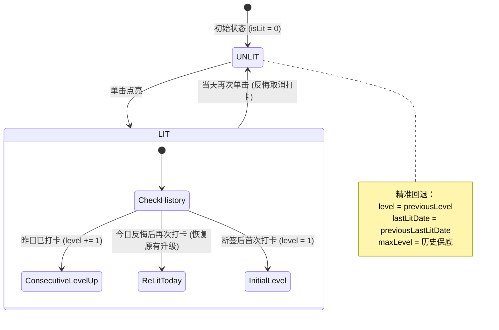
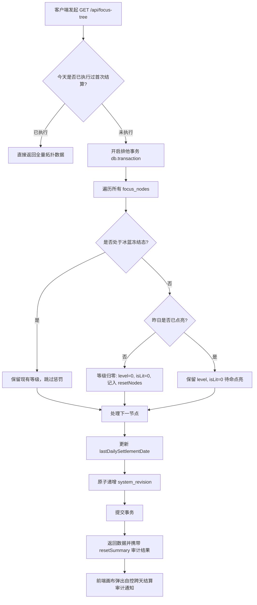

# 04-国策树拓扑与规范引擎模块 (Focus Tree & RSIP Topology)

> **模块编号：** 04  
> **设计草案版本：** v1.0 / Draft  
> **所属系统：** Sacred Focus（国策树与神圣座位）效能工程中枢  
> **对齐协议：** RSIP 递归稳态迭代协议 (Recursive Steady-state Iteration Protocol)

---

## 1. 模块概述与业务职责

### 1.1 模块定位
国策树拓扑与规范引擎是系统**宏观行为指引与全天候自控习惯演化中枢**。系统摒弃了孤立无序的 Todo List，将日常行为抽象为类似《钢铁雄心》的有向无环拓扑图（DAG），并以凌晨 04:00 业务日为脉搏驱动连续打卡升星与断签归零。

### 1.2 核心业务职责
1. **双模交互与内存沙箱隔离**：
   - **展示模式 (View Mode，默认)**：防误触保护，单击打卡点亮，双击沉浸查看四维规范卡，画布平移悬停智能锁定；
   - **编辑模式 (Edit Mode)**：前端纯内存沙盒排版，未点击“保存排版”前绝不污染持久层；支持撤销/重做（`Ctrl+Z`/`Ctrl+Y`）；
2. **DAG 拓扑交互引擎**：
   - 基于 `@vue-flow/core` 构建，提供 8 向缩放分组外框（`FocusGroupFrame`）、正交折线避障连线（`OrthogonalEdge`）与两步点击连桩（Click-to-Connect）；
   - 支持自由流转说明标签（`FocusLabelCard`）；
3. **凌晨 04:00 自控跨天结算状态机**：
   - 每日首次上线自动核对打卡连续性：昨日断签节点当前等级归零（保留历史最高等级 `maxLevel`）；
   - 处于“冰蓝冻结”保全态的节点免受断签归零惩罚；
4. **单点点亮与防作弊反悔状态机**：
   - 昨日已点亮，今日打卡：等级 `level + 1`，抬升 `maxLevel`；
   - 当天反悔取消打卡：精准回退打卡前保存的 `previousLevel` 与 `previousLastLitDate`，彻底杜绝断签后当天打卡再反悔刷白洗数据的作弊漏洞；
5. **集中级联删除审计**：
   - 删除分组或节点时，前置执行 Diff 审计，提示受影响的连线与孤儿节点，由用户确认后原子提交；
6. **基准排版与时空排序（FocusListView）**：
   - 类 Excel 复合排序，按晨曦唤醒、白昼蓄力、暮色收拢等时机分组，无时间节点智能沉底。

---

## 2. 核心源文件清单

| 文件路径 | 架构角色 | 核心职责说明 |
|---|---|---|
| [`backend/src/routes/focusTree.ts`](file:///d:/Codes/Projects/sacred-focus/backend/src/routes/focusTree.ts) | 后端路由 | 国策树全量存取、单点点亮状态机与列表排序维护 |
| [`backend/src/db/queries/focusTree.ts`](file:///d:/Codes/Projects/sacred-focus/backend/src/db/queries/focusTree.ts) | 后端持久化 | 预编译 `upsertFocusNode` 与全量拓扑查询语句 |
| [`backend/src/db/queries/settlement.ts`](file:///d:/Codes/Projects/sacred-focus/backend/src/db/queries/settlement.ts) | 核心算法引擎 | 每日 04:00 首次上线断签结算排他事务引擎 |
| [`frontend/src/stores/focusTree.ts`](file:///d:/Codes/Projects/sacred-focus/frontend/src/stores/focusTree.ts) | 前端 Store | 节点/连线/分组响应式状态树、编辑态标记与历史栈 |
| [`frontend/src/views/FocusCanvasView.vue`](file:///d:/Codes/Projects/sacred-focus/frontend/src/views/FocusCanvasView.vue) | 核心画布视图 | DAG 拓扑画布、正交连线交互与两步连接桩调度器 |
| [`frontend/src/views/FocusListView.vue`](file:///d:/Codes/Projects/sacred-focus/frontend/src/views/FocusListView.vue) | 核心列表视图 | 时空排序列表、全生命周期四维规范增删改 |
| [`frontend/src/components/canvas/FocusNodeCard.vue`](file:///d:/Codes/Projects/sacred-focus/frontend/src/components/canvas/FocusNodeCard.vue) | UI 组件 | 国策节点卡片（等级进度条、冰蓝冻结态显示） |
| [`frontend/src/components/canvas/FocusGroupFrame.vue`](file:///d:/Codes/Projects/sacred-focus/frontend/src/components/canvas/FocusGroupFrame.vue) | UI 组件 | 8 向缩放分组外框框架 |
| [`frontend/src/components/canvas/OrthogonalEdge.vue`](file:///d:/Codes/Projects/sacred-focus/frontend/src/components/canvas/OrthogonalEdge.vue) | UI 组件 | 曼哈顿正交避障折线连线组件 |
| [`frontend/src/components/canvas/NodeSpecModal.vue`](file:///d:/Codes/Projects/sacred-focus/frontend/src/components/canvas/NodeSpecModal.vue) | 交互弹窗 | 四维规范卡沉浸查阅器（指令/破戒条件/效益机制/补充） |
| [`frontend/src/components/canvas/DeletionAuditModal.vue`](file:///d:/Codes/Projects/sacred-focus/frontend/src/components/canvas/DeletionAuditModal.vue) | 交互弹窗 | 集中删除与级联拓扑影响审计弹窗 |

---

## 3. 核心业务状态机机制

### 3.1 节点单点点亮与反悔取消状态机


### 3.2 凌晨 04:00 每日结算流转


---

## 4. 四维规范卡实体结构定义

国策节点严格遵循自控工程学的**四维规范卡体系**，由以下字段构成：
```ts
// specCard 数据规范
export interface SpecCard {
  instruction: string;       // 1. 操作指令：明确无歧义的微观行为步骤
  failCondition: string;     // 2. 破戒条件：红线触发行为与违规界定
  benefitMechanism: string;  // 3. 效益机制：心理犒赏与正向自控反馈
  notes?: string;            // 4. 补充说明：外部依赖或环境限制
}
```

---

## 5. 对外接口协议清单

| 方法 | 路径 | 描述 |
|---|---|---|
| `GET` | `/api/focus-tree` | 获取当前完整国策树（附带每日跨天审计结算） |
| `PUT` | `/api/focus-tree` | 全量更新节点/分组/连线/标签（带 CAS expectedRevision 乐观锁） |
| `POST` | `/api/focus-tree/nodes/:id/toggle` | 触发单个国策节点的今日打卡点亮或反悔撤销 |
| `PUT` | `/api/focus-tree/nodes/reorder` | 保存国策列表的时空基准排序 |
| `POST` | `/api/focus-tree/nodes` | 新增单个国策节点 |
| `PUT` | `/api/focus-tree/nodes/:id` | 修改单个国策节点属性与规范卡 |
| `DELETE` | `/api/focus-tree/nodes/:id` | 删除单个国策节点（自动解除分组与连线） |

---

## 6. 跨模块协同关系

1. **与【02-数据库模块】联动**：
   - 依赖 `dateUtils.ts` 的业务日算法判定昨日/今日边界；
   - 任何排版覆盖或打卡均原子自增 `system_revision`；
2. **与【06-版本演化模块】联动**：
   - 5 槽位版本快照生成时，完整封存当前全量国策树拓扑；
   - 快照回滚时原子覆盖国策树四表；
3. **与【07-多端协同探针】联动**：
   - 画布通过 `watch(isEditMode)` 与 store 同步 `isEditing` 状态，指示探针挂起静默拉取，防冲掉用户未保存的排版成果。
