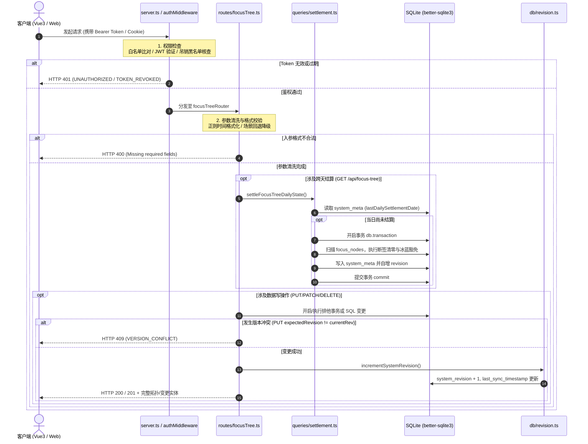

# 04-国策树拓扑与规范引擎模块 逻辑流程与时序架构详细设计 (Draft)

> **文档定位：** 模块 04 真实源代码逻辑执行流深度审计与工程实现草案  
> **对齐版本：** v1.1 (基于 `backend/src/routes/focusTree.ts`、`settlement.ts`、`dateUtils.ts` 等实际源码)  
> **审查基准：** 全量 API 入口校验、内部时序链路、事务边界、异常吞咽审计、四大边界条件（空值/重复点亮/超时/并发）

---

## 1. 入口与路由全量矩阵（API & 校验规则审计）

模块 04 的路由根路径统一挂载在 [`backend/src/server.ts`](file:///d:/Codes/Projects/sacred-focus/backend/src/server.ts#L91) 的 `/api/focus-tree` 前缀下。  
模块内共有 **11 个对外服务接口**，当前全模块**【未引入 Zod 校验库】**，全部依托 TypeScript 编译期强转与运行时原生 `if` 逻辑判定。

### 1.1 API 端点与参数校验全景表

| 序号 | HTTP 方法 | 路由路径 | 接收参数 (Params / Query / Body) | 校验类型 | 实际生效的校验规则与边界约束 | 风险与缺陷标注 |
|---|---|---|---|---|---|---|
| 1 | `GET` | `/api/focus-tree` | 无 | 无 | 无入参校验。前置经过 `/api` 全局鉴权。 | - |
| 2 | `POST` | `/api/focus-tree/reset-settlement-audit` | 无 | 无 | 无入参校验。仅用于管理/联调重置今日审计标记。 | - |
| 3 | `PUT` | `/api/focus-tree` | **Body (JSON)**:<br>- `nodes?: FocusNode[]`<br>- `edges?: FocusEdge[]`<br>- `groups?: FocusGroup[]`<br>- `labels?: FocusLabel[]`<br>- `expectedRevision?: number` | 原生条件校验 | `typeof expectedRevision === 'number'`：验证版本号是否为数值并执行 CAS 比对。<br>各数组存在性：`if (groups)`, `if (nodes)`, `if (edges)`, `if (labels)`。 | **【未做 Zod 校验】**<br>**【未做数组元素深层结构校验】**（仅做 TS 强转，非数组或元素字段非法会引发 SQLite 运行时异常）。 |
| 4 | `PATCH` | `/api/focus-tree/nodes/:id/toggle-lit` | **Params**:<br>- `id: string`<br>**Body**: 无 | 原生 SQL 校验 | 原生 SQL 存在性校验：`SELECT ... WHERE id = ?`。<br>若不存在返回 `404`。 | **【未做 Zod 校验】**<br>注意：实际源码方法为 `PATCH` 且路径为 `/toggle-lit`（非文档偶见的 `POST /toggle`）。 |
| 5 | `PUT` | `/api/focus-tree/nodes/reorder` | **Body (JSON)**:<br>- `nodeIds: string[]` | 原生类型校验 | `if (!Array.isArray(nodeIds))`：必须为数组，否则返回 `400`。 | **【未做 Zod 校验】**<br>**【未校验元素类型与 ID 存在性】**（传入 `[null]` 或不存在的 ID 不会报错但静默跳过）。 |
| 6 | `POST` | `/api/focus-tree/nodes` | **Body (JSON)**:<br>`FocusNode` 完整对象 | 原生非空校验 | `if (!n.id \|\| !n.code \|\| !n.name)`：校验核心三要素非空，否则返回 `400`。 | **【未做 Zod 校验】**<br>**【未校验 code 唯一性】**，直接覆盖已有 ID（`INSERT OR REPLACE`）。 |
| 7 | `PUT` | `/api/focus-tree/nodes/:id` | **Params**:<br>- `id: string`<br>**Body (JSON)**:<br>`Partial<FocusNode>` | 原生正则与非空校验 | 1. 存在性：`SELECT ... WHERE id = ?` -> `404`<br>2. 时间正则：`/^(\d{1,2})[:：](\d{2})$/` 解析格式。 | **【未做 Zod 校验】**<br>**【未做 level/maxLevel 数值合法性与上限约束】**。 |
| 8 | `DELETE` | `/api/focus-tree/nodes/:id` | **Params**:<br>- `id: string` | 原生执行受影响行数校验 | 检查事务返回值 `result.changes > 0`，若无影响行则返回 `404`。 | **【未做 Zod 校验】** |
| 9 | `POST` | `/api/focus-tree/groups` | **Body (JSON)**:<br>`FocusGroup` 完整对象 | 原生非空校验 | `if (!g.id \|\| !g.name \|\| !g.themeColor)`：校验三要素非空，否则返回 `400`。 | **【未做 Zod 校验】**<br>**【未做 themeColor 颜色格式校验】**。 |
| 10 | `PUT` | `/api/focus-tree/groups/:id` | **Params**:<br>- `id: string`<br>**Body (JSON)**:<br>`Partial<FocusGroup>` | 原生 SQL 校验 | 存在性：`SELECT ... WHERE id = ?` -> `404`。 | **【未做 Zod 校验】** |
| 11 | `DELETE` | `/api/focus-tree/groups/:id` | **Params**:<br>- `id: string`<br>**Query**:<br>- `deleteChildren?: string` | 原生布尔比对 | `deleteChildren = req.query.deleteChildren === 'true'`。 | **【未做 Zod 校验】**<br>**【未做分组 ID 存在性检查】**（ID 不存在也返回 200）。 |

---

## 2. 内部执行时序与生命周期审计

### 2.1 全链路执行时序模型

国策树内部流转严格依照四步闭环推进：  
`全局身份鉴权与限流` $\rightarrow$ `入参清洗与格式归一化` $\rightarrow$ `业务日状态机/排他事务` $\rightarrow$ `版本号原子自增与响应`



### 2.2 核心环节详细剖析

#### 1. 权限检查 (Auth Checking)
- **前置挂载点**：在 [`backend/src/server.ts`](file:///d:/Codes/Projects/sacred-focus/backend/src/server.ts#L72) 中，通过 `app.use('/api', authMiddleware)` 实现全量拦截。
- **白名单规则**：[`backend/src/middleware/auth.ts`](file:///d:/Codes/Projects/sacred-focus/backend/src/middleware/auth.ts#L9-L14) 中仅 `/health`, `/auth/login`, `/auth/status`, `/sync/status` 免鉴权。`/api/focus-tree` 下的所有接口均**必须鉴权**。
- **凭证提取**：优先从 `Authorization: Bearer <token>` 提取，备选 `req.cookies['sf_token']` 或 `x-access-token`。
- **防时序攻击**：对配置的静态 `APP_ACCESS_TOKEN`，使用 `crypto.timingSafeEqual` 进行常量时间比对。
- **吊销检查**：解析 JWT payload 中的 `jti`，查询 `system_meta` 表中是否存在未过期的 `revoked_jti:<jti>`。

#### 2. 参数清洗与归一化 (Sanitization & Normalization)
- **时间正则清洗**：
  在 [`upsertFocusNode`](file:///d:/Codes/Projects/sacred-focus/backend/src/db/queries/focusTree.ts#L42-L50) 与 [`PUT /nodes/:id`](file:///d:/Codes/Projects/sacred-focus/backend/src/routes/focusTree.ts#L276-L295) 中，同时兼容中英文冒号：
  ```ts
  const match = triggerTime.match(/^(\d{1,2})[:：](\d{2})$/);
  if (match) {
    const h = parseInt(match[1], 10);
    const m = parseInt(match[2], 10);
    finalTime = `${String(h).padStart(2, '0')}:${String(m).padStart(2, '0')}`;
    hasExactTime = 1;
    timeValueMinutes = h * 60 + m; // 换算为当日 00:00 起绝对分钟数，用于基准列表排序
  } else {
    finalTime = null;
    hasExactTime = 0;
    timeValueMinutes = null;
  }
  ```
- **触发场景降级链**：
  ```ts
  const finalScene = node.triggerScene?.trim() || finalTime || '全天候';
  ```
- **坐标与尺寸兜底**：
  `position?.x ?? 0`, `position?.y ?? 0`, `size?.width ?? 320`, `size?.height ?? 200`。
- **业务日算法对齐**：
  调用 [`getBusinessDay()`](file:///d:/Codes/Projects/sacred-focus/backend/src/db/dateUtils.ts#L7-L15)，以东八区 UTC+8 为基准，减去凌晨 04:00 阈值（净偏移 +4h），解耦服务器宿主机本地物理时区。

#### 3. 数据库 SQL/ORM 操作与事务边界
底层采用同步 SQLite 引擎 `better-sqlite3`：
- **`GET /api/focus-tree` 事务边界**：
  调用 `settleFocusTreeDailyState()`，事务开启于 [`settlement.ts:L21`](file:///d:/Codes/Projects/sacred-focus/backend/src/db/queries/settlement.ts#L21)（`const settleTx = db.transaction(...)`）。函数执行成功自动提交；若中途出错自动滚回。
- **`PUT /api/focus-tree` 全量同步事务边界**：
  事务开启于 [`focusTree.ts:L54`](file:///d:/Codes/Projects/sacred-focus/backend/src/routes/focusTree.ts#L54)（`const syncTx = db.transaction(...)`），按顺序执行：
  1. `DELETE FROM focus_groups` $\rightarrow$ 批量 `INSERT INTO focus_groups`
  2. `DELETE FROM focus_nodes` $\rightarrow$ 循环调用预编译语句 `upsertFocusNode` 批量写入
  3. `DELETE FROM focus_edges` $\rightarrow$ 批量 `INSERT INTO focus_edges`
  4. `DELETE FROM focus_labels` $\rightarrow$ 批量 `INSERT INTO focus_labels`
  5. 内部调用 `incrementSystemRevision()`
  - 提交点：执行 `syncTx()` 返回；
  - 回滚点：任何外键冲突、空值违反均触发 `syncTx` 自动全量回滚。
- **`PUT /nodes/reorder` 事务边界**：
  开启于 [`focusTree.ts:L236`](file:///d:/Codes/Projects/sacred-focus/backend/src/routes/focusTree.ts#L236)（`const reorderTx = db.transaction(...)`），批量更新 `sortOrder`。
- **`DELETE /nodes/:id` 事务边界**：
  开启于 [`focusTree.ts:L353`](file:///d:/Codes/Projects/sacred-focus/backend/src/routes/focusTree.ts#L353)，原子完成连线清理与节点物理删除。
- **`DELETE /groups/:id` 事务边界**：
  开启于 [`focusTree.ts:L437`](file:///d:/Codes/Projects/sacred-focus/backend/src/routes/focusTree.ts#L437)，原子完成子节点级联清理/解绑、外框连线清理与外框删除。
- **`PATCH /nodes/:id/toggle-lit` 事务点**：
  **【无多语句显式事务】**。采用单条参数化 `UPDATE focus_nodes SET ... WHERE id = @id` 语句，依赖 SQLite 单语句隐式原子事务，紧随其后独立调用 `incrementSystemRevision()` 独立事务。

### 2.3 异常吞咽审计（是否存在 Try-Catch 吞异常？）

对模块 04 所有代码进行逐行审计：
1. **`PUT /api/focus-tree`（全量保存）**：
   - 包含显式 `try-catch`：
     ```ts
     try {
       syncTx();
       res.json({ message: 'Focus tree synchronized successfully', ... });
     } catch (err: any) {
       console.error('Focus tree sync error:', err);
       res.status(500).json({
         error: 'SYNC_TRANSACTION_FAILED',
         message: '国策树同步事务执行失败，数据库约束或数据格式异常',
         details: err?.message || String(err)
       });
     }
     ```
   - **审计结论**：**未吞掉异常**。捕获后完整输出日志，并向客户端抛出 `500` 与业务错误码 `SYNC_TRANSACTION_FAILED` 及详细信息。
2. **其余 10 个路由（`GET /`, `PATCH /toggle-lit`, `POST /nodes` 等）**：
   - **代码中完全没有包裹 try-catch 块**！
   - **审计结论**：任何数据库抛错（如唯一约束冲突、外键失效）直接向外抛出，冒泡至 `server.ts` 的全局未捕获异常处理中间件（Line 110-119），返回标准 `500 INTERNAL_SERVER_ERROR`。**代码中不存在吞掉异常或静默掩盖报错的行为**。

### 2.4 HTTP 状态码与业务错误码速查表

| HTTP 状态码 | 业务错误码 (`error`) | 触发场景说明 | 响应 Payload 示例 |
|---|---|---|---|
| `400 Bad Request` | `Missing required node fields` | 新增单节点时缺失 `id`、`code` 或 `name` | `{"error": "Missing required node fields"}` |
| `400 Bad Request` | `Missing required group fields` | 新增分组时缺失 `id`、`name` 或 `themeColor` | `{"error": "Missing required group fields"}` |
| `400 Bad Request` | `nodeIds must be an array of string` | 节点列表排版保存时入参非数组 | `{"error": "nodeIds must be an array of string"}` |
| `401 Unauthorized` | `UNAUTHORIZED` | 未携带 Token 或静态访问令牌不符 | `{"error": "UNAUTHORIZED", "message": "神圣契约拒绝未授权访问..."}` |
| `401 Unauthorized` | `TOKEN_REVOKED` | JWT token 的 jti 已在注销黑名单中 | `{"error": "TOKEN_REVOKED", "message": "该登录凭证已被安全注销..."}` |
| `401 Unauthorized` | `TOKEN_EXPIRED_OR_INVALID` | JWT 校验失败或过期 | `{"error": "TOKEN_EXPIRED_OR_INVALID", "message": "登录凭证已过期..."}` |
| `404 Not Found` | `Node not found` | 点亮、更新、删除不存在的节点 ID | `{"error": "Node not found"}` |
| `404 Not Found` | `Group not found` | 修改不存在的分组 ID | `{"error": "Group not found"}` |
| `409 Conflict` | `VERSION_CONFLICT` | 全量排版保存时，传入的 `expectedRevision` 与当前中枢版本不一致 | `{"error": "VERSION_CONFLICT", "message": "检测到其他设备已提交新版本...", "currentRevision": 42}` |
| `500 Internal Server Error` | `SYNC_TRANSACTION_FAILED` | 全量拓扑写库事务失败（违反外键、格式冲突） | `{"error": "SYNC_TRANSACTION_FAILED", "message": "国策树同步事务执行失败...", "details": "..."}` |
| `500 Internal Server Error` | `INTERNAL_SERVER_ERROR` | 全局兜底捕获的未处理异常 | `{"error": "INTERNAL_SERVER_ERROR", "message": "服务器自控中枢发生内部异常..."}` |

---

## 3. 边界处理专项深度审计

本章依据真实源码，严密复核**空值**、**重复点亮**、**超时**、**并发**四大边界。凡源码未实现逻辑，一律显式标注为 `【未做判断】`。

### 3.1 空值处理 (Null / Undefined / Empty)

#### (1) 实体与数据库存在性空值
- **节点存在性**：
  在 `PATCH /nodes/:id/toggle-lit` 与 `PUT /nodes/:id` 中均有判断：
  ```ts
  const current = db.prepare('SELECT ... WHERE id = ?').get(id);
  if (!current) {
    return res.status(404).json({ error: 'Node not found' });
  }
  ```
- **节点删除影响行数空值**：
  在 `DELETE /nodes/:id` 中，检查删除操作是否发生变更：
  ```ts
  const result = db.prepare('DELETE FROM focus_nodes WHERE id = ?').run(id);
  if (result.changes === 0) {
    return res.status(404).json({ error: 'Node not found' });
  }
  ```
- **分组删除存在性**：
  - 源码位置：[`DELETE /api/focus-tree/groups/:id`](file:///d:/Codes/Projects/sacred-focus/backend/src/routes/focusTree.ts#L433-L458)
  - 审计结论：**【未做判断】**！即便传入一个数据库中根本不存在的 `groupId`，事务依然顺利执行并返回 `200 { message: 'Group deleted successfully', id }`，没有检查 `changes > 0`。

#### (2) 入参结构空值
- **单节点新增空值**：
  `if (!n.id || !n.code || !n.name)` 显式拦截返回 `400`。
- **全量同步顶层空值**：
  支持部分更新：`if (groups) { ... }`, `if (nodes) { ... }`, `if (edges) { ... }`, `if (labels) { ... }`。若不传某字段则不对该表做清理与重建。
- **列表重排序空值**：
  - 源码位置：[`PUT /api/focus-tree/nodes/reorder`](file:///d:/Codes/Projects/sacred-focus/backend/src/routes/focusTree.ts#L230-L246)
  - 审计结论：`if (!Array.isArray(nodeIds))` 会拦截非数组；但如果数组为空 `[]`，事务空跑后返回成功；若数组内包含 `null` 或 `undefined`，**【未对数组内部元素做非空判断】**。

#### (3) 数据库字段默认值与回退
- `groupId`：若为空字符则转换为 `null`（`node.groupId || null`），避免破坏 SQLite 外键约束；
- `specCard` 四维卡空值：
  ```ts
  specInstruction: node.specCard?.instruction || '',
  specFailCondition: node.specCard?.failCondition || '',
  specBenefitMechanism: node.specCard?.benefitMechanism || '',
  specNotes: node.specCard?.notes ?? null
  ```
- 坐标空值：`positionX: node.position?.x ?? 0, positionY: node.position?.y ?? 0`。

---

### 3.2 重复点亮与状态机防作弊反悔处理 (Repeat Toggle)

国策树的核心魅力在于“以日为步长”的自控状态机。源码在 [`backend/src/routes/focusTree.ts:L148-L196`](file:///d:/Codes/Projects/sacred-focus/backend/src/routes/focusTree.ts#L148-L196) 实现了极其严密的防作弊反悔与重复点亮逻辑：

#### (1) 正向点亮分支（`current.isLit === 0`）
```ts
if (current.isLit === 0) {
  nextLit = true;
  nextPreviousLevel = current.level; // 备份当前等级供反悔精确回退
  nextPreviousLastLitDate = current.lastLitDate ?? null; // 备份当前打卡日期供反悔回退 (P1-004)

  if (current.lastLitDate === yesterday) {
    // 1. 连续打卡：昨日已点亮，今日连续打卡，等级 +1
    nextLevel = current.level + 1;
  } else if (current.lastLitDate === today) {
    // 2. 当日反悔后再次重复点亮：恢复撤销前的升级等级，防止重复刷级
    nextLevel = Math.max((current.previousLevel ?? 0) + 1, 1);
  } else {
    // 3. 初始首次打卡或断签后重新启动：等级置为 1
    nextLevel = 1;
  }

  nextMaxLevel = Math.max(current.maxLevel, nextLevel);
  nextLastLitDate = today;
}
```

#### (2) 反悔撤销打卡分支（`current.isLit === 1`）
```ts
else {
  nextLit = false;
  // 等级回退到今日点亮前备份的 previousLevel
  nextLevel = Math.max(current.previousLevel ?? 0, 0);

  // 最高等级保全：若历史最高等级是由今日打卡刚刚抬升的，则同步减回；否则保留历史最高
  if (current.maxLevel === current.level) {
    nextMaxLevel = Math.max(nextLevel, 1);
  } else {
    nextMaxLevel = Math.max(current.maxLevel, 1);
  }

  // P1-004 治理：反悔时精准还原历史业务日期，杜绝写死 yesterday 导致的“断签洗白”刷级作弊
  if (current.previousLastLitDate !== undefined && current.previousLastLitDate !== null) {
    nextLastLitDate = current.previousLastLitDate;
  } else if (nextLevel > 0) {
    nextLastLitDate = yesterday;
  } else {
    nextLastLitDate = null;
  }
  nextPreviousLastLitDate = null;
}
```

#### (3) 毫秒级极速连续点击重复点亮
- **审计结论**：**【后端未做限频去抖判断】**。若客户端短时间内并发发送两次 `toggle-lit`，由于读写非单事务加锁，两次请求分别读到 `isLit=0` 并依次执行升级，可能导致异常流转；前端目前仅依赖 Pinia Store 内内存赋值做本地去抖，后端未设 Redis 或内存分布式防抖锁。

---

### 3.3 超时与时钟跨度处理 (Timeout Handling)

#### (1) HTTP 请求执行超时
- 审计结论：**【未做请求超时中断判断】**。未引入 `connect-timeout` 等中间件，依靠 Node.js 默认超时机制。因底层数据库为本地 SQLite 同步 I/O，通常在 1~5ms 内返回，极少出现 I/O 超时。

#### (2) SQLite 数据库锁等待超时
- 在 [`backend/src/db/connection.ts`](file:///d:/Codes/Projects/sacred-focus/backend/src/db/connection.ts) 中配置了 SQLite WAL 模式及 Busy Timeout（默认 5000ms），防止多进程并发写时立即锁死崩溃。

#### (3) 跨天时钟漂移与回拨处理
- 业务日由 [`getBusinessDay()`](file:///d:/Codes/Projects/sacred-focus/backend/src/db/dateUtils.ts#L7-L15) 计算：
  ```ts
  const netShiftMs = (timezoneOffsetHours - 4) * 60 * 60 * 1000;
  const shifted = new Date(date.getTime() + netShiftMs);
  ```
- **时钟回拨审计**：**【未做时钟单调递增性校验】**。若服务器物理时间被恶意或因 NTP 错误向前大幅回拨（回拨至昨天之前），`settleFocusTreeDailyState()` 中的 `metaRow.value === today` 可能会产生判定失效或重复结算。

---

### 3.4 并发与竞态冲突处理 (Concurrency & Race Conditions)

#### (1) 全量排版保存的 CAS 乐观版本锁 (Optimistic Locking)
针对多标签页、多终端（如 PC 端与手机端）同时打开排版编辑并提交的问题，在 [`backend/src/routes/focusTree.ts:L43-L52`](file:///d:/Codes/Projects/sacred-focus/backend/src/routes/focusTree.ts#L43-L52) 实现了 CAS 乐观版本控制：
```ts
if (typeof expectedRevision === 'number') {
  const currentRev = getSystemRevision();
  if (expectedRevision !== currentRev) {
    return res.status(409).json({
      error: 'VERSION_CONFLICT',
      message: '检测到其他设备已提交新版本，请先同步最新状态后再保存',
      currentRevision: currentRev
    });
  }
}
```
- **审计标注**：
  - 若客户端传参了 `expectedRevision`，一旦与服务器当前版本不一致，立刻返回 `409 Conflict` 阻断覆盖；
  - **【未做强制判定】**：若请求体未传入 `expectedRevision`（`undefined`），系统会绕过该 `if`，直接强行无锁覆盖（向后兼容旧端调用）。

#### (2) 跨天结算的 TOCTOU 双重核查锁 (Time-Of-Check to Time-Of-Use)
在服务器冷启动时，多个客户端可能同时发起 `GET /api/focus-tree`，导致并发执行结算。源码在 [`backend/src/db/queries/settlement.ts:L13-L27`](file:///d:/Codes/Projects/sacred-focus/backend/src/db/queries/settlement.ts#L13-L27) 中实现了两阶段双重核查：
```ts
// 阶段 1：事务外快速读取，消除绝大部分日常无意义开销
const metaRow = db.prepare('SELECT value FROM system_meta WHERE key = ?').get('lastDailySettlementDate');
if (metaRow && metaRow.value === today) {
  return null;
}

// 阶段 2：进入排他事务后的二次锁定校验，消除 TOCTOU 并发竞态 (D-4 治理)
const settleTx = db.transaction(() => {
  const lockedMeta = db.prepare('SELECT value FROM system_meta WHERE key = ?').get('lastDailySettlementDate');
  if (lockedMeta && lockedMeta.value === today) {
    return false; // 并发其他协程已完成结算，直接安全退出
  }
  // ... 执行结算
});
```

#### (3) 单节点点亮 `PATCH /nodes/:id/toggle-lit` 的并发
- 源码审计：点亮接口通过 `SELECT` 读取当前节点状态，在 Node.js 内存中计算 `nextLit` 和 `nextLevel` 后，再执行 `UPDATE`。
- **审计结论**：**【未做并发 CAS 或单节点行版本控制】**。如果同一个节点在同一瞬间受到两个不同客户端并发点击，由于读与写之间跨越了事件循环计算，且未将读取包裹在排他事务中，可能产生读-改-写（Read-Modify-Write）竞态。建议后续将其也纳入 `expectedLevel` 乐观锁机制。

---

## 4. 架构改进建议与演化待办 (Actionable Backlog)

为将本草案推动至生产级极致健壮状态，建议后续完成以下改进：

1. **引入 Zod 统一校验中间件**：
   - 为 `FocusNode`, `FocusGroup`, `FocusEdge` 及 `reorder` 构建严密的 Zod Schema，严格约束 `level >= 0`, `maxLevel >= 1`, 颜色十六进制格式与连线有向锚点枚举；
2. **`DELETE /groups/:id` 补充存在性审计**：
   - 增加 `result.changes > 0` 校验，未命中目标时统一规范返回 `404 Group not found`；
3. **点亮接口引入 CAS 与防抖**：
   - `PATCH /nodes/:id/toggle-lit` 支持接收可选的 `expectedIsLit` 参数，防止并发网络抖动造成的状态逆转；
4. **全量保存强制要求 `expectedRevision`**：
   - 废除无版本号的盲目覆盖行为，要求所有合法客户端必须上报已读取的版本号基准。
