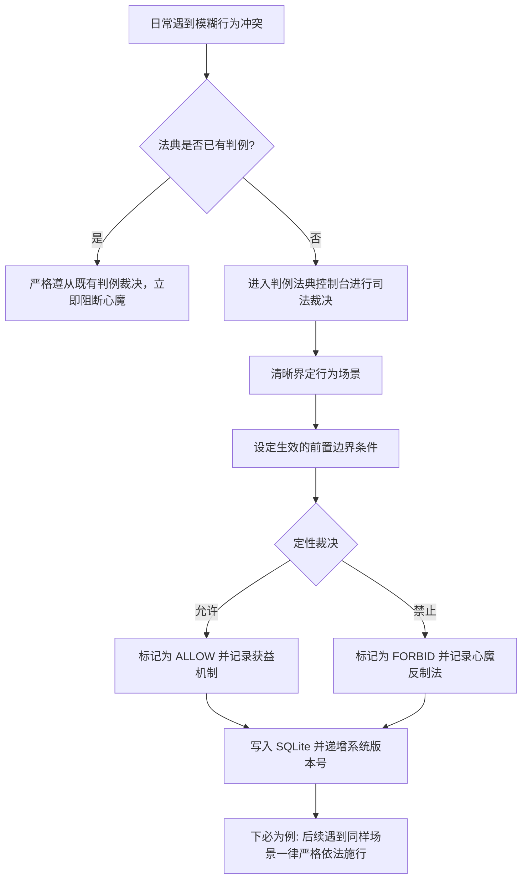

# 05-判例法典与合规裁决模块 (Precedent Case Law)

> **模块编号：** 05  
> **设计草案版本：** v1.0 / Draft  
> **所属系统：** Sacred Focus（国策树与神圣座位）效能工程中枢  
> **对齐协议：** 下必为例判例法典体系 (Precedent Case Law)

---

## 1. 模块概述与业务职责

### 1.1 模块定位
判例法典是系统**法制化自控中枢与反借口防线**。知乎 Edmond 指出，意志力崩溃往往始于“下不为例”的心魔借口与模糊灰色地带。判例法典将法学判例法思想引入个人行为管理，要求对灰色行为做出裁决并“下必为例”，以法律条文的形式彻底堵死认知失调。

### 1.2 核心业务职责
1. **司法化定性裁决**：对模糊地带行为作出定性裁决：
   - `ALLOW`（允许施行）：属于正向恢复、合规技术探索或不可抗力行为；
   - `FORBID`（绝对禁止）：属于意志妥协、伪装成学习的逃避行为；
2. **严格前置边界条件存证**：
   - 记录裁决生效的严格前置条件（如“仅限工作日下班后”、“且已完成主链专注”），防止偷换概念；
3. **判词与法理依据剖析**：
   - 阐明裁决的底层原因，记录心魔诱因与心理机制，形成长效自控经验资产；
4. **专注破戒即时复盘**：
   - 与神圣座位破戒中断联动，发生违规时直接关联法典判例快速归因；
5. **法典资产独立归档与恢复**：
   - 支持判例法典单独导出为 JSON 文件并在新设备一键合并恢复。

---

## 2. 核心源文件清单

| 文件路径 | 架构角色 | 核心职责说明 |
|---|---|---|
| [`backend/src/routes/cases.ts`](file:///d:/Codes/Projects/sacred-focus/backend/src/routes/cases.ts) | 后端路由 | 判例法典的 CRUD、裁决过滤、批量导出与恢复 |
| [`frontend/src/views/CaseLawView.vue`](file:///d:/Codes/Projects/sacred-focus/frontend/src/views/CaseLawView.vue) | 前端核心视图 | 下必为例法典查阅、判例搜索与定性裁决录入控制台 |
| [`backend/src/db/schema.ts`](file:///d:/Codes/Projects/sacred-focus/backend/src/db/schema.ts) | 数据库层 | `precedent_cases` 数据表与 `idx_cases_verdict_date` 复合索引 |

---

## 3. 数据模型定义

```ts
// 判例法典实体契约 (frontend/src/types/index.ts)
export interface PrecedentCase {
  id: string;                 // UUID v4
  date: string;               // 判决日期 (YYYY-MM-DD)
  behavior: string;           // 涉案行为描述 (如: "深夜研究技术框架至凌晨2点")
  verdict: 'ALLOW' | 'FORBID';// 裁决性质: ALLOW(允许) / FORBID(禁止)
  boundaryCondition: string;  // 严格前置边界条件与判词解析
  createdAt: string;          // 创建时间戳
}
```

---

## 4. 关键交互与业务逻辑

### 4.1 判例录入与防破窗流转


### 4.2 独立导出与增量导入策略
- **导出**：`/api/cases/export` 返回标准 JSON 结构，包含元数据、导出时间与判例列表；
- **导入**：`/api/cases/import` 支持 `ON CONFLICT(id) DO UPDATE` 幂等合并，保留本地未修改判例并补充新判例。

---

## 5. 对外接口协议清单

| 方法 | 路径 | 鉴权要求 | 描述 |
|---|---|:---:|---|
| `GET` | `/api/cases` | 已认证 | 获取全部判例（按日期与创建时间倒序） |
| `POST` | `/api/cases` | 已认证 | 录入并发布一条新判例（自动递增版本号） |
| `DELETE` | `/api/cases/:id` | 已认证 | 删除指定判例（支持二次防误触确认） |
| `GET` | `/api/cases/export` | 已认证 | 导出法典全量 JSON 备份包 |
| `POST` | `/api/cases/import` | 已认证 | 批量导入/合并恢复判例数据 |

---

## 6. 跨模块协同关系

1. **与【03-神圣座位】联动**：
   - 专注违规中断（`FAIL`）时记录的 `failureReason` 可作为法典起诉案由，推动新判例法产生；
2. **与【02-数据库】联动**：
   - 依托 `idx_cases_verdict_date` 索引，实现前端按 `ALLOW` / `FORBID` 毫秒级瞬间过滤；
3. **与【06-版本演化与整机迁移】联动**：
   - 整机镜像导出与恢复时，法典数据作为核心法理资产纳入全系统备份包。
