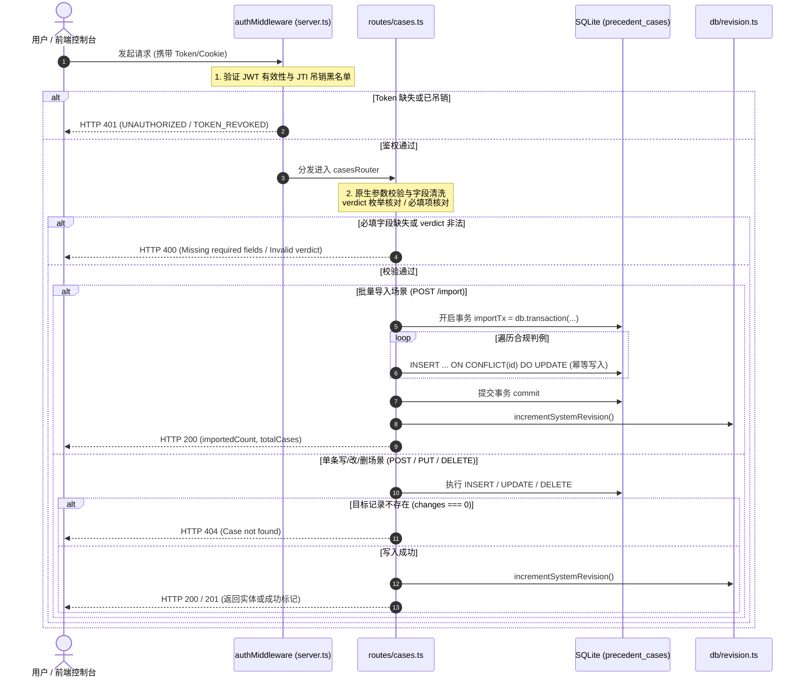

# 05-判例法典与合规裁决模块 逻辑流程与时序架构详细设计 (Draft)

> **文档定位：** 模块 05 真实源代码逻辑执行流深度审计与工程实现草案  
> **对齐版本：** v1.1 (基于 `backend/src/routes/cases.ts`、`schema.ts`、`frontend/src/views/CaseLawView.vue` 等实际源码)  
> **审查基准：** 全量 API 入口校验、内部时序链路、事务边界、异常吞咽审计、四大边界条件（空值/重复录入与幂等/超时/并发）

---

## 1. 入口与路由全量矩阵（API & 校验规则审计）

模块 05 的路由统一挂载在 [`backend/src/server.ts`](file:///d:/Codes/Projects/sacred-focus/backend/src/server.ts#L90) 的 `/api/cases` 路径前缀下。  
全模块共有 **6 个对外服务接口**，经源码逐行排查，本模块**【未引入 Zod 等 Schema 校验库】**，全部采用原生 JavaScript/TypeScript `if` 逻辑、字符串比较及 SQLite 约束做运行时判定。

### 1.1 API 端点与参数校验全景表

| 序号 | HTTP 方法 | 路由路径 | 接收参数 (Params / Query / Body) | 校验类型 | 实际生效的校验规则与边界约束 | 风险与缺陷标注 |
|---|---|---|---|---|---|---|
| 1 | `GET` | `/api/cases` | **Query**:<br>- `verdict?: string` | 原生字符串枚举校验 | `if (verdict && (verdict === 'ALLOW' \|\| verdict === 'FORBID'))`：有效则过滤查询，否则静默回退为全量查询。 | **【未做 Zod 校验】**<br>若 query 传入非法 verdict（如 `?verdict=INVALID`），不报错但静默查全部。 |
| 2 | `GET` | `/api/cases/export` | 无 | 无 | 无入参校验。前置经过 `/api` 全局鉴权。 | - |
| 3 | `POST` | `/api/cases/import` | **Body (JSON)**:<br>- `PrecedentCase[]` (直接数组)<br>或<br>- `{ cases: PrecedentCase[] }` (包装对象) | 原生结构类型与循环清洗过滤 | 1. 顶层结构识别：`Array.isArray(body) ? body : (Array.isArray(body?.cases) ? body.cases : null)`<br>2. 顶层非空校验：`if (!rawCases \|\| !Array.isArray(rawCases))` 返回 `400`<br>3. 元素白名单清洗：`if (!c.id \|\| !c.behavior \|\| !c.verdict \|\| !c.boundaryCondition) continue`<br>4. 裁决枚举校验：`if (c.verdict !== 'ALLOW' && c.verdict !== 'FORBID') continue`<br>5. 强制 `String()` 强制类型转换。 | **【未做 Zod 校验】**<br>部分字段缺失或 verdict 非法的单个判例会被静默丢弃（`continue`），不向调用方反馈跳过列表。 |
| 4 | `POST` | `/api/cases` | **Body (JSON)**:<br>- `id: string`<br>- `date: string`<br>- `behavior: string`<br>- `verdict: 'ALLOW' \| 'FORBID'`<br>- `boundaryCondition: string`<br>- `createdAt?: string` | 原生必填项与枚举校验 | 1. 必填非空校验：`if (!id \|\| !date \|\| !behavior \|\| !verdict \|\| !boundaryCondition)` 返回 `400`<br>2. 裁决枚举校验：`if (verdict !== 'ALLOW' && verdict !== 'FORBID')` 返回 `400`。 | **【未做 Zod 校验】**<br>**【未做空白字符 trim 校验】**（如 `"   "` 可绕过非空检查）；<br>**【未做 date 格式正则校验】**；<br>**【未做 ID 冲突前置校验】**（重复 ID 触发 SQLite 500）。 |
| 5 | `PUT` | `/api/cases/:id` | **Params**:<br>- `id: string`<br>**Body (JSON)**:<br>- `date?: string`<br>- `behavior: string`<br>- `verdict: 'ALLOW' \| 'FORBID'`<br>- `boundaryCondition: string` | 原生必填项与枚举校验 | 1. 必填非空校验：`if (!behavior \|\| !verdict \|\| !boundaryCondition)` 返回 `400`<br>2. 裁决枚举校验：`if (verdict !== 'ALLOW' && verdict !== 'FORBID')` 返回 `400`<br>3. 存在性校验：`if (result.changes === 0)` 返回 `404`。 | **【未做 Zod 校验】**<br>**【未做空白字符 trim 校验】**；<br>`date` 字段采用 SQL `COALESCE(@date, date)` 保底。 |
| 6 | `DELETE` | `/api/cases/:id` | **Params**:<br>- `id: string` | 原生受影响行数校验 | `if (result.changes === 0)` 返回 `404`。 | **【未做 Zod 校验】** |

---

## 2. 内部执行时序与生命周期审计

### 2.1 全链路执行时序模型

判例法典模块承载个人意志法制化存证，生命周期链路清晰精练：  
`全局鉴权与限流` $\rightarrow$ `参数结构清洗与枚举防御` $\rightarrow$ `SQL 预编译/幂等写入` $\rightarrow$ `系统版本号 revision 原子递增`



### 2.2 核心环节详细剖析

#### 1. 权限检查 (Auth Checking)
- **拦截生效点**：[`backend/src/server.ts:L72`](file:///d:/Codes/Projects/sacred-focus/backend/src/server.ts#L72) 统一装配 `app.use('/api', authMiddleware)`。
- **白名单规则**：[`backend/src/middleware/auth.ts`](file:///d:/Codes/Projects/sacred-focus/backend/src/middleware/auth.ts#L9-L14) 中未将 `/cases` 纳入公共路径。全量判例读取、检索、导出、录入、修改、删除均**属于受保护资源**，必须具备有效身份凭证。
- **未授权拦截**：无凭证直接返回 `401 UNAUTHORIZED`，凭证过期返回 `401 TOKEN_EXPIRED_OR_INVALID`，凭证被销毁返回 `401 TOKEN_REVOKED`。

#### 2. 参数清洗与格式归一化 (Sanitization & Normalization)
- **`GET /api/cases` 查询参数清洗**：
  ```ts
  const verdict = req.query.verdict as string | undefined;
  if (verdict && (verdict === 'ALLOW' || verdict === 'FORBID')) {
    // 命中白名单，使用带参数的高性能索引查询
    rows = db.prepare('SELECT * FROM precedent_cases WHERE verdict = ? ORDER BY date DESC, createdAt DESC').all(verdict);
  } else {
    // 兜底全量查询
    rows = db.prepare('SELECT * FROM precedent_cases ORDER BY date DESC, createdAt DESC').all();
  }
  ```
- **`POST /api/cases/import` 兼容性与强类型归一化**：
  - 自动解包顶层结构：兼容纯数组 `[case1, case2]` 与封装包 `{ cases: [...] }`；
  - 兜底补齐日期：若未传 `date` 则截取当前 UTC `YYYY-MM-DD`（`substring(0, 10)`）；未传 `createdAt` 则补全当前 ISO 时间戳；
  - 强行转为字符串标量：使用 `String(...)` 包裹各字段，杜绝注入对象引发驱动层崩溃。
- **`PUT /api/cases/:id` 日期保留策略**：
  ```sql
  date = COALESCE(@date, date)
  ```
  通过 SQL 原生 `COALESCE` 函数，若前端未更新 `date`（传 null），则安全继承原数据库记录的值。

#### 3. 数据库 SQL/ORM 操作与事务边界
底层依托 `better-sqlite3` 驱动，利用事先创建好的复合索引 `idx_cases_verdict_date ON precedent_cases(verdict, date DESC)` 保证排序与过滤性能。
- **批量导入事务边界 (`POST /import`)**：
  - 事务开启：[`backend/src/routes/cases.ts:L73`](file:///d:/Codes/Projects/sacred-focus/backend/src/routes/cases.ts#L73)（`const importTx = db.transaction((cases: any[]) => { ... })`）；
  - 提交点：函数内部循环执行预编译语句 `upsertStmt.run(...)` 完毕后，`importTx(rawCases)` 顺利结束时自动提交；
  - 回滚点：事务内发生任何不可恢复的 SQLite 致命错误，事务自动触发 Rollback。
- **单条增删改的事务边界 (`POST /`, `PUT /:id`, `DELETE /:id`)**：
  - **【无显式多语句事务】**：单条写语句依托 SQLite 的语句级隐式原子性保证；随后调用 `incrementSystemRevision()`，由 revision 内部自建的短事务原子递增版本号。

### 2.3 异常吞咽审计（是否存在 Try-Catch 吞异常？）

1. **`POST /api/cases/import`（批量导入）**：
   - 包含显式 `try-catch`：
     ```ts
     try {
       importTx(rawCases);
       incrementSystemRevision();
       const totalRow = db.prepare('SELECT COUNT(*) as count FROM precedent_cases').get() as { count: number } | undefined;
       res.json({ success: true, importedCount, totalCases: totalRow?.count || 0 });
     } catch (err: any) {
       console.error('Failed to import precedent cases', err);
       res.status(500).json({ error: 'Failed to import cases: ' + err.message });
     }
     ```
   - **审计结论**：**未吞掉异常**。捕获到错误后立刻打印错误栈，并向客户端抛出 `500` 与明晰的错误字符串。
2. **其余 5 个路由（`GET /`, `GET /export`, `POST /`, `PUT /:id`, `DELETE /:id`）**：
   - **完全未包裹 try-catch 块**！
   - **审计结论**：凡遇主键冲突（如已存在相同的 ID 执行单条 `POST /`）、数据库文件死锁等未处理异常，均由 Express 框架冒泡至 `server.ts` 的全局未捕获异常处理中间件（Line 110-119），记录后返回标准 `500 INTERNAL_SERVER_ERROR`。**不存在掩盖或静默忽略异常的代码片段**。

### 2.4 HTTP 状态码与业务错误码速查表

| HTTP 状态码 | 业务错误信息 (`error`) | 触发代码位置 | 场景说明 |
|---|---|---|---|
| `400 Bad Request` | `Invalid payload: expected an array of cases or an object with a cases array` | `cases.ts:L57` | 批量导入时请求体非数组亦非包含 `cases` 数组的对象 |
| `400 Bad Request` | `Missing required precedent case fields` | `cases.ts:L113`<br>`cases.ts:L143` | 新增或修改判例时缺失必填三要素（行为、裁决、前置边界） |
| `400 Bad Request` | `Invalid verdict value. Must be ALLOW or FORBID.` | `cases.ts:L117`<br>`cases.ts:L147` | 裁决性质传入除 `'ALLOW'` 和 `'FORBID'` 以外的非法字符 |
| `401 Unauthorized` | `UNAUTHORIZED` | `auth.ts:L42` | 未携带 Token 或静态访问凭证无效 |
| `401 Unauthorized` | `TOKEN_REVOKED` | `auth.ts:L59` | JWT token 已被安全注销列入黑名单 |
| `401 Unauthorized` | `TOKEN_EXPIRED_OR_INVALID` | `auth.ts:L77` | Token 格式破损或自然时间超期 |
| `404 Not Found` | `Case not found` | `cases.ts:L163`<br>`cases.ts:L177` | 尝试修改或删除一个不存在的判例 ID（`changes === 0`） |
| `500 Internal Server Error` | `Failed to import cases: <message>` | `cases.ts:L104` | 批量导入事务在写入或递增版本时发生底层异常 |
| `500 Internal Server Error` | `INTERNAL_SERVER_ERROR` | `server.ts:L116` | 新增重复 ID 触发 SQLite PRIMARY KEY 约束等未捕获异常 |

---

## 3. 边界处理专项深度审计

依据实际源代码，复核**空值**、**重复操作与幂等**、**超时**、**并发**四大边界。凡代码未处理逻辑，显式标注为 `【未做判断】`。

### 3.1 空值处理 (Null / Undefined / Empty)

#### (1) 实体更新/删除受影响行数空值校验
在修改与删除判例接口中，通过检查 SQLite 返回的 `changes` 判定目标行是否存在：
```ts
// PUT /api/cases/:id 与 DELETE /api/cases/:id
if (result.changes === 0) {
  return res.status(404).json({ error: 'Case not found' });
}
```
- **审计结论**：处理健全，避免对不存在的实体修改或重复删除误报成功。

#### (2) 入参非空与假值判定漏洞
在新增判例 [`POST /api/cases:L112`](file:///d:/Codes/Projects/sacred-focus/backend/src/routes/cases.ts#L112) 中：
```ts
if (!id || !date || !behavior || !verdict || !boundaryCondition) {
  return res.status(400).json({ error: 'Missing required precedent case fields' });
}
```
- **审计结论**：
  - 能有效拦截 `undefined`、`null`、`""`（空字符串）；
  - **【未做空白字符 trim 判断】**：如果客户端传入 `behavior: "   "`（纯空格字符串），在 JS 逻辑下 `!"   "` 为 `false`，能够绕过校验成功落库，导致生成空白无意义判例；
  - **【未做 date 格式正则校验】**：传入 `date: "invalid-date"` 同样能通过判定并直接存库。

#### (3) 批量导入空数组与空字段判例
在 [`POST /api/cases/import`](file:///d:/Codes/Projects/sacred-focus/backend/src/routes/cases.ts#L75-L80) 中：
- 若传入空数组 `[]`：校验 `Array.isArray([])` 判定为真，事务空跑后返回 `{ success: true, importedCount: 0, totalCases }`；
- 若数组中某个对象字段缺失（如 `!c.behavior`）或 `verdict` 非法，通过 `continue` **静默跳过该条记录**，其余合规记录正常导入，保证批量导入具有容错弹性。

---

### 3.2 重复录入与幂等性处理 (Duplicate / Idempotency)

#### (1) 单条判例新增 (`POST /api/cases`)
```ts
db.prepare(`
  INSERT INTO precedent_cases (id, date, behavior, verdict, boundaryCondition, createdAt)
  VALUES (@id, @date, @behavior, @verdict, @boundaryCondition, @createdAt)
`).run({ ... });
```
- **主键重复**：使用纯 `INSERT` 而非 `INSERT OR REPLACE`。若客户端传入已有的 `id`，将抛出 `SqliteError: UNIQUE constraint failed: precedent_cases.id`，由全局错误拦截器以 `500` 响应。**【未作友好的 409 Conflict 错误拦截】**；
- **业务重复判例**：**【未做行为文本重复或相似度查重判断】**。若用户多次提交相同行为描述（如“熬夜研究新技术”），系统将生成两条并存的独立判例，需由用户在前端自行辨析或删除。

#### (2) 批量导入 (`POST /api/cases/import`) 幂等设计
```sql
INSERT INTO precedent_cases (id, date, behavior, verdict, boundaryCondition, createdAt)
VALUES (@id, @date, @behavior, @verdict, @boundaryCondition, @createdAt)
ON CONFLICT(id) DO UPDATE SET
  date = excluded.date,
  behavior = excluded.behavior,
  verdict = excluded.verdict,
  boundaryCondition = excluded.boundaryCondition,
  createdAt = excluded.createdAt
```
- **审计结论**：具备**严格幂等性**。多次导入同一个 JSON 备份文件不会产生脏数据或报错，而是无缝原地覆写更新已有记录，新增记录自动追加。

---

### 3.3 超时处理 (Timeout Handling)

#### (1) HTTP 接口请求超时
- 审计结论：**【未做请求级超时配置与处理】**。未配置 Express 超时中间件。鉴于判例数据量通常在数百至数千条级别，SQLite 同步执行耗时通常低于 3ms，实际运行极少发生请求超时。

#### (2) 批量导入海量数据时的事件循环阻塞
- 审计结论：**【未做单次导入条数上限校验（Batch Limit）】**。若恶意用户上传包含 100 万条判例的超大 JSON 文件，`better-sqlite3` 的同步 `importTx` 事务将独占 Node.js 主事件循环数秒，导致其他并发请求暂时挂起。建议后续补充单次导入不得超过 1000 条的硬性限制。

---

### 3.4 并发处理 (Concurrency Control)

#### (1) 单条判例更新的读-改-写竞态 (`PUT /api/cases/:id`)
- 源码审计：直接执行 `UPDATE precedent_cases SET ... WHERE id = @id`。
- **审计结论**：**【未做 CAS 乐观锁版本控制】**。未像国策树那样接收 `expectedRevision`，若两个管理员在不同终端同时编辑同一条判例，后提交者的内容将直接覆盖前提交者的内容。

#### (2) 并发删除相同判例 (`DELETE /api/cases/:id`)
- 源码审计：通过 `result.changes === 0` 判定。
- **审计结论**：当两个并发请求同时删除同一 ID 时，由于 SQLite 内部写锁互斥，第一个请求先完成删除（`changes = 1`，返回 200），第二个请求由于记录已被移除将得到 `changes = 0`，精准返回 `404 Case not found`。**并发删除逻辑安全无泄漏**。

#### (3) 系统全局版本号协同
- 任何通过 API 完成的新增、修改、删除或批量导入，均强制触发：
  ```ts
  incrementSystemRevision();
  ```
- **协同结论**：原子递增 `system_meta` 的版本号并刷新时间戳，确保其他终端的轻量探针能在 5 秒内感应到判例库变更并主动刷新前端数据。

---

## 4. 架构改进建议与演化待办 (Actionable Backlog)

1. **补齐空白字符与日期格式校验**：
   - 在 `POST /` 与 `PUT /:id` 中对 `behavior` 和 `boundaryCondition` 执行 `.trim()` 校验；对 `date` 增加 `^\d{4}-\d{2}-\d{2}$` 正则校验；
2. **新增接口防主键冲突友好化**：
   - 捕获 `SQLITE_CONSTRAINT_PRIMARYKEY` 异常，转换为 `409 Conflict: Case ID already exists`；
3. **批量导入增加批次规模配额限制**：
   - 增加 `if (rawCases.length > 5000)` 保护，拦截超大 payload 阻塞主事件循环；
4. **导入接口增加部分失败详情回显**：
   - 将跳过的非法判例统计为 `skippedCount` 并回显其原始 ID，提升运维可观测性。
