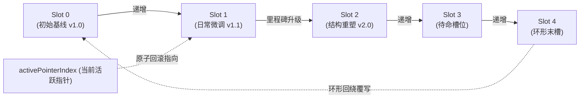
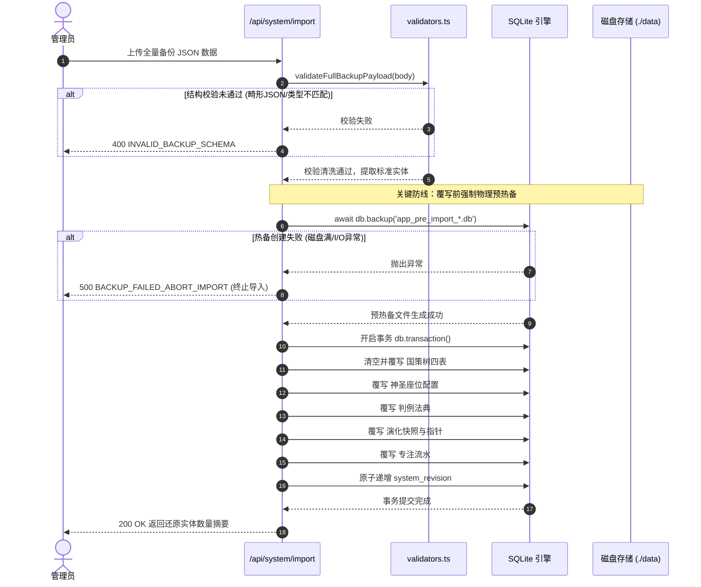

# 06-版本演化与整机灾备模块 (Evolution & System Migration)

> **模块编号：** 06  
> **设计草案版本：** v1.0 / Draft  
> **所属系统：** Sacred Focus（国策树与神圣座位）效能工程中枢  
> **对齐协议：** RSIP 递归稳态迭代协议 & 零丢失安全灾备标准

---

## 1. 模块概述与业务职责

### 1.1 模块定位
本模块是系统**架构代际演进与灾难恢复最高防线**。自控系统需要随生活节奏动态迭代，但盲目的修改容易造成原有自控稳态崩溃。系统通过“5 槽位环形快照”支持版本演进与无损回滚；同时提供“整机全量加密迁移与预热备”能力，保障用户跨机搬家 100% 数据安全。

### 1.2 核心业务职责
1. **5 槽位环形版本演化快照 (Slot 0 ~ 4)**：
   - 自动语义化递增版本号（如日常微调 `v1.0` -> `v1.1`，重大里程碑升级 `v2.0`）；
   - 记录每次演进的更新日志（Changelog Notes）；
   - 支持锁定任意历史槽位，一键原子级无损回滚覆盖国策树四表；
2. **整机全量镜像导出 (`/api/system/export`)**：
   - 15 次/10 分钟严格频控，防拖库 DoS 风险；
   - 一键生成包含国策拓扑、座位配置、流水明细、判例法典与演化快照的全量标准化 JSON 归档；
3. **安全预热备与灾难阻断机制 (`/api/system/import`)**：
   - 导入前自动调用 SQLite 底层 `db.backup('app_pre_import_*.db')` 进行物理快照；
   - 若热备创建失败（如磁盘空间不足），**立即终止导入操作**，严禁破坏性覆写；
4. **400 行 Native 强类型 Schema 防御门禁**：
   - 纯原生 TypeScript 编写，无第三方库依赖；
   - 递归核验节点、分组、连线、规范卡与流水的所有字段类型、边界尺寸与颜色值，拒绝脏数据污染。

---

## 2. 核心源文件清单

| 文件路径 | 架构角色 | 核心职责说明 |
|---|---|---|
| [`backend/src/routes/evolution.ts`](file:///d:/Codes/Projects/sacred-focus/backend/src/routes/evolution.ts) | 后端路由 | 5 槽位快照持久化、槽位指针切换与版本无损原子回滚 |
| [`backend/src/routes/system.ts`](file:///d:/Codes/Projects/sacred-focus/backend/src/routes/system.ts) | 后端路由 | 全系统整机镜像导出、预热备生成与全量事务恢复 |
| [`backend/src/utils/validators.ts`](file:///d:/Codes/Projects/sacred-focus/backend/src/utils/validators.ts) | 安全门禁 | 400 行原生递归 Schema 数据校验与清洗引擎 |
| [`frontend/src/components/canvas/EvolutionModal.vue`](file:///d:/Codes/Projects/sacred-focus/frontend/src/components/canvas/EvolutionModal.vue) | 交互弹窗 | 5 槽位版本快照生成、演化日志填写与历史槽位回滚看板 |
| [`frontend/src/components/common/SystemMigrationModal.vue`](file:///d:/Codes/Projects/sacred-focus/frontend/src/components/common/SystemMigrationModal.vue) | 交互弹窗 | 全系统镜像冷备导出、备份包上传与恢复状态反馈模态框 |

---

## 3. 5 槽位环形演化与指针流转拓扑

---

## 4. 关键恢复流程与灾备机制

### 4.1 整机导入预热备与事务恢复时序

---

## 5. 对外接口协议清单

| 方法 | 路径 | 限流规则 | 描述 |
|---|---|:---:|---|
| `GET` | `/api/evolution` | 常规频控 | 获取当前 5 槽位快照列表与当前活跃槽位指针 |
| `POST` | `/api/evolution/snapshots` | 60次/分 | 将当前国策树生成新快照并推入下一槽位 |
| `POST` | `/api/evolution/rollback/:slotIndex` | 60次/分 | 锁定指定历史槽位，原子无损回滚国策树 |
| `GET` | `/api/system/export` | 15次/10分 | 导出整机全量加密 JSON 归档镜像包 |
| `POST` | `/api/system/import` | 10次/小时 | 强门禁校验 + 自动预热备，全量恢复整机数据 |

---

## 6. 跨模块协同关系

1. **与【02-数据库模块】联动**：
   - 依赖 `better-sqlite3` 原生 `db.backup()` 驱动在线无锁热备；
   - 采用 Prepared Statements 预编译，确保大事务恢复期间耗时最低；
2. **与【04-国策树拓扑模块】联动**：
   - 演化快照生成与回滚的目标为国策树的核心拓扑数据（节点、分组、连线、说明标签）；
3. **与【07-多端协同模块】联动**：
   - 无论是快照回滚还是整机恢复，完成后均强制递增全局 `system_revision`，通知所有在线客户端探针拉取最新数据。
