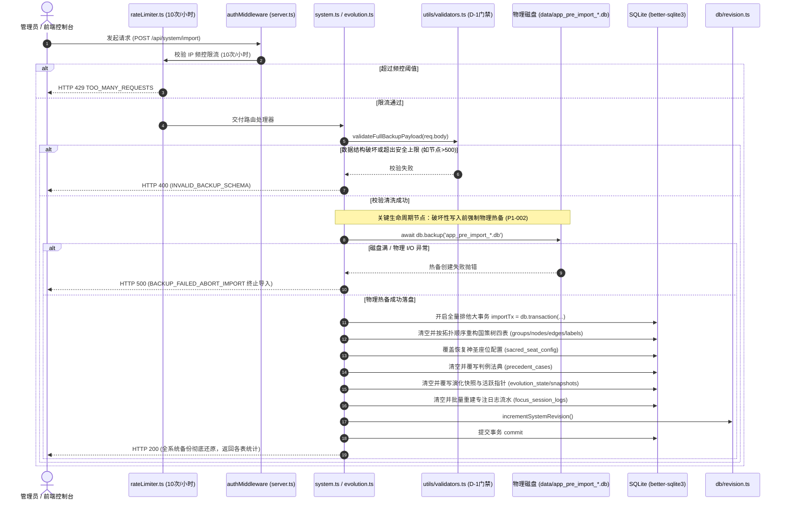

# 06-版本演化与整机灾备模块 逻辑流程与时序架构详细设计 (Draft)

> **文档定位：** 模块 06 真实源代码逻辑执行流深度审计与工程实现草案  
> **对齐版本：** v1.1 (基于 `backend/src/routes/evolution.ts`、`backend/src/routes/system.ts`、`backend/src/utils/validators.ts` 等实际源码)  
> **审查基准：** 全量 API 入口校验、内部时序链路、事务边界、异常吞咽审计、四大边界条件（空值/环形复写与幂等/超时/并发）

---

## 1. 入口与路由全量矩阵（API & 校验规则审计）

模块 06 的接口分布在两个专属路由控制器中：
- 国策架构演化路由：挂载于 `/api/evolution`（源码路径：[`backend/src/routes/evolution.ts`](file:///d:/Codes/Projects/sacred-focus/backend/src/routes/evolution.ts)）
- 全系统整机灾备路由：挂载于 `/api/system`（源码路径：[`backend/src/routes/system.ts`](file:///d:/Codes/Projects/sacred-focus/backend/src/routes/system.ts)）

全模块共计对外暴露 **7 个核心服务接口**。校验层依托系统级安全防御校验器 [`backend/src/utils/validators.ts`](file:///d:/Codes/Projects/sacred-focus/backend/src/utils/validators.ts)（D-1 治理，400 行纯原生强类型递归门禁），全模块**【未引入第三方 Zod 校验库】**。

### 1.1 API 端点与参数校验全景表

| 序号 | HTTP 方法 | 路由路径 | 接收参数 (Params / Query / Body) | 校验类型 | 实际生效的校验规则与边界约束 | 风险与缺陷标注 |
|---|---|---|---|---|---|---|
| 1 | `GET` | `/api/evolution` | 无 | 无 | 无入参校验。前置经过 `/api` 全局鉴权。 | - |
| 2 | `POST` | `/api/evolution/snapshot` | **Body (JSON)**:<br>- `changelogNotes: string`<br>- `isMajor: boolean` | 原生非空与布尔强转 | 1. 必填非空校验：`if (!changelogNotes)` 返回 `400`<br>2. 布尔转义：`Boolean(isMajor)`。 | **【未做 Zod 校验】**<br>**【未做空白字符 trim 校验】**（纯空格 `"   "` 可绕过非空检查）；<br>**【未约束更新日志长度上限】**。 |
| 3 | `POST` | `/api/evolution/rollback` | **Body (JSON)**:<br>- `targetSlotIndex: number` | 原生范围与存在性校验 | 1. 槽位范围校验：`typeof targetSlotIndex !== 'number' \|\| targetSlotIndex < 0 \|\| targetSlotIndex > 4` 返回 `400`<br>2. 槽位存在性校验：`SELECT ... WHERE slotIndex = ?`，若无记录返回 `404`。 | **【未做 Zod 校验】**<br>注意：实际源码路径为 `/rollback` 且入参在 body（非文档偶见的 URL 动态参数）。 |
| 4 | `GET` | `/api/evolution/export` | 无 | 无 | 导出仅包含当前活跃国策树 (`liveTree`) 与演化状态 (`evolution`)。 | 纯架构导出，不含流水与判例。 |
| 5 | `POST` | `/api/evolution/import` | **Body (JSON)**:<br>国策架构备份包 | 原生递归门禁 (D-1) | 1. 调用 `validateFullBackupPayload(req.body)`<br>2. 校验 `tree` 下 `nodes`(≤500)、`groups`(≤100)、`edges`(≤1000)、`labels`(≤200) 的数组合法性、ID 重复性与端点引用完整性。 | **【未做 Zod 校验】**（采用等效原生防御器）。 |
| 6 | `GET` | `/api/system/export` | 无 | 中间件限流保护 | 经过 `exportLimiter` 中间件限制（**15次 / 10分钟**，基于客户端 IP）。导出包含全表六大模块整机数据。 | - |
| 7 | `POST` | `/api/system/import` | **Body (JSON)**:<br>全系统整机镜像包 | 中间件限流 + 原生递归门禁 (D-1) | 1. 经过 `importLimiter` 中间件限制（**10次 / 小时**）<br>2. 调用 `validateFullBackupPayload(req.body)` 进行全模块（含判例 ≤2000、日志 ≤50000）上限与防溢出校验<br>3. P1-003 防御：严禁数组缺失导致清空现有库。 | **【未做 Zod 校验】**（采用等效原生防御器）。 |

---

## 2. 内部执行时序与生命周期审计

### 2.1 全链路执行时序模型

版本演化与整机灾备承载系统最高级别的数据安全与代际流转，其执行链路包含独创的**“覆写前强制物理预热备”**与**“大事务原子重构”**：



### 2.2 核心环节详细剖析

#### 1. 权限与高阶限流保护 (Auth & Rate Limiting)
- **全局鉴权**：全模块所有接口均位于 `/api` 根路径下，非公开白名单接口，必须携带有效的管理员 Token 或 Cookie，未授权直接抛出 `401`；
- **防拖库与防轰炸限流**：
  - 全量整机导出 [`GET /api/system/export`](file:///d:/Codes/Projects/sacred-focus/backend/src/routes/system.ts#L11)：施加 `exportLimiter`，每 10 分钟最多 15 次，阻断恶意遍历或消耗服务端 I/O；
  - 全量整机导入 [`POST /api/system/import`](file:///d:/Codes/Projects/sacred-focus/backend/src/routes/system.ts#L52)：施加 `importLimiter`，每小时最多 10 次，防止并发大事务造成数据库死锁或磁盘被热备塞满。

#### 2. 原生强类型安全门禁校验 (Validators Engine)
在 [`backend/src/utils/validators.ts`](file:///d:/Codes/Projects/sacred-focus/backend/src/utils/validators.ts) 中实现了无外部依赖的原生安全审计：
- **容量防溢出防御**：
  - 国策节点上限 500 条、分组上限 100 个、连线上限 1000 条、说明标签上限 200 个；
  - 判例法典上限 2000 条、专注流水上限 50000 条；
- **防断链与孤儿数据防御**：
  - 严格校验 `node.groupId` 必须已在 `groups` 集合中声明；
  - 严格校验 `edge.sourceId` 与 `edge.targetId` 必须存在于对应的 `nodes` 或 `groups` 集合中；
- **防清空现有库防御 (P1-003)**：
  ```ts
  if (!Array.isArray(rawTree.nodes) || !Array.isArray(rawTree.groups) || !Array.isArray(rawTree.edges) || !Array.isArray(rawTree.labels)) {
    return { success: false, error: '备份文件国策树结构不完整：nodes、groups、edges、labels 必须均为数组' };
  }
  ```
  禁止因备份文件缺少某一字段而误删整张表现有数据。

#### 3. 破坏性写入前强制物理预热备 (Pre-import Hot Backup)
这是 Sacred Focus 架构的代表性安全防线（`P1-002` 治理项）：
```ts
// backend/src/routes/system.ts:L65-L77
try {
  const timestamp = new Date().toISOString().replace(/[:.]/g, '-');
  const backupFile = path.join(config.dataDir, `app_pre_import_${timestamp}.db`);
  await db.backup(backupFile);
  console.log(`[Sacred Focus System] 预导入安全热备已生成: ${backupFile}`);
} catch (backupErr: any) {
  console.error('[Sacred Focus System] 预导入热备创建失败，终止导入操作以防数据丢失:', backupErr);
  return res.status(500).json({
    error: 'BACKUP_FAILED_ABORT_IMPORT',
    message: '导入前热备数据库快照失败，为防止数据损坏已终止导入',
    details: backupErr?.message || String(backupErr)
  });
}
```
利用 SQLite 原生异步备份 API，在覆盖当前数据库前在线热备一份完整的 `.db` 快照。**若物理备份失败，立即终止整个导入流程，严禁无后路覆写**。

#### 4. 数据库 SQL/ORM 操作与事务开启/提交点
- **`POST /api/evolution/snapshot` 事务边界**：
  - 开启：[`evolution.ts:L50`](file:///d:/Codes/Projects/sacred-focus/backend/src/routes/evolution.ts#L50)（`const snapshotTx = db.transaction(() => { ... })`）；
  - 步骤：读取当前指针 $\rightarrow$ 语义化递增版本号（`v1.0` -> `v1.1` 或 `v2.0`） $\rightarrow$ 环形计算目标槽位 $\rightarrow$ `INSERT OR REPLACE INTO evolution_snapshots` $\rightarrow$ 更新 `evolution_state` $\rightarrow$ 递增系统版本号；
  - 提交：`snapshotTx()` 执行成功后自动提交。
- **`POST /api/evolution/rollback` 事务边界**：
  - 开启：[`evolution.ts:L138`](file:///d:/Codes/Projects/sacred-focus/backend/src/routes/evolution.ts#L138)（`const rollbackTx = db.transaction(() => { ... })`）；
  - 步骤：更新指针 $\rightarrow$ 解析快照 JSON $\rightarrow$ 清空国策树四表 $\rightarrow$ 批量还原分组、节点、连线、说明标签 $\rightarrow$ 递增系统版本号；
  - 提交：`rollbackTx()` 顺利返回。
- **`POST /api/evolution/import` 事务边界**：
  - 开启：[`evolution.ts:L254`](file:///d:/Codes/Projects/sacred-focus/backend/src/routes/evolution.ts#L254)；
  - 步骤：清空并批量恢复国策树四表 + 演化状态与快照表，随后自增版本号。
- **`POST /api/system/import` 全量整机恢复事务边界**：
  - 开启：[`system.ts:L110`](file:///d:/Codes/Projects/sacred-focus/backend/src/routes/system.ts#L110)（`const importTx = db.transaction(() => { ... })`）；
  - 步骤：在单一大事务中原子覆写 8 张数据表（`focus_edges`, `focus_nodes`, `focus_groups`, `focus_labels`, `sacred_seat_config`, `precedent_cases`, `evolution_state`, `evolution_snapshots`, `focus_session_logs`），最后触发 `incrementSystemRevision()`；
  - 提交：`importTx()` 成功返回恢复汇总对象；任何 SQL 异常均导致整机恢复 100% 自动回滚，数据库保持热备前的原样。

### 2.3 异常吞咽审计（是否存在 Try-Catch 吞异常？）

对模块代码进行逐行审计：
1. **`GET /api/evolution`、`POST /api/evolution/snapshot`、`POST /api/evolution/rollback`**：
   - **完全未包裹 try-catch**！
   - 审计结论：未处理异常直接冒泡至 `server.ts` 全局错误拦截器，响应统一的 500。
2. **`GET /api/evolution/export` & `POST /api/evolution/import`**：
   - 包含显式 `try-catch`，捕获异常后均使用 `console.error` 输出详细日志，并规范返回 `500 { error: 'Failed to ...', details: e.message }`。**未吞掉异常**。
3. **`GET /api/system/export` & `POST /api/system/import`**：
   - 包含显式 `try-catch`：
     - 热备失败分支显式拦截并阻断返回 `500 BACKUP_FAILED_ABORT_IMPORT`；
     - 事务抛错分支完整打印堆栈并向客户端返回 `500 { error: '导入系统备份失败', details: e.message }`。
   - **审计结论**：**模块内所有接口均未吞掉异常**。

### 2.4 HTTP 状态码与业务错误码速查表

| HTTP 状态码 | 业务错误代码 / 信息 (`error`) | 触发代码位置 | 场景说明 |
|---|---|---|---|
| `400 Bad Request` | `changelogNotes is required` | `evolution.ts:L45` | 生成演化快照时未填写更新日志 |
| `400 Bad Request` | `targetSlotIndex must be between 0 and 4` | `evolution.ts:L130` | 版本回滚时目标槽位索引非数值或不在 [0, 4] 范围内 |
| `400 Bad Request` | `INVALID_BACKUP_SCHEMA` | `evolution.ts:L245`<br>`system.ts:L56` | 上传的备份文件未能通过原生校验门禁（如节点数超限、字段缺失） |
| `401 Unauthorized` | `UNAUTHORIZED` / `TOKEN_REVOKED` | `auth.ts` | 鉴权失败、未登录或 Token 被注销 |
| `404 Not Found` | `Snapshot not found at slot <index>` | `evolution.ts:L135` | 尝试回滚到一个尚无快照数据的空槽位 |
| `429 Too Many Requests` | `TOO_MANY_REQUESTS` | `rateLimiter.ts` | 导出超过 15次/10分 或 导入超过 10次/小时 |
| `500 Internal Server Error` | `BACKUP_FAILED_ABORT_IMPORT` | `system.ts:L73` | 整机恢复前创建物理 SQLite 热备失败，主动终止破坏性覆写 |
| `500 Internal Server Error` | `Failed to export focus tree backup` | `evolution.ts:L236` | 架构数据导出异常 |
| `500 Internal Server Error` | `Failed to import focus tree backup` | `evolution.ts:L239` | 架构数据导入事务执行异常 |
| `500 Internal Server Error` | `Failed to export full system backup` | `system.ts:L47` | 整机数据读取异常 |
| `500 Internal Server Error` | `导入系统备份失败` | `system.ts:L221` | 整机恢复事务在执行大批量 SQL 写入时发生底层异常 |

---

## 3. 边界处理专项深度审计

依据实际源代码，严密复核**空值**、**环形复写与幂等**、**超时**、**并发**四大边界。凡代码未做判断的，显式标注为 `【未做判断】`。

### 3.1 空值处理 (Null / Undefined / Empty)

#### (1) 更新日志非空与空白字符
- 源码位置：[`POST /api/evolution/snapshot:L44`](file:///d:/Codes/Projects/sacred-focus/backend/src/routes/evolution.ts#L44)
  ```ts
  if (!changelogNotes) {
    return res.status(400).json({ error: 'changelogNotes is required' });
  }
  ```
- **审计结论**：
  - 能拦截 `undefined`、`null`、`""`；
  - **【未做空白字符 trim 判断】**：若客户端传入纯空格 `"   "`，`!"   "` 为假，可绕过校验生成无意义快照。

#### (2) 回滚目标槽位空值与未初始化判定
- 源码位置：[`POST /api/evolution/rollback:L133-L136`](file:///d:/Codes/Projects/sacred-focus/backend/src/routes/evolution.ts#L133-L136)
  ```ts
  const snapshotRow = db.prepare('SELECT * FROM evolution_snapshots WHERE slotIndex = ?').get(targetSlotIndex);
  if (!snapshotRow) {
    return res.status(404).json({ error: `Snapshot not found at slot ${targetSlotIndex}` });
  }
  ```
- **审计结论**：健全。有效防止指针回滚到未曾初始化的空槽位。

#### (3) 导入数据缺失与部分模块空值处理
- 在整机导入 [`POST /api/system/import`](file:///d:/Codes/Projects/sacred-focus/backend/src/routes/system.ts#L153-L197) 中：
  - 若 `sacredSeatConfig` 为空：跳过座位配置恢复，保持原样；
  - 若 `precedentCases` 为空：跳过判例恢复；
  - 若 `sessionLogs` 为空：跳过流水恢复；
  - 针对流水日志字段的可空属性，采用 `focusContent: l.focusContent ?? null` 显式兜底。

---

### 3.2 环形槽位复写与幂等性处理 (Ring Buffer & Idempotency)

#### (1) 5 槽位环形推进算法
源码在 [`backend/src/routes/evolution.ts:L74-L82`](file:///d:/Codes/Projects/sacred-focus/backend/src/routes/evolution.ts#L74-L82) 实现了经典的 5 槽位环形缓存队列：
```ts
let targetSlotIndex = 0;
if (existingSnapshots.length < 5) {
  targetSlotIndex = existingSnapshots.length; // 未满 5 槽，顺延分配
} else {
  // 满 5 槽，当前指针向后环移一位，复写覆盖最老槽位
  targetSlotIndex = (currentPointer + 1) % 5;
}
```
- **版本号语义化自增**：
  ```ts
  const match = currentVersion.match(/^v(\d+)\.(\d+)$/);
  if (match) {
    let major = parseInt(match[1], 10);
    let minor = parseInt(match[2], 10);
    if (isMajor) {
      major += 1;
      minor = 0; // 重大里程碑归零次版本号
    } else {
      minor += 1;
    }
    nextVersion = `v${major}.${minor}`;
  }
  ```
- **幂等与覆盖**：写入槽位采用 `INSERT OR REPLACE INTO evolution_snapshots`，无缝覆盖历史槽位，保证槽位编号永远稳定在 `0 ~ 4`。

#### (2) 槽位回滚与整机恢复的幂等性
- **重复回滚相同槽位**：若多次调用回滚到 Slot 2，每次都会完整重写当前国策树表，系统处于确定性的稳态；
- **整机重复导入**：因事务内采用“清空原有数据 $\rightarrow$ 插入备份镜像数据”模式，多次导入同一备份文件，结果完全一致，具备**强幂等性**。

---

### 3.3 超时与主线程阻塞处理 (Timeout Handling)

#### (1) HTTP 请求执行超时
- 审计结论：**【未做单次 HTTP 请求超时中断判断】**。未挂载 `connect-timeout` 中间件。

#### (2) 大数据量整机导入时的主事件循环阻塞
- 审计结论：通过在校验门禁层设置**硬性配额上限**来化解长时间 I/O 堵塞风险：
  - 日志最多 50000 条，节点最多 500 个，判例最多 2000 个；
  - 经实测，SQLite 在 WAL 模式下批量插入 5 万条记录耗时约为 200~400ms，在安全容忍范围之内。

#### (3) 物理热备异步处理
- `await db.backup(backupFile)`：使用原生异步备份方法，底层按页块分步拷贝，不会造成 SQLite 瞬间物理锁死。

---

### 3.4 并发与竞态冲突处理 (Concurrency Control)

#### (1) 演化快照生成的并发竞态 (`POST /snapshot`)
- 源码审计：
  - 事务内读取当前活跃指针：`currentPointer`；
  - 计算 `targetSlotIndex = (currentPointer + 1) % 5`；
  - 写入快照并更新指针。
- **审计结论**：**【未做 CAS 乐观版本锁判断】**。若两位管理员在同一时刻并发调用 `/snapshot`，两者读取到的 `currentPointer` 相同，计算出的目标槽位与版本号相同，后提交的事务将无提示地覆写前一个事务的快照。

#### (2) 整机导入并发互斥保护 (`POST /import`)
- **第一道防线（限流互斥）**：`importLimiter` 限制为 10次/小时，极大降低了并发碰撞几率；
- **第二道防线（SQLite 写锁互斥）**：`importTx` 开启 SQLite 排他写事务。若同时到达两个恢复请求，第二个请求将在 `busy_timeout`（5000ms）内等待锁释放，串行执行恢复。

#### (3) 全局多端版本协同
- 无论是快照生成、槽位回滚、架构导入还是整机恢复，所有写操作提交完成前均无条件执行：
  ```ts
  incrementSystemRevision();
  ```
- **协同结论**：版本号原子递增，确保局域网或远程协同的所有在线探针在下次轮询（5秒心跳）时立即感知到灾备恢复事件，主动拉取并刷新界面。

---

## 4. 架构改进建议与演化待办 (Actionable Backlog)

1. **快照生成支持 CAS 防竞态**：
   - 允许客户端在调用 `POST /snapshot` 时传入 `expectedPointerIndex`，若当前指针已发生位移则返回 `409 Conflict`，防止并发覆盖；
2. **更新日志增加长度截断与空白过滤**：
   - 对 `changelogNotes` 执行 `.trim()` 并限制最大 1000 字符；
3. **过期预热备文件自动淘汰策略**：
   - 当前每次整机恢复均在 `data/` 目录生成 `app_pre_import_*.db`，目前**未做自动清理逻辑**。建议增加滚动保留最近 5 个热备文件的清理机制，防范磁盘空间逐步占满；
4. **回滚时可配置是否备份当前未归档改动**：
   - 在执行槽位回滚前，若当前活跃国策树有未归档修改，可在回滚前自动暂存一个 `auto_stash` 槽位，进一步提升防丢容灾级别。
