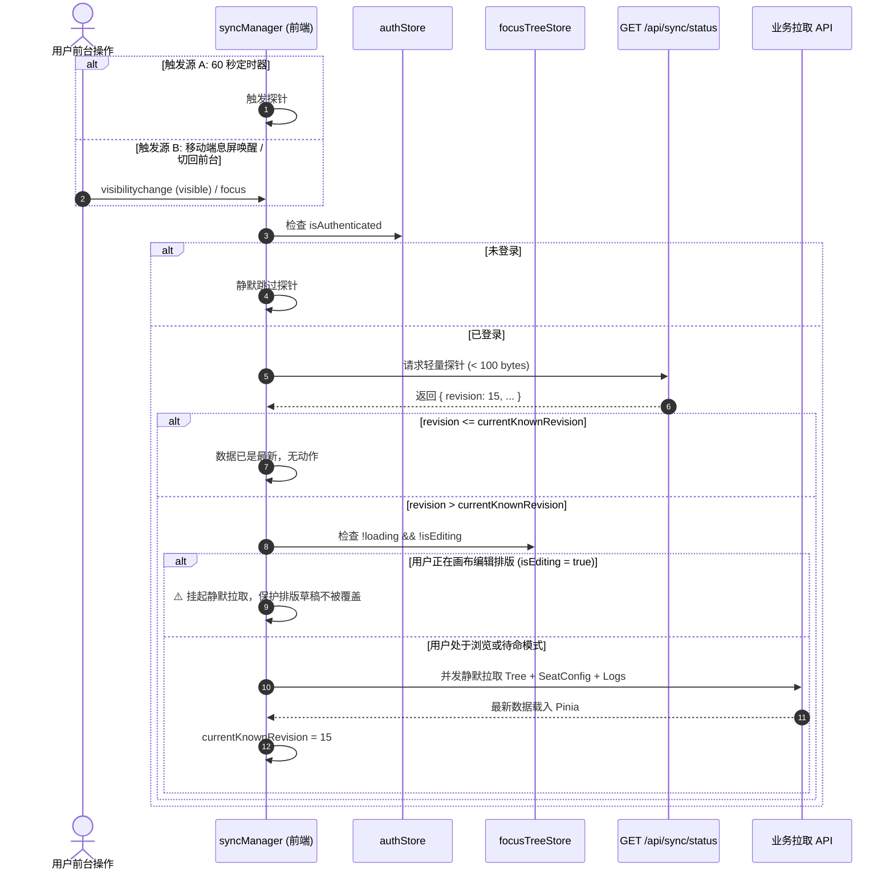

# 07-多端协同探针与轻量同步模块 (Sync Probe & Coordination)

> **模块编号：** 07  
> **设计草案版本：** v1.0 / Draft  
> **所属系统：** Sacred Focus（国策树与神圣座位）效能工程中枢  
> **对齐协议：** CAS 乐观协同探针协议 (Compare-And-Swap Probe)

---

## 1. 模块概述与业务职责

### 1.1 模块定位
本模块是系统**多终端无感协同与长连接替代方案中枢**。在单机轻量自建场景下，维护全时 WebSocket 长连接会显著增加移动端耗电、代理服务器内存占用及断线重连复杂度。系统通过**微型 HTTP 探针 + CAS 版本锁 + 页面前台生命周期监听**，以极端轻量的开销实现了跨设备实时协同。

### 1.2 核心业务职责
1. **微型心跳探针 (`/api/sync/status`)**：
   - 响应体积 $< 100\text{ 字节}$（仅返回 `revision`、`evolutionVersion`、`updatedAt`）；
   - 服务端纯内存/索引单点读取，响应耗时 $< 1\text{ms}$，极低网络与 CPU 损耗；
2. **多源生命周期驱动触发**：
   - **定时心跳**：后台每 60 秒触发一次静默探针；
   - **前台唤醒**：监听 `document.visibilitychange`（息屏唤醒或切回标签页）与 `window.focus` 事件，瞬间主动探测；
3. **CAS 乐观并发版本核对**：
   - 本地维护 `currentKnownRevision`；
   - 仅当服务端 `revision > currentKnownRevision` 时触发数据拉取，杜绝无意义的网络流量损耗；
4. **画布排版草稿互斥保护 (Anti-Collision)**：
   - 核心保障：当检测到 `focusTreeStore.isEditing === true` 时，**自动挂起静默拉取**，彻底杜绝云端更新冲掉用户正在排版的画布草稿；
5. **SPA / PWA 内存泄漏守护**：
   - 提供闭包清理函数，在页面卸载时注销定时器与全局事件监听。

---

## 2. 核心源文件清单

| 文件路径 | 架构角色 | 核心职责说明 |
|---|---|---|
| [`backend/src/routes/sync.ts`](file:///d:/Codes/Projects/sacred-focus/backend/src/routes/sync.ts) | 后端路由 | 极轻量同步探针接口，返回当前全局版本与快照代际 |
| [`frontend/src/utils/syncManager.ts`](file:///d:/Codes/Projects/sacred-focus/frontend/src/utils/syncManager.ts) | 前端调度器 | 探针轮询定时器、生命周期事件监听与草稿互斥调度 |
| [`frontend/src/utils/api.ts`](file:///d:/Codes/Projects/sacred-focus/frontend/src/utils/api.ts) | 网络层封装 | 统一网络请求封装、Cookie 凭据携带与 401 自动跳转 |
| [`backend/src/db/revision.ts`](file:///d:/Codes/Projects/sacred-focus/backend/src/db/revision.ts) | 版本中枢 | 全局原子递增 `system_revision` 版本号管理 |

---

## 3. 探针协同流转架构



---

## 4. 关键实现代码解析

```ts
// frontend/src/utils/syncManager.ts
async function probeAndSync() {
  if (isProbing) return;
  isProbing = true;

  try {
    const authStore = useAuthStore();
    if (!authStore.isAuthenticated) return;

    const data = await apiFetch<{ revision: number }>('/api/sync/status');

    if (currentKnownRevision === 0) {
      currentKnownRevision = data.revision;
      return;
    }

    if (data.revision > currentKnownRevision) {
      currentKnownRevision = data.revision;

      const focusTreeStore = useFocusTreeStore();
      const sacredSeatStore = useSacredSeatStore();

      // P2-LOG-02 防御：未处于加载中且未处于画布排版态方可刷新
      if (!focusTreeStore.loading && !focusTreeStore.isEditing) {
        await Promise.allSettled([
          focusTreeStore.fetchTreeData(),
          sacredSeatStore.fetchConfig(),
          sacredSeatStore.fetchLogs()
        ]);
      }
    }
  } finally {
    isProbing = false;
  }
}
```

---

## 5. 对外接口协议清单

| 方法 | 路径 | 鉴权要求 | 响应体积 | 描述 |
|---|---|:---:|:---:|---|
| `GET` | `/api/sync/status` | 公开 | $< 100\text{ bytes}$ | 轻量探针接口，返回当前全局系统版本号与最后修改时间 |

---

## 6. 跨模块协同关系

1. **与【02-数据库模块】联动**：
   - 探针直接读取 `system_meta` 表中的 `system_revision`；
2. **与【03-神圣座位】、【04-国策树】联动**：
   - 当版本号跳变时，协调并发调度 `fetchTreeData` 与 `fetchConfig`，实现多端数据自动无感收敛；
3. **与【04-国策树编辑沙盒】深度互斥**：
   - 读取 `focusTreeStore.isEditing`，在用户专注排版时提供确定的草稿隔离屏障。
