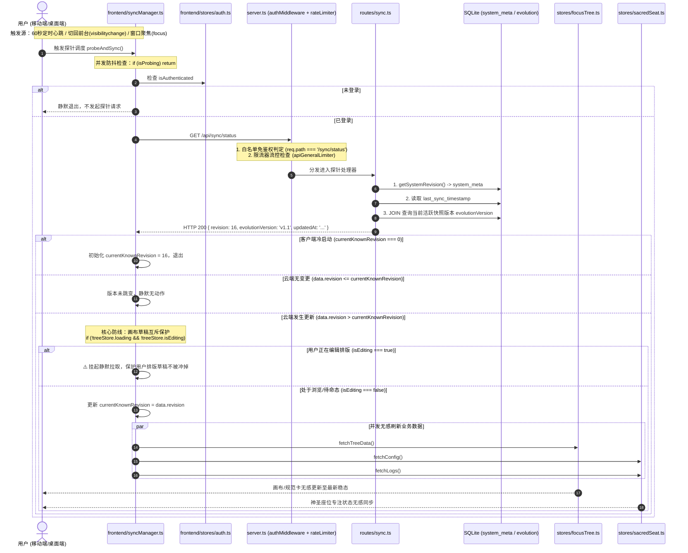

# 07-多端协同探针与轻量同步模块 逻辑流程与时序架构详细设计 (Draft)

> **文档定位：** 模块 07 真实源代码逻辑执行流深度审计与工程实现草案  
> **对齐版本：** v1.1 (基于 `backend/src/routes/sync.ts`、`backend/src/db/revision.ts`、`frontend/src/utils/syncManager.ts` 等实际源码)  
> **审查基准：** 全量 API 入口校验、内部时序链路、探针与中枢双向闭环、异常吞咽审计、四大边界条件（空值/重复探针防抖/超时离线/并发CAS）

---

## 1. 入口与路由全量矩阵（API & 校验规则审计）

模块 07 的服务端核心路由挂载在 [`backend/src/server.ts`](file:///d:/Codes/Projects/sacred-focus/backend/src/server.ts#L88) 的 `/api/sync` 前缀下。  
全模块核心服务接口为极轻量心跳探针 `/api/sync/status`。经源码审计，本模块**【未引入 Zod 校验库】**（探针不接收请求参数，属于免鉴权只读探针）。

### 1.1 API 端点与参数校验全景表

| 序号 | HTTP 方法 | 路由路径 | 接收参数 (Params / Query / Body) | 校验类型 | 实际生效的校验规则与边界约束 | 风险与缺陷标注 |
|---|---|---|---|---|---|---|
| 1 | `GET` | `/api/sync/status` | 无 | 无 | 无入参校验。<br>**免鉴权白名单接口**：在 `authMiddleware` 的 `PUBLIC_PATHS` 中注册，允许未携带 Token 访问。<br>限流规则：已登录 1000次/分，未登录 60次/分，本机/内网豁免。 | **【未做入参校验】**（无入参需求）。<br>属于公开探针，公网环境下暴露系统原子版本号与快照代际名称。 |

---

## 2. 内部执行时序与生命周期审计

### 2.1 全链路执行时序模型

模块 07 采用“微型 HTTP 轮询探针 + 前端前台生命周期监听 + CAS 乐观版本号对比”架构，彻底取代全时 WebSocket 长连接，以极低功耗实现多终端数据无感热同步：



### 2.2 核心环节详细剖析

#### 1. 权限与网络门禁策略 (Auth & Gate)
- **免鉴权白名单注册**：
  在 [`backend/src/middleware/auth.ts:L9-L14`](file:///d:/Codes/Projects/sacred-focus/backend/src/middleware/auth.ts#L9-L14) 中：
  ```ts
  const PUBLIC_PATHS = [
    '/health',
    '/auth/login',
    '/auth/status',
    '/sync/status' // 探针白名单
  ];
  ```
  即使客户端未携带 Token，`authMiddleware` 判定 `isPublic === true` 后直接 `next()` 放行；若携带 Token 则正常解析 `req.user`。
- **差异化限流防护**：
  挂载在 [`backend/src/middleware/rateLimiter.ts:L18-L29`](file:///d:/Codes/Projects/sacred-focus/backend/src/middleware/rateLimiter.ts#L18-L29) 的 `apiGeneralLimiter`：
  - 已认证客户端（`req.user` 存在）：**1000 次 / 分钟**；
  - 未认证客户端：**60 次 / 分钟**；
  - 本机与可信内网（`isLocalOrTrusted`）：**完全豁免限流**。

#### 2. 服务端数据库 SQL/ORM 查询
探针执行极其精炼，仅涉及 3 条简单单表/短关联查询，单次响应体积 $< 100\text{ 字节}$，执行耗时 $< 1\text{ms}$：
1. **原子版本号**：调用 `getSystemRevision()`：
   ```sql
   SELECT value FROM system_meta WHERE key = 'system_revision';
   ```
2. **最后同步时间戳**：
   ```sql
   SELECT value FROM system_meta WHERE key = 'last_sync_timestamp';
   ```
3. **活跃快照代际宏观版本**：
   ```sql
   SELECT s.version FROM evolution_snapshots s 
   JOIN evolution_state e ON s.slotIndex = e.activePointerIndex 
   WHERE e.id = 1;
   ```
- **事务边界**：只读查询，**无显式事务**。

#### 3. 全局版本号原子自增中枢 (`incrementSystemRevision`)
全系统所有核心写操作（打卡、国策树保存、判例录入、专注开始/结束/反悔、版本演化快照、整机恢复）均统一收口调用 [`backend/src/db/revision.ts:L10-L30`](file:///d:/Codes/Projects/sacred-focus/backend/src/db/revision.ts#L10-L30)：
```ts
export function incrementSystemRevision(): number {
  const now = new Date().toISOString();
  const tx = db.transaction(() => {
    db.prepare(`
      INSERT INTO system_meta (key, value)
      VALUES ('system_revision', '1')
      ON CONFLICT(key) DO UPDATE SET value = CAST(CAST(system_meta.value AS INTEGER) + 1 AS TEXT)
    `).run();

    db.prepare(`
      INSERT INTO system_meta (key, value)
      VALUES ('last_sync_timestamp', @now)
      ON CONFLICT(key) DO UPDATE SET value = excluded.value
    `).run({ now });

    const row = db.prepare("SELECT CAST(value AS INTEGER) AS rev FROM system_meta WHERE key = 'system_revision'").get() as { rev: number };
    return row.rev;
  });

  return tx();
}
```
- **事务开启与提交点**：使用 `db.transaction()` 短事务，通过 SQLite 原生原子计算 `CAST(value AS INTEGER) + 1`，保证无论单进程多并发还是极端并发写入，版本号严格**单调递增且连续**。

### 2.3 异常吞咽审计（是否存在 Try-Catch 吞异常？）

1. **服务端 `GET /api/sync/status`**：
   ```ts
   try {
     const revision = getSystemRevision();
     // ...
     res.json({ revision, evolutionVersion: activeSnapRow?.version || 'v1.0', updatedAt: ... });
   } catch (e: any) {
     res.status(500).json({ error: 'Failed to probe sync status', details: e.message });
   }
   ```
   - **审计结论**：**未吞掉异常**。捕获底层数据库不可用等异常时，明确向客户端返回 `500` 与详细错误信息。
2. **客户端 `frontend/src/utils/syncManager.ts`**：
   ```ts
   try {
     // probe logic ...
   } catch (e) {
     // 探针静默失败不中断用户当前操作
   } finally {
     isProbing = false;
   }
   ```
   - **设计定位审计**：此处客户端 `catch` 吞掉了网络异常，**属于预期的设计行为**。作为后台静默探针，当遭遇移动端弱网、隧道瞬断或离线时，静默吞掉报错可以防止控制台向用户弹出骚扰弹窗；`finally` 块确保释放 `isProbing = false` 互斥锁，等待下一次生命周期唤醒重试。

### 2.4 HTTP 状态码与业务错误码速查表

| HTTP 状态码 | 业务错误代码 / 信息 (`error`) | 触发代码位置 | 场景说明 |
|---|---|---|---|
| `429 Too Many Requests` | `RATE_LIMIT_EXCEEDED` | `rateLimiter.ts:L24` | 客户端探针探测频率超过流控限制（未认证 > 60次/分，已认证 > 1000次/分） |
| `500 Internal Server Error` | `Failed to probe sync status` | `sync.ts:L25` | 服务端读取 `system_meta` 或演化表时发生底层 SQLite I/O 故障 |
| `500 Internal Server Error` | `INTERNAL_SERVER_ERROR` | `server.ts:L116` | 全局中间件兜底未捕获异常 |

---

## 3. 边界处理专项深度审计

依据实际源代码，严密复核**空值**、**重复探针与防抖**、**超时离线**、**并发CAS**四大边界。凡代码未做判断的，显式标注为 `【未做判断】`。

### 3.1 空值处理 (Null / Undefined / Empty)

#### (1) 系统初始状态元数据空值
- 源码位置：[`backend/src/routes/sync.ts:L9-L23`](file:///d:/Codes/Projects/sacred-focus/backend/src/routes/sync.ts#L9-L23) 与 [`revision.ts:L4-L7`](file:///d:/Codes/Projects/sacred-focus/backend/src/db/revision.ts#L4-L7)
  ```ts
  // revision.ts
  const row = db.prepare("SELECT value FROM system_meta WHERE key = 'system_revision'").get();
  return row ? parseInt(row.value, 10) : 1; // 缺失保底为 1

  // sync.ts
  evolutionVersion: activeSnapRow?.version || 'v1.0', // 缺失快照保底为 v1.0
  updatedAt: timeRow?.value || new Date().toISOString() // 缺失时间戳保底为当前时间
  ```
- **审计结论**：健全。在新初始化未生成任何快照或元数据记录的数据库上，能够优雅兜底，绝不抛出空指针异常。

#### (2) 客户端已知版本初始空值 (0)
- 源码位置：[`frontend/src/utils/syncManager.ts:L31-L34`](file:///d:/Codes/Projects/sacred-focus/frontend/src/utils/syncManager.ts#L31-L34)
  ```ts
  if (currentKnownRevision === 0) {
    currentKnownRevision = data.revision;
    return;
  }
  ```
- **审计结论**：首次打开网页时，`currentKnownRevision` 初始为 `0`。探针首次命中将基准版本设为云端当前值，静默退出，避免页面初次载入时发生重复拉取全量数据的无效网络风暴。

---

### 3.2 重复探针与客户端防抖 (De-bounce & Idempotency)

#### (1) 探针飞行互斥锁 (`isProbing`)
```ts
let isProbing = false;
async function probeAndSync() {
  if (isProbing) return;
  isProbing = true;
  try { ... }
  finally { isProbing = false; }
}
```
- **审计结论**：当 60 秒定时器触发的同时，用户恰好触发了 `window.focus` 或切屏，由于 `isProbing` 布尔互斥锁存在，后发起的探测会**瞬间被丢弃**，确保同一时间只有一个 HTTP 探针在网路中传输。

#### (2) 版本比对幂等判定
```ts
if (data.revision > currentKnownRevision) { ... }
```
- **审计结论**：仅在云端版本**严格大于**本地已知版本时才触发拉取；相等或小于时静默返回，彻底杜绝高频无意义重绘。

---

### 3.3 超时与移动端弱网离线处理 (Timeout & Offline)

#### (1) 服务端 I/O 超时
- **审计结论**：服务端探针仅执行主键单行点查，无任何网络下游依赖，本地执行通常 $< 0.5\text{ms}$，**【服务端未做超时熔断判断】**。

#### (2) 客户端网络断开与超时回退
- 客户端依托原生 `fetch` 与 `apiFetch`。在移动设备地铁穿梭、隧道或息屏彻底断网时，请求抛出 `TypeError: Failed to fetch`，被 `probeAndSync` 的 `catch` 块静默消化；
- **【未做显式请求超时中断（AbortController）】**：若移动网络处于恶劣的“挂起半死”状态，探针可能长期处于挂起态，导致 `isProbing` 锁未释放；建议为探针 fetch 配置 3000ms 超时的 `AbortSignal.timeout(3000)`。

---

### 3.4 并发与 CAS 竞争关键隐患深度审计 (Concurrency & CAS Edge)

#### (1) 画布排版草稿互斥防线 (Anti-Collision)
- 源码位置：[`frontend/src/utils/syncManager.ts:L44`](file:///d:/Codes/Projects/sacred-focus/frontend/src/utils/syncManager.ts#L44)
  ```ts
  if (!focusTreeStore.loading && !focusTreeStore.isEditing) {
    await Promise.allSettled([
      focusTreeStore.fetchTreeData(),
      sacredSeatStore.fetchConfig(),
      sacredSeatStore.fetchLogs()
    ]);
  }
  ```
- **审计结论**：有效防御了云端静默更新冲掉用户前端未保存的节点拖拽与连线草稿。

#### (2) ⚠️ 致命架构缺陷审计：`currentKnownRevision` 提前覆盖导致的 CAS 乐观锁失效
在 [`frontend/src/utils/syncManager.ts:L36-L51`](file:///d:/Codes/Projects/sacred-focus/frontend/src/utils/syncManager.ts#L36-L51) 中存在如下时序：
```ts
if (data.revision > currentKnownRevision) {
  console.log(`[Sacred Focus Sync] 云端检测到更新: rev ${currentKnownRevision} -> ${data.revision}`);
  currentKnownRevision = data.revision; // ⚠️ 此处先无条件更新了本地版本号！

  const focusTreeStore = useFocusTreeStore();
  const sacredSeatStore = useSacredSeatStore();

  if (!focusTreeStore.loading && !focusTreeStore.isEditing) {
    await Promise.allSettled([ ... ]);
  }
}
```
- **缺陷场景复现**：
  1. 终端 A 与终端 B 同时处于版本 `rev = 10`；
  2. 终端 A 进入“编辑排版模式”（`isEditing = true`），开始拖拽调整布局；
  3. 此时终端 B 在手机端点亮了一个节点，云端版本跃迁至 `rev = 11`；
  4. 终端 A 的探针触发，检测到 `11 > 10`，执行 `currentKnownRevision = 11`；随后因 `isEditing === true`，跳过了 `fetchTreeData()`；
  5. 终端 A 用户调整完毕，点击“保存排版”。前端取出 `getCurrentRevision()` 作为 `expectedRevision = 11` 发送给后端；
  6. 后端收到 `expectedRevision = 11`，比对 `11 === 11`，判定**无冲突**，成功写入！
  7. **最终结果**：终端 A 基于旧版本 `10` 的排版直接覆写了数据库，终端 B 刚才点亮的节点状态被彻底洗掉，**后端设计的 CAS 乐观版本锁被前端探针提前更新变量的行为实质性破坏**！
- **修复方案**：`currentKnownRevision = data.revision` **必须移入数据真正拉取成功之后**；当处于 `isEditing` 态时，**严禁更新 `currentKnownRevision`**，并应当在界面右上角提示用户“检测到云端已被其他设备修改，保存将触发版本冲突”。

---

## 4. 架构改进建议与演化待办 (Actionable Backlog)

1. **紧急修复 CAS 乐观锁版本伪造漏洞**：
   - 将 `syncManager.ts` 中的 `currentKnownRevision = data.revision` 调整为受控更新：若 `isEditing === true` 则不更新本地已知版本，保留旧版本供 `saveTreeLayout` 触发 409 拦截并提示冲突；
2. **探针补充 3 秒超时中止器**：
   - 在探针请求中配置 `signal: AbortSignal.timeout(3000)`，防止恶劣移动网络下长时间霸占 `isProbing` 锁；
3. **PWA 后台保活生命周期注销完整性**：
   - 确保在 Vue 组件卸载或路由注销时，统一调用 `initSyncManager()` 返回的清理闭包注销 `visibilitychange` 监听；
4. **编辑态下的版本跳变用户预警**：
   - 当 `isEditing === true` 且检测到 `data.revision > currentKnownRevision` 时，在画布顶部展示黄色告警栏：“⚠️ 云端有新提交，当前编辑版本落后，建议保存前先导出草稿”。
