# 🌳 动能破晓：全域稳态与昼夜效能国策树 v1.0

> 💡 **核心战役目标**：构建覆盖 **`07:30 晨光禁娱`** 至 **`00:00 神圣寝域`** 的全天候闭环自洽系统，消除拖延、内耗与报复性熬夜。  
> **战略方针**：**零敲牛皮糖**（极低阻力阶梯）+ **不战而屈人之兵**（手环半自动代偿）+ **动线合并与物理隔离** + **判例法消灭侥幸**。  
> **版本状态**：`v1.0 正式版` ｜ **创建日期**：2026-09-02

---

## 🗺️ 一、 总体可视化流程图 (Mermaid)

> 🎨 **原生双模式自适应与大字号排版**：
> - 采用紧凑垂直列阵布局（严格控制横向宽度 $\le 2$ 列），**彻底根治画面被压缩缩小为“小蚂蚁字”的问题**；
> - 节点字号提升至 **15px** 并加粗标题；
> - 在 **Typora 浅色模式** 下呈现清晰的 **「白底黑字」**，在 **Obsidian 深色模式** 下呈现 **「黑底白字」**，仅保留彩色高对比边框与 Emoji。

```mermaid
flowchart TD
    %% 样式定义：字号调大至15px，纯边框着色，完美适配白底黑字/黑底白字
    classDef default font-size:15px;
    classDef root stroke:#2563eb,stroke-width:2.5px,font-size:15px;
    classDef morning stroke:#ea580c,stroke-width:2.5px,font-size:15px;
    classDef day stroke:#0284c7,stroke-width:2.5px,font-size:15px;
    classDef buff stroke:#16a34a,stroke-width:2.5px,font-size:15px;
    classDef night stroke:#7c3aed,stroke-width:2.5px,font-size:15px;
    classDef alt stroke:#64748b,stroke-width:2px,stroke-dasharray: 3 3,font-size:15px;

    %% 1. 根基宪法组
    subgraph R_Group ["🛡️ 【根国策组】系统宪法与元机制（全天候生效）"]
        direction LR
        R0["🛡️ <b>R0 水密隔舱</b><br/>生病/不可抗力冻结结算"]:::root
        R1["⚖️ <b>R1 下必为例</b><br/>模糊行为终身判例定性"]:::root
        R2["🔤 <b>R2 词林赎买</b><br/>背10词解锁10m娱乐"]:::root
    end

    %% 2. 早起破晓组 (单列垂直流水线，大字号极速阅读)
    subgraph M_Group ["🌅 【早起国策组】破晓突围流水线"]
        direction TB
        M1["⏰ <b>M1 离地起爆</b><br/>闹钟响后3分钟下床"]:::morning
        M2["🚿 <b>M2 净面破障</b><br/>醒后10分钟进洗手间洗漱"]:::morning
        M3["📵 <b>M3 晨光净空</b><br/>起身后30m手环禁娱"]:::morning
        M4["📋 <b>M4 沙盘推演</b><br/>微软ToDo极简规划单元"]:::morning
        M1 --> M2 --> M3 --> M4
    end

    %% 3. 日间作战与体智充能组 (双列并排，充分利用宽度且不缩放)
    subgraph Day_Section ["⚡ 【日间作战与充能】"]
        direction LR
        subgraph D_Group ["🎯 专注心流引擎"]
            direction TB
            F1["🎙️ <b>F1 声呐巡航</b><br/>通勤录音自聊防刷屏"]:::day
            F2["🧩 <b>F2 碎石颗粒</b><br/>仅拆到可启动单元"]:::day
            F3["🪑 <b>F3 神圣坐席</b><br/>工位锁定+限制组关闭"]:::day
            F4["🔥 <b>F4 微火试车</b><br/>先跑5分钟低阻力启动"]:::day
            F5["🚀 <b>F5 全功率深潜</b><br/>状态佳手环顺延至60m"]:::day
            F1 --> F2 --> F3 --> F4 --> F5
        end

        subgraph B_Group ["🔋 储备充能资产"]
            direction TB
            L1["📖 <b>L1 记忆温固</b><br/>日常单词复习巩固"]:::buff
            L2["🎯 <b>L2 前沿装填</b><br/>每日定量新词背诵"]:::buff
            L3["🏋️ <b>L3 营垒锻造</b><br/>寝室器械力量锻炼"]:::buff
            L1 --> L2 --> L3
        end
    end

    %% 4. 夜间极夜组 (紧凑单双列混排，告别横向拉伸)
    subgraph N_Group ["🌙 【夜间国策组】极夜降临与神圣寝域"]
        direction TB
        N1["🔕 <b>N1 暮鼓内省 (22:30)</b><br/>主力勿扰+记账+补蛋白粉"]:::night
        
        subgraph N_Lock ["23:00 物理驱逐 (手环闹钟)"]
            direction LR
            N2_Work["🎒 <b>N2-A 兵装前置</b><br/>工作日：主力机进通勤包"]:::night
            N2_Rest["🗄️ <b>N2-B 结界归仓</b><br/>休息日：主力机放进抽屉"]:::night
        end

        N3["🌑 <b>N3 极夜滤镜 (23:00-8:10)</b><br/>备用机自动化全黑白屏"]:::night
        N4["♨️ <b>N4 温足解甲 (23:15)</b><br/>泡脚放松 + 倒水顺手洗漱"]:::night
        N5["📝 <b>N5 战阵复盘 (23:30前)</b><br/>记录今日笔记·排空脑内存"]:::night
        N6["🔒 <b>N6 电子宵禁 (23:30)</b><br/>备用机限制组App自动封锁"]:::night
        N7["🛏️ <b>N7 神圣寝域 (24:00)</b><br/>上床5m脱手·闭目充电"]:::night
        N8["🎧 <b>N8 声波避难所</b><br/>外部吵闹戴耳机听离线白噪音"]:::alt

        N1 --> N2_Work & N2_Rest
        N2_Work & N2_Rest --> N3 --> N4 --> N5 --> N6 --> N7
        N7 -.->|喧闹防御| N8
    end

    %% 跨组主干连接
    R_Group ~~~ M_Group
    M4 -->|通勤出门| F1
    F5 -.->|专注间歇| L1
    L3 -.->|消耗·缺蛋白| N1
    R2 -.->|赎买弹药| L1

    %% 子图透明边框样式
    style R_Group stroke:#2563eb,stroke-width:1.5px,stroke-dasharray: 4 4;
    style M_Group stroke:#ea580c,stroke-width:1.5px,stroke-dasharray: 4 4;
    style Day_Section stroke:#0284c7,stroke-width:1.5px,stroke-dasharray: 4 4;
    style D_Group stroke:#0284c7,stroke-width:1px,stroke-dasharray: 2 2;
    style B_Group stroke:#16a34a,stroke-width:1px,stroke-dasharray: 2 2;
    style N_Group stroke:#7c3aed,stroke-width:1.5px,stroke-dasharray: 4 4;
    style N_Lock stroke:#7c3aed,stroke-width:1px,stroke-dasharray: 2 2;
```

---

## 📋 二、 各节点详细定义与规范卡

### 🛡️ 【基石组：系统元机制（宪法与底线）】

#### 🛡️ R0：水密隔舱协议（Watertight Bulkhead）
* **创建日期**：2026-09-02 ｜ **节点类型**：元机制告示牌（全天候生效，永不崩溃）
* **触发条件**：突发生病、学校不可抗突发事故、外部不可避断电停水等。
* **规则描述**：在日记中打上 `[FREEZE]` 声明，**冻结当日国策结算**。允许休养生息，不判定为节点崩溃，保全历史稳态进度条，坚决防止“破罐子破摔”的雪崩心理。

#### ⚖️ R1：下必为例协议（Binding Precedent）
* **创建日期**：2026-09-02 ｜ **节点类型**：博弈论判例法典（全天候生效）
* **触发条件**：遇到模糊地带或新 App（如“想装个新工具/查资料，算不算限制组”）。
* **规则描述**：执行前必须进行终身推演——**“若我现在开特例，则今后在相同场景下一律合法”**。如果你不愿承担该行为成为永久习惯的终身代价，则当场判定为违规并列入限制组。

#### 🔤 R2：词林赎买机制（Vocabulary Ransom）
* **创建日期**：2026-09-02 ｜ **节点类型**：冲激代偿机制（全天候生效）
* **触发条件**：在限制时段内产生“强烈想破戒/额外玩手机”的多巴胺冲动。
* **硬性约束**：**每额外游玩 10 分钟，必须提前在背词软件中完成 10 个单词的学习/复习**。
* **半自动操作**：背完 10 词后，在手环上开启 **10 分钟倒计时**，震动必须立刻放下手机。未背单词直接玩手机判定为严重违例。

---

### 🌅 【早起国策组：破晓突围流水线】

#### ⏰ M1：离地起爆（3分钟下床）
* **创建日期**：2026-09-02 ｜ **节点类型**：物理动能锚点
* **动作指令**：晨间闹钟响后 **3 分钟内脚掌触地离开床铺**，将身体重心完全移出床铺引力场。
* **失败判定**：闹钟响后躺在床上超过 3 分钟（含闭眼回笼觉与玩手机）。

#### 🚿 M2：净面破障（10分钟进洗手间）
* **创建日期**：2026-09-02 ｜ **节点类型**：神经激活仪式
* **动作指令**：完成下床后 **10 分钟内必须进入洗手间**，用冷水洗脸并完成刷牙洗漱，借助凉水物理刺激面部三叉神经驱散睡眠惰性。
* **失败判定**：下床后游荡超过 10 分钟未进入洗手间洗漱。

#### 📵 M3：晨光净空（晨起30分钟禁娱）
* **创建日期**：2026-09-02 ｜ **节点类型**：多巴胺防火墙（半自动）
* **动作指令**：下床瞬间在手环上启动 **30 分钟倒计时**。倒计时结束前，**严禁打开任何娱乐/社交/资讯类限制组 App**。仅允许洗漱、饮水、拉伸或查看备忘录。
* **失败判定**：30 分钟内主动点开限制组应用。

#### 📋 M4：沙盘推演（微软ToDo极简规划）
* **创建日期**：2026-09-02 ｜ **节点类型**：日间作战桥梁
* **动作指令**：M3 禁娱结束前夕或出门前，花 3 分钟打开微软 ToDo，仅规划今日 **1~3 个核心行动单元**（颗粒度见 F2），规划完毕即关闭软件准备出行。
* **失败判定**：过度做复杂的层级规划，或跳过规划直接盲目出门。

---

### ⚡ 【专注作战组：日间心流引擎】

#### 🎙️ F1：声呐巡航（通勤自语录音）
* **创建日期**：2026-09-02 ｜ **节点类型**：动态机动防御
* **动作指令**：踏上通勤路线后，戴上耳机开启手机录音机，以“跟自己闲聊/复盘今日规划/探讨问题”的形式持续口头叙述。
* **收益**：全面占领发声和思考通道，**从生理上杜绝边走边低头刷手机**，同时零成本锻炼即兴口语表达。
* **失败判定**：通勤途中低头无目的滑动社交/短视频软件。

#### 🧩 F2：碎石颗粒（极简可启动颗粒度）
* **创建日期**：2026-09-02 ｜ **节点类型**：认知卸载准则
* **动作指令**：任务拆解**坚决只细化到“随时能开始动手的第一步”**（如“打开IDE创建文件”、“写出前言第一句话”），绝不进行过度规划。
* **失败判定**：因规划过大过重导致前额叶抗拒拖延。

#### 🪑 F3：神圣坐席（工位预约与限制组封锁）
* **创建日期**：2026-09-02 ｜ **节点类型**：环境结界
* **动作指令**：坐在指定学习/工作座位上，在手环上设定目标倒计时，同时限制组 App 全面封锁。时间一到立即开始行动。

#### 🔥 F4：微火试车（5分钟低阻力点火）
* **创建日期**：2026-09-02 ｜ **节点类型**：破冰起跑器
* **规则描述**：心理契约仅承诺**“全神贯注做 5 分钟”**。5 分钟一到：若产生痛苦抗拒，允许停下微调、喝水或更换极小任务；若顺利进入专注状态，立即触发 **F5**。

#### 🚀 F5：全功率深潜（60分钟深度心流）
* **创建日期**：2026-09-02 ｜ **节点类型**：高阶攻坚战役
* **动作指令**：F4 微火点火成功后，顺水推舟在手环上**将倒计时延展至 60 分钟**，进入闭关单任务冲刺，中途拒绝任何无关切换。

---

### 🔋 【体智充能组：军备与储备资产】

#### 📖 L1：记忆温固（词库日常复习）
* **创建日期**：2026-09-02 ｜ **节点类型**：资产巩固
* **动作指令**：利用白天碎片垃圾时间或早晨，在背词软件中完成既有旧词复习。亦作为 R2 赎买额度的原料库。

#### 🎯 L2：前沿装填（每日定量新词背诵）
* **创建日期**：2026-09-02 ｜ **节点类型**：增量攻坚
* **动作指令**：每日推进既定配额的新单词攻坚背诵，为语言能力持续蓄能。

#### 🏋️ L3：营垒锻造（寝室器械体能刺激）
* **创建日期**：2026-09-02 ｜ **节点类型**：生理稳态筑底
* **动作指令**：在寝室利用哑铃/弹力带等简易器材进行 15~30 分钟抗阻或体能训练。利用身体疲劳提升深睡压力，并与夜间 N1 蛋白质审计形成因果闭环。

---

### 🌙 【夜间国策组：极夜降临与神圣寝域】

#### 🔕 N1：暮鼓内省（22:30 锚点）
* **创建日期**：2026-09-02 ｜ **节点类型**：后勤与生理审计（每晚 22:30）
* **动作指令**：
  1. 主力机系统自动化开启勿扰模式；
  2. 花 2 分钟审阅分析今日账目流水并补录；
  3. 打开健康日记记录饮食：**核算蛋白质摄入**，若存在缺口，此时立即冲泡一杯蛋白粉补上。
* **失败判定**：22:35 前未开启勿扰且未进行记账与健康复核。

#### 🎒/🗄️ N2：兵器入库（23:00 物理驱逐）
* **创建日期**：2026-09-02 ｜ **节点类型**：空间隔离分支（每晚 23:00 手环闹钟）
* **分支动作**：
  * **工作日分支（N2-A 兵装前置）**：主力机直接放进次日通勤包并拉上拉链，省去次晨翻找手机的时间；
  * **休息日分支（N2-B 结界归仓）**：主力机锁进书桌抽屉并关好，彻底脱离视觉与触觉接触范围。
* **失败判定**：23:05 之后仍拿主力机坐在床头把玩。

#### 🌑 N3：极夜滤镜（23:00 - 08:10）
* **创建日期**：2026-09-02 ｜ **节点类型**：纯被动自动化
* **动作指令**：备用机通过色彩滤镜自动化切换为**全黑白屏幕**，剥夺视觉多巴胺反馈。

#### ♨️ N4：温足解甲（23:15 动线合并）
* **创建日期**：2026-09-02 ｜ **节点类型**：生理诱导与动线压缩（23:15）
* **动作指令**：开始打热水泡脚，借助核心体温先升后降诱发睡意；**合并物理动线**：泡完脚端起洗脚水倒水时，顺路完成刷牙、洗脸与洗漱，消灭多批次折腾。

#### 📝 N5：战阵复盘（23:30 前）
* **创建日期**：2026-09-02 ｜ **节点类型**：认知内存清空
* **动作指令**：在电脑或备用机上写下今日笔记与复盘，将大脑缓存写入硬盘，防止睡前思维漫游。

#### 🔒 N6：电子宵禁（23:30 自动化）
* **创建日期**：2026-09-02 ｜ **节点类型**：自动化封锁
* **动作指令**：备用机屏幕使用时间/限制组启动，封锁所有非闹钟应用。

#### 🛏️ N7：神圣寝域（24:00 就寝攻坚）
* **创建日期**：2026-09-02 ｜ **节点类型**：终极攻坚战役（23:55 进被窝，00:00 熄灯）
* **神圣定义**：床铺只用于休息充电。**5 分钟内彻底放下手机，闭目养神**。坚守“闭目养神即是大脑充电”的心态，无论室友是否走动，绝不产生急躁心理。
* **失败判定**：00:05 仍在床头亮屏看手机。

#### 🎧 N8：声波避难所（噪音防御分支）
* **创建日期**：2026-09-02 ｜ **节点类型**：非对称应急防御（非吵不戴，戴则白噪）
* **分支规则**：环境安静则纯净静躺；若室友喧闹/吹头，戴上柔软侧睡耳机播放预存单曲白噪音（手环或手机定时 30 分钟自动关闭），阻断对抗心理。

---

## 🛠️ 三、 递归迭代与调试手册

### 1. 手环倒计时半自动化矩阵
充分利用手环的快捷计时卡片，将需要意志力决策的时间全部“外包”给手环震动：

| 计时预设 | 挂靠国策节点 | 使用场景与动作指令 |
| :---: | :---: | :--- |
| **`30 分钟`** | **M3 晨光净空** | 晨起下床瞬间点开，震动前不碰任何限制组 App。 |
| **`5 分钟`** | **F4 微火试车** | 面对硬骨头任务时点开，只做 5 分钟极简启动。 |
| **`60 分钟`** | **F5 全功率深潜** | 5 分钟微火成功后顺延开启，进入单任务深度攻坚。 |
| **`10 分钟`** | **R2 词林赎买** | 满足“背完 10 个词”后点开，震动立刻交还手机。 |
| **`30 分钟`** | **N8 声波避难** | 深夜遇噪音戴耳机听离线白噪音时开启定时休眠。 |

### 2. 面对崩溃的“肉鸽心态”与回溯三问
若某天某节点熄灭（例如 23:00 没忍住继续刷手机）：
1. **绝不进行道德内耗**：系统参数需要微调，过去的稳态进度条依然存在；
2. **启动回溯三问**：
   * *是不是 22:30 的勿扰与记账锚点没踩稳？*
   * *是不是任务颗粒度太大导致白天积攒了逃避情绪？*
   * *是不是单词赎买的 10 分钟手环倒计时没有提前按定？*
3. **修剪参数，次日重新点亮**。

---

## 🧭 四、 底层设计逻辑与解题公理 (深度参考)

> 💡 本部分为系统的理论支撑库，日常执行无需翻阅，仅在系统迭代或迷茫时查阅。

### 1. 破解“侥幸破窗与诱惑漫延”：判例法定性与词林赎买
* **痛点根源**：自制力崩溃往往始于一次微小的“我就看一眼/这个新软件应该不算娱乐吧/再玩10分钟”。
* **解法**：
  * **定性法则（下必为例）**：面对新 App 或灰色行为，以“今后在相同场景下一律合法”的终身代价来裁决，瞬间放大违规摩擦力；
  * **冲激代偿（词林赎买）**：在“想玩手机”的原点插入“背 10 个单词换 10 分钟（手环倒计时定死）”。背词的枯燥感能劝退 80% 的伪冲动，即使执行也是将精力转化为正面词汇资产。

### 2. 破解“晨间回笼与多巴胺劫持”：离地起爆与晨光净空
* **痛点根源**：醒来躺在床上看手机，前额叶尚未苏醒就被短视频/图文的高频多巴胺劫持，导致整天神经递质基线紊乱、作息推迟。
* **解法**：
  * **3分钟脚触地**：彻底离开床铺引力场；
  * **10分钟冷水破障**：利用凉水洗漱刺激三叉神经唤醒大脑；
  * **手环30分钟倒计时禁娱**：清晨前 30 分钟严禁接触限制组 App，构筑晨光多巴胺防火墙。

### 3. 破解“通勤低头刷屏与社交表达短板”：声呐巡航
* **痛点根源**：通勤路上无意识掏出手机刷信息流，既有交通安全隐患，又浪费碎片精力，且长期缺乏主动口语表达环境。
* **解法**：戴上耳机开启录音机，以“跟自己闲聊/复盘今日/自问自答”的方式持续说话。发声思考不仅能全面占领注意力回路，**从生理上杜绝边走边低头刷手机**，更是一套零成本的即兴口才与逻辑表达训练营。

### 4. 破解“日间启动拖延与过度规划瘫痪”：碎石颗粒与微火引燃
* **痛点根源**：任务规划过于宏大复杂会导致前额叶认知过载（启动阻力无穷大），进而诱发拖延。
* **解法**：
  * **碎石颗粒化**：任务规划只拆解到“马上能动手的第一步”（如“打开IDE创建文件”、“写出前言第一句话”），绝不过度规划；
  * **微火试车（5分钟法则）**：心理契约仅承诺“全神贯注做 5 分钟”。5 分钟一到，若进入状态顺势由手环延长至 60 分钟深度深潜；若阻力仍大则允许停下微调，消除心理挫败感。

### 5. 破解“睡前拖延与噪音对抗”：动线合并、物理隔离与神圣寝域
* **痛点根源**：睡前动作分散（洗漱、泡脚、整理各自独立导致拖沓）；手机带上床导致停不下来；室友吹头/聊天等噪音引发烦躁焦虑。
* **解法**：
  * **动线合并**：将“泡完脚倒洗脚水”与“刷牙洗漱”合并为一个物理连招；
  * **空间隔离**：23:00 主力机放进包（工作日）或抽屉（休息日），备用机黑白屏并启动电子宵禁；
  * **重新定义 00:00 寝域**：00:00 不是“必须睡着”，而是“进被窝闭目养神”。静躺本身就是在高效充电；仅在极端喧闹时启动预存白噪音防御，绝不与环境对抗。

---

## 模糊记录

上方是ai辅助总结归纳后的结论，下方为记录个人最开始的模糊想法规划

---

目标：早睡早起

期望睡眠时间：00:00-7:30

原因：晚上12点停热水，室友在这个时间洗澡，洗澡完吹头的噪声影响入睡，于是拉迟入睡时间

先前尝试带耳机听视频早入睡，但是头戴式降噪强，但是无法侧睡，不能翻动半夜不舒服，药丸耳机入睡后滑落，压在背部，第二天醒来不舒服，而且现在耳机带多了，有点不舒服，拉迟时间后就不用带耳机睡眠，可以小音量外放听视频，可是现在发现外放听视频声音不能大，会影响室友，同时听视频还有个问题，就是现在不知道听什么，经常为了找合适的视频听，而花费大量时间，于是现在干脆打算不听任何音频，仅在00:00上床后仍在大声交谈时戴耳机听音频抵消噪音入眠

递归，反向递推设计

12点前上床

上床时带备用机（用于闹钟）

11点45分关闭限制组app -> 引出新问题，我常刷b站，但同时b站也是我听视频的主要应用，我是否该将b站列入限制组

11点半备用机开启黑白模式

11点后不玩主力机，开始记录当日日记，补全餐饮与运动信息给Gemini，获取health-log并记录，开始泡脚，准备睡前洗漱

10点半主力机开启勿扰模式，补记记账信息

如果任一节点需要额外游玩手机，每额外游玩10分钟，需要先在不背单词中背10个单词（提升游玩成本，如果实在想玩，可能在背单词时困了，助眠）

------

我又更新了下国策树，但是描述还不是很清晰，请你帮我把模糊的想法具体化，为各个节点命名，并且设计合适的串行、分支。

根国策组：
 1、意外（如生病）时冻结节点
 2、醒来后10分钟内进洗手间洗漱
 3、下必为例，为各种模糊的节点规则定性（如在禁止限制组app时，遇到新的app，先根据下必为例，来判断他是否该判定为限制组）
 4、夜晚休息时想要额外玩手机，每次先背诵10个单词来解锁10分钟（这种限定的时间都使用手环的倒计时功能来实现半自动执行，每次只需要设置具体的时长即可）

夜间国策组：
 1、22：30，开启主力机勿扰（自动任务）+ 查看记账信息（审阅分析、补录）+ 记录健康日记（补录、分析，如果蛋白质不够，则此时喝蛋白粉补上一部分）
 2、23点（手环闹钟），如果明天是工作日，则主力机提前放包里，如果是休息日，则放进抽屉里
 3、备用机23：00-8：10开启黑白滤镜（自动化任务）
 4、23：30，限制组app禁用（自动化任务）
 5、泡脚休息、泡完脚倒洗脚水时顺便洗漱
 6、记录今日笔记，回顾今日
 7、24点上床，5分钟内放下手机，闭目养神，准备睡觉
 8、如果太吵，则戴耳机听提前下载的白噪音

专注加强组：
 1、启用神圣座位预约时禁用限制组app，具体预约时长又手环倒计时设置，时间一到立马开始
 2、为每个任务单元分配到可以开始行动即可，不进行过度规划
 3、先进行5分钟专注任务，如果进入状态，则延长为60分钟

早起国策组：
 1、闹钟响起后3分钟内下床
 2、起床前30分钟，不使用限制组任务（使用手环定时）

不知道该如何分组，有些是目标，有些不知道该放入哪个分组，又或者该新建什么分组：
 1、使用app微软todo清单，简单设计规划今日任务
 2、通勤路上，录音跟自己闲聊，来锻炼语言能力、同时避免路上边走路边玩手机
 3、复习单词
 4、背诵今日单词
 5、使用器材在寝室进行锻炼
