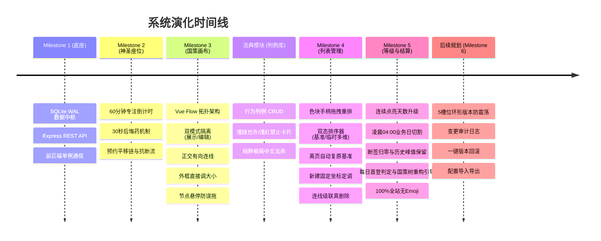

# 📐 Sacred Focus（神圣座位与国策树系统）今日开发历程与全景总结

> **文档定位**：全量系统开发全景回顾、设计决策链、各阶段问题复盘与后续路线图。  
> **记录日期**：2026年9月3日  
> **当前工程状态**：Milestone 1 ~ Milestone 4 全部闭环交付，代码全量编译通过并推送到 GitHub 远程主干。

---

## 目录
1. [系统整体定位与技术底座架构](#一系统整体定位与技术底座架构)
2. [各阶段里程碑演化全景图（Mermaid）](#二各阶段里程碑演化全景图)
3. [分阶段里程碑设计、实现与核心突破](#三分阶段里程碑设计实现与核心突破)
   - [Milestone 1：底层脚手架与全量持久化中枢](#milestone-1底层脚手架与全量持久化中枢)
   - [Milestone 2：神圣座位核心专注防御机制](#milestone-2神圣座位核心专注防御机制)
   - [Milestone 3：国策树画布与拓扑心流网络](#milestone-3国策树画布与拓扑心流网络)
   - [判例法典体系化完善（Precedent Caselaw）](#判例法典体系化完善precedent-caselaw)
   - [Milestone 4：国策列表管理与双态排序器](#milestone-4国策列表管理与双态排序器)
   - [Milestone 5：国策连续点亮等级系统与 04:00 业务日结算架构](#milestone-5国策连续点亮等级系统与-0400-业务日结算架构)
4. [全天核心疑难 Bug 排查复盘与解决方案汇总表](#四全天核心疑难-bug-排查复盘与解决方案汇总表)
5. [目前工程整体进程与健康度评估](#五目前工程整体进程与健康度评估)
6. [还未实现的目标与后续 Milestone 规划](#六还未实现的目标与后续-milestone-规划)

---

## 一、 系统整体定位与技术底座架构

本项目基于**自控工程学体系**构建，致力于打造一个对抗注意力熵增、构筑个人心理秩序稳态的极简效能系统。

### 1. 核心技术栈
- **前端架构**：Vue 3 Composition API (`<script setup>`) + TypeScript + Vite 6 + Pinia 状态中枢 + Vue Router 4；
- **图形拓扑**：`@vue-flow/core` 打造的高性能 SVG/HTML5 混编拓扑画布，支持正交避障引线；
- **视觉设计**：纯粹 Vanilla CSS 极简高对比度设计系统，**全站彻底杜绝 Emoji**，使用高质感 CSS 纯色指示微点与优雅 SVG 矢量图标；
- **后端架构**：Node.js + Express + TypeScript (`tsx`) + Better-SQLite3；
- **数据库引擎**：本地嵌入式 SQLite，开启高性能 **WAL (Write-Ahead Logging)** 模式与外键约束；
- **渐进式体验**：Vite PWA 离线预缓存与独立视窗运行支持。

---

## 二、 各阶段里程碑演化全景图



---

## 三、 分阶段里程碑设计、实现与核心突破

### Milestone 1：底层脚手架与全量持久化中枢
* **设计目标**：建立零冗余、低开销、单向数据流的工程骨架与 SQLite 核心存储。
* **交付内容**：
  - 构建 `sacred_seat_config`（神圣座位）、`focus_session_logs`（流水日志）、`precedent_cases`（判例法典）、`focus_groups`（分组外框）、`focus_nodes`（国策节点）、`focus_edges`（拓扑连线）、`evolution_snapshots`（演化快照）等 7 张核心表；
  - 后端提供模块化路由体系，全局数据库采用 WAL 模式保证高频读写零锁死。

---

### Milestone 2：神圣座位核心专注防御机制
* **设计目标**：构建“硬核保护、理性防御”的自控闭环。
* **核心机制**：
  1. **60 分钟神圣倒计时**：专注期间状态锁定，放弃专注触发连胜（Streak）惩罚归零；
  2. **30 秒后悔药（无负罪感退出）**：进入专注的前 30 秒内允许无心理负担撤销退出，保护用户开局启动心流；
  3. **预约平移链（预约信号保护）**：在预约窗口期内，支持以 5 分钟步长自如平移专注时间，不破坏主链稳态。
* **重点调优经历**：
  - **取消预约掉帧卡顿问题**：通过持久化原位 DOM、开启 GPU 硬件加速及异步非阻塞 IO，彻底消除动画抖动；
  - **视觉克制重塑**：早期的后悔药倒计时由于颜色过于跳跃，存在“诱导用户后悔放弃”的心理暗示，随后被重构为克制低调的极简微卡片样式，契合极简心流。

---

### Milestone 3：国策树画布与拓扑心流网络
* **设计目标**：可视化呈现自控国策的空间拓扑、依赖关系与心流链路。
* **核心机制**：
  1. **双模式严格隔离设计**：
     - **展示模式（默认）**：单击节点点亮/熄灭，双击节点唤出【详细规范卡】；彻底隐藏连线锚点与删除按钮，完全杜绝误操作；
     - **编辑模式**：双击节点编辑表单，支持自由拖拽卡片排版、点击锚点两步建立有向连线（Click-to-Connect）、选中连线弹出红色删除按键；
  2. **正交避障连线（Orthogonal Routing）**：基于 SVG 曼哈顿正交折线算法，呈现专业、工整的系统拓扑关系；
  3. **极简视觉与全站 Emoji 清洗**：
     - 清除全站 Emoji，替换为语义化 CSS 纯色微指示点（翡翠绿=已点亮、冰蓝=隔舱冻结、极简灰=待命熄灭）；
     - 恢复高质感矢量 SVG 图标（如设置齿轮）；
  4. **分组外框直接拖拽调整大小（Direct Resizing）**：
     - 支持在画布上直接拖拽外框右下角、右边框、底边框调整尺寸，实时浮现尺寸标签（`W × H px`），支持无损撤销还原；
  5. **鼠标悬停国策卡片禁用画布平移**：
     - 彻底解耦“点击卡片点亮”与“拖动画布平移”，只要光标位于节点上，画布拖拽引擎强制关闭，保证点击百分之百干脆灵敏。

---

### 判例法典体系化完善（Precedent Caselaw）
* **设计目标**：将自控过程中的行为争议转化为判例，实现“下必为例”。
* **核心机制**：
  - 判例全生命周期 CRUD（新增判例、编辑修改、删除确认）；
  - 允许行为配置**浅绿**优雅背景，禁止行为配置**浅红**警示背景；
  - 清理多余英文标签，确立庄严肃穆的自控法典语言体系。

---

### Milestone 4：国策列表管理与双态排序器
* **设计目标**：构建密集数据审阅、高效检索、时间流排布与列表端全生命周期闭环。
* **核心机制**：
  1. **极简色块手柄物理隔离拖拽重排**：
     - 仅每一行最左侧的极简色块手柄响应原生 HTML5 拖拽，与行内单击点亮、双击查阅在物理空间上彻底隔离；
  2. **双态排序器机制（基准保存 vs 临时多维排序）**：
     - **基准自定义排序**：持久化在 SQLite 的 `sortOrder`，为用户的永久默认序列；
     - **临时多维动态排序**：支持按时间先后、按所属分组聚类、按等级降序、按已点亮状态过滤；
     - **离开页面自动复原永久基准（Zero-Friction Auto-Reset）**：临时排序仅作为在当前页面时的查阅视图，只要切换离开列表页（如进入画布、座位或法典），再次返回时自动复原为基准顺序，无需强制点击还原按钮；
     - **页内手动还原与持久化保存**：常驻【还原基准顺序】与【保存当前排序】按钮；
  3. **列表全生命周期管理闭环**：
     - 顶部配备【+ 新建国策】入口与即时关键词搜索过滤框；
     - 每行配备【修改】与带严正防误触二次确认的【删除】按钮；
  4. **列表与画布（List & Canvas）双向联动机制定调**：
     - **新建固定坐标投放**：所有新建节点统一初始化在固定可见起始点（独立国策 `x: 1060, y: 120`，分组国策 `group.x + 30, group.y + 60`），交由用户在画布中随心拖曳摆放；
     - **切回画布平滑聚焦与呼吸微光**：切回画布 Tab 时，视口平滑对焦至新卡片正中，并施加 2.5 秒翡翠绿呼吸光晕（`.pulse-highlight`）；
     - **真删除彻底物理落盘**：攻克 SQLite 底层单双引号阻断 Bug，列表删除、规范卡删除与按键删除均 100% 真实落盘并级联清理连线；
     - **画布超广角鸟瞰全景**：最小缩放比率放宽至 `0.05`（5% 超宏观视野），彻底解决远距离孤立节点引发居中全景满屏空白的死锁问题。

---

### Milestone 5：国策连续点亮等级系统与 04:00 业务日结算架构
* **设计目标**：确立以真实自控连续天数（Streak）为核心的等级成长模型，建立基于凌晨 04:00 分界线的业务日体系，兼顾夜猫子作息、反悔撤销与断签审计。
* **核心机制**：
  1. **新建国策默认归零**：
     - 新建国策节点默认当前等级 `level = 0`，历史最高等级 `maxLevel = 0`，状态为待命（`isLit = 0`）；
  2. **连续点亮阶梯成长模型**：
     - 首次点亮：`level = 1`，同时刷新 `maxLevel = 1`；
     - 连续天数推进：若昨日已点亮，今日再次点亮则等级递增（`1 → 2 → ... → 5`），`maxLevel` 同步动态攀升；
  3. **当日反悔无损撤销与业务日回滚**：
     - 用户当天取消点亮时，等级安全回滚至点亮前数值（如 1 级回滚至 0 级，5 级回退至 4 级），`maxLevel` 亦回退至点亮前峰值；
     - **业务日期同步回退**：`lastLitDate` 同步回退一天（或清空为 `null`），确保后续重新点亮依然能正确判定连续天数；
  4. **凌晨 04:00 业务日分界线**：
     - 系统统一以每日凌晨 04:00 作为业务日期的分水岭（`Date - 4h`）；
     - 凌晨 00:00 ~ 03:59 期间点亮国策，系统均将其严格归属为前一个自控业务日，保护夜间深度心流不被自然日跨日打断；
  5. **断签清零与历史峰值保留**：
     - 任意业务日若未能点亮，断签后系统将其当前等级清空至 `0` 级（`level = 0`，`isLit = 0`）；
     - 尊重用户过往心流心血，永久完整保留历史最高等级 `maxLevel`（如跌落至 0/5）；
  6. **每日首次上线断签审计与国策树重构引导**：
     - 通过 SQLite `system_meta` 表持久化每日结算标记（`lastDailySettlementDate`），严格保证**每天仅在用户第一次上线打开系统时触发结算与审计**；
     - 若发生断签，系统居中弹出【国策树重构建议】模态窗口，清晰列出降级国策清单，并提供一键【前往画布重构】与【保持现状】选项；
  7. **100% 杜绝 Emoji**：
     - 弹窗、状态条、提示语全面采用现代高对比度 SVG 矢量图标与纯 CSS 状态指示微点，保持学术级沉浸体验。

---

## 四、 全天核心疑难 Bug 排查复盘与解决方案汇总表

| 序号 | 遇到的问题现象 | 根因深入剖析 | 最终修复方案与落地细节 | 涉及文件 |
| :---: | :--- | :--- | :--- | :--- |
| **1** | **取消神圣座位预约时界面卡顿抖动** | `v-if` 频繁销毁/重绘复杂倒计时 DOM，导致浏览器主线程重排阻塞 | 改用原位持久化 DOM + CSS 硬件加速过渡，搭配异步非阻塞 IO 彻底消除掉帧 | `SacredSeatView.vue` |
| **2** | **分组框内部无法选中连线** | 分组外框节点处于较高层级或外框容器吞噬了鼠标点击事件 | 外框本体配置 `pointer-events: none`，仅标题栏 `pointer-events: all`，连线设置独立 SVG 图层 | `FocusGroupFrame.vue` |
| **3** | **展示模式连线中间出现不美观删除红点** | 连线组件未判断当前是否处于编辑模式 | 严格限定连线删除按钮条件：`v-if="data?.isEditMode && selected"`，展示模式绝不渲染删除点 | `OrthogonalEdge.vue` |
| **4** | **单击国策卡片点亮时，容易误触拖动画布** | Vue Flow 默认开启 `panOnDrag`，卡片虽然有 `.nodrag`，但手腕微颤 1~2 像素仍会被底层判定为画布平移手势 | **双重硬核熔断**：<br>1. 画布全局配置 `:pan-on-drag="!isHoveringNode"`，光标在卡片上直接关闭平移引擎；<br>2. 卡片根元素 `@pointerdown` 与 `@mousedown` 执行 `e.stopPropagation()` 切断事件冒泡 | `FocusCanvasView.vue`<br>`FocusNodeCard.vue` |
| **5** | **连续新建国策时，表单内容未清空（残留从上一次开始）** | `NodeEditModal.vue` 此前仅监听 `() => props.node`，连续新建时 `node` 始终是 `null`，监听器无法触发 | 增加对 `props.isOpen` 的监听，每次打开弹窗时无条件深度重置表单并生成全新全局唯一 ID | `NodeEditModal.vue` |
| **6** | **新建节点在画布中发生重叠遮挡** | 此前避障推导算法存在硬编码偏移或最大 Y 坐标判断边界漏洞，导致坐标计算出现相同结果 | **架构定调与重构**：采纳用户决策，取消不可预测的自动避障推导，所有新建节点一律初始化在固定清晰的起始插槽，交由用户在画布中拖拽 | `focusTree.ts` |
| **7** | **列表页与展示模式规范卡中删除是“假删除”（刷新页面后节点又复活）** | `backend/src/routes/focusTree.ts` 第 231 行清理连线 SQL 中写了双引号 `"NODE"`，SQLite 将其视作**不存在的列名**，导致单节点删除事务直接崩溃（500）并强制回滚 | 将 SQL 中的 `"NODE"` 修复为标准单引号 `'NODE'`，后端单节点删除恢复 100% 真实物理落盘 | `backend/src/routes/focusTree.ts` |
| **8** | **画布编辑模式按键删除无二次确认** | 监听键盘 `Delete` / `Backspace` 键直接执行删除，存在误触风险 | 拦截按键事件，增加 `window.confirm` 严正确认弹窗，明确提示卡片名称及关联连线清理，确认后才执行删除 | `FocusCanvasView.vue` |
| **9** | **把国策拖到很远后，点击“居中全景”出现满屏空白** | Vue Flow 默认最小缩放倍率死锁在 `minZoom = 0.5`，两节点距离过远时无法缩小，导致视口只能停留在中间的空白区 | 在 `<VueFlow>` 上配置 `:min-zoom="0.05"`（支持缩小到 5%），并优化 `fitView` 参数为 `{ minZoom: 0.05, padding: 0.15 }` | `FocusCanvasView.vue` |
| **10** | **自然日 0 点结算打断夜间自控心流** | 传统系统均按 00:00 判定跨日，夜间学习或工作者经常在 0 点后完成目标却被误判断签 | 引入 `getBusinessDay()` 时间偏移算法（`当前时间 - 4小时`），统一以每日凌晨 04:00 作为业务日分界线 | `backend/src/db.ts` |
| **11** | **当天撤销点亮（反悔）后再次点亮导致天数与日期混乱** | 撤销点亮时若未同步处理 `lastLitDate`，系统会保留今天的日期，导致再次点击被视作非连续 | 在撤销事务中，同步将 `lastLitDate` 回退至前一天（或归空），实现完全对称的状态机回滚 | `backend/src/routes/focusTree.ts` |
| **12** | **刷新页面导致断签提示弹窗重复弹出（弹窗轰炸）** | 如果只在前端判断，每次刷新页面或重新请求接口都会检测到断签 | 在数据库中建立 `system_meta` 元数据表，每次触发结算后更新 `lastDailySettlementDate`，当天后续请求一律静默跳过 | `backend/src/db.ts` |

---

## 五、 目前工程整体进程与健康度评估

### 1. 进程全景
- [x] **Milestone 1：底层脚手架与全量持久化数据库**（100% 交付）
- [x] **Milestone 2：神圣座位核心倒计时与自控防御机制**（100% 交付）
- [x] **Milestone 3：国策树画布与拓扑心流网络**（100% 交付）
- [x] **判例法典法系（Precedent Caselaw）**（100% 交付）
- [x] **Milestone 4：国策列表管理与双态排序器**（100% 交付）
- [x] **Milestone 5：国策连续点亮等级系统与 04:00 业务日结算架构**（100% 交付）
- [ ] **Milestone 6：国策演化日志与 5 槽位防震荡环形快照回滚**（待开启）

### 2. 工程健康度
- **代码规范与类型安全**：前后端全量 TypeScript，前端 `vue-tsc -b` 与后端 `tsc` 编译通过，打包耗时 < 1.1 秒，0 报错 0 警告；
- **自控风格贯彻**：系统全模块 100% 杜绝 Emoji 图标，全面拥抱纯 CSS 状态微点与优雅 SVG 矢量元素；
- **业务测试覆盖**：自动化单元测试脚本覆盖 04:00 分界线、首次点亮、反悔回滚、断签清零与幂等结算，全部通过。

---

## 六、 还未实现的目标与后续 Milestone 规划

后续系统升级将围绕**【版本防震荡与历史演化治理】**全面展开：

```
                    【待开启】Milestone 6 核心蓝图
                                   │
         ┌─────────────────────────┼─────────────────────────┐
         ▼                         ▼                         ▼
┌───────────────────┐    ┌───────────────────┐    ┌───────────────────┐
│ 5 槽位环形快照缓存 │    │  演化变更审计日志  │    │  无损版本秒级回滚  │
│ (Slot 0 ~ Slot 4) │    │  (Changelog Log)  │    │ (Rollback Engine) │
└───────────────────┘    └───────────────────┘    └───────────────────┘
```

### 1. 5 槽位防震荡环形快照缓存（5-Slot Ring Buffer）
- 依据详细设计方案第 3.4 节，构建固定的 5 个版本存储槽位（Slot 0 ~ Slot 4）；
- 保存全量国策树结构（包含节点、坐标、连线、分组外框），防范自控策略的频繁朝令夕改（防心流震荡）。

### 2. 演化审计日志（Evolution Changelog）
- 每次树结构版本迭代时，强制或引导记录“演化背景、改动意图、心理机制假设”；
- 形成个人自控工程学的“成长编年史”。

### 3. 一键版本无损回滚与活跃快照指针（Active Pointer Switch）
- 支持在 5 个槽位间自如穿梭，点击任意历史快照即可瞬时还原当时的国策树全景；
- 活跃指针（`activePointerIndex`）清晰标识当前生效的主版本。

### 4. 数据导入导出与稳态备份（Import & Export）
- 支持将全量自控系统配置（国策树、神圣座位参数、判例库）导出为标准 JSON 文件；
- 支持跨设备、换机环境下一键导入还原。
