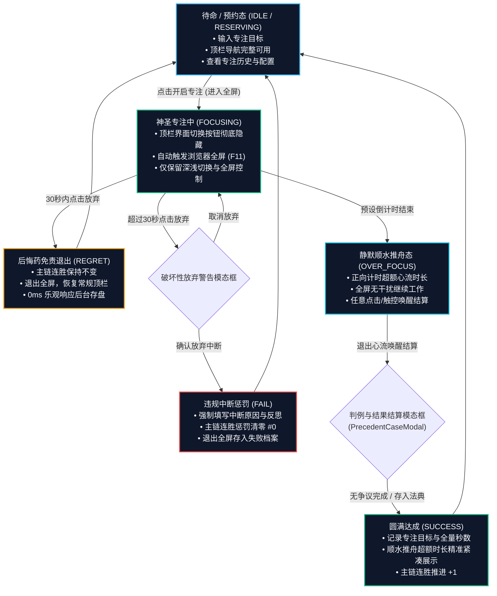

# 🧘 神圣座位专注记录、历史档案与沉浸交互重构总结

> **文档定位**：记录本轮系统迭代中针对「神圣座位全流程专注记录」、「后悔药 vs 违规中断差异化治理」、「专注历史档案面板」以及「专注态全屏防打断沉浸体验」的设计方案、技术架构与实现细节。  
> **记录日期**：2026年9月7日  
> **涉及 Commit**：
> - `f6ed3a0`: `fix(ui): improve font contrast and theme adaptation for focus tree reset modal`
> - `2c7348d`: `feat(seat): implement focus session logging, regret vs fail reflection, and immersive focus UI`

---

## 目录
1. [需求背景与核心设计哲学](#一需求背景与核心设计哲学)
2. [总体架构与业务状态流转图](#二总体架构与业务状态流转图)
3. [核心模块实现与技术细节](#三核心模块实现与技术细节)
   - [1. 物理时钟毫秒级真实采集](#1-物理时钟毫秒级真实采集)
   - [2. 后悔药免责退出 vs 违规中断严正清零](#2-后悔药免责退出-vs-违规中断严正清零)
   - [3. 顺水推舟超额深潜与紧凑时长格式化](#3-顺水推舟超额深潜与紧凑时长格式化)
   - [4. 神圣专注历史档案模态框 (FocusHistoryModal)](#4-神圣专注历史档案模态框-focushistorymodal)
   - [5. 专注时顶部导航隔离与全屏沉浸（F11 效果）](#5-专注时顶部导航隔离与全屏沉浸f11-效果)
4. [数据库模式与向下兼容迁移](#四数据库模式与向下兼容迁移)
5. [前端关键组件与交互对齐](#五前端关键组件与交互对齐)
6. [测试验证与构建表现](#六测试验证与构建表现)

---

## 一、 需求背景与核心设计哲学

在自控工程学的设计闭环中，“专注过程”不能仅仅是一次孤立的倒计时，而是自控行为的**高价值数据沉淀与复盘中枢**：

1. **过程可追溯**：每一次进入座位的意图（专注目标）、实际投入的时间资产（真实物理耗时），必须精确沉淀至数据库；
2. **免责与代价的严格边界**：
   - **启动阻抗保护**：允许在 30 秒后悔药窗口内因外部偶发事件无负罪感退出，保全主链连胜；
   - **违规中断的心理震慑**：超过 30 秒后放弃属于单方面违约，主链惩罚性归零，并**强制要求记录违约归因与反思**，化失败为自控认知资产；
3. **沉浸式防护（Anti-Entropy Focus）**：
   - 专注进行中，UI 应当极度纯粹，**屏蔽任何可能诱发注意力分散或误触打断的界面切换按钮**；
   - 启动即进入全屏（类似于按下 F11），营造神圣无扰的仪式感；
   - 仅保留深浅主题切换与全屏控制，不剥夺基础视觉偏好。

---

## 二、 总体架构与业务状态流转图



---

## 三、 核心模块实现与技术细节

### 1. 物理时钟毫秒级真实采集

- **痛点**：传统前端依靠 `setInterval` 累加计数，在浏览器标签页后台节流（Throttling）或笔记本休眠唤醒时，计时器会被大幅度压缩，导致采集的“实际专注秒数”远小于真实经过的时间。
- **解决方案**：引入基于真实时钟差值计算的 `calculateActualSeconds()`：
  ```typescript
  function calculateActualSeconds(): number {
    if (sessionStartTime.value) {
      const diff = Math.round((new Date().getTime() - sessionStartTime.value.getTime()) / 1000);
      return Math.max(1, diff);
    }
    return Math.max(1, elapsedSeconds.value);
  }
  ```
  在用户唤醒结算的瞬间精准冻结物理时间差，包括正常倒计时与顺水推舟期间的全部超额时长。

---

### 2. 后悔药免责退出 vs 违规中断严正清零

在 [SacredSeatView.vue](file:///d:/Codes/Projects/sacred-focus/frontend/src/views/SacredSeatView.vue) 与 [sacredSeat.ts](file:///d:/Codes/Projects/sacred-focus/backend/src/routes/sacredSeat.ts) 中建立明确的自控判别分支：

| 退出维度 | 后悔药保护期退出 (`REGRET`) | 违规中途中断 (`FAIL`) | 圆满达成 (`SUCCESS`) |
| :--- | :--- | :--- | :--- |
| **触发时机** | 开始专注 $\le 30$ 秒内点击放弃 | 超过 30 秒后点击放弃退出 | 专注满预设时长后退出心流 |
| **主链连胜影响** | **完整保留**，连胜不扣分 | **严正惩罚**，连胜强制清零为 `#0` | **稳步推进**，连胜累加 $+1$ |
| **反思填写要求** | 免责无需填写，直接平滑重置 | **强制必填**中断原因与心理反思 | 记录专注完成内容，可选存入判例 |
| **交互响应度** | 0ms 乐观更新，UI 瞬间回退待命 | 弹出高警示度二次确认模态框 | 唤醒结算模态框，冻结真实物理时长 |

---

### 3. 顺水推舟超额深潜与紧凑时长格式化

- **痛点分析**：早期顺水推舟仅按分钟取整显示（如 `+0m 顺水推舟`、`+2m 顺水推舟`），在实际专注超额 18 秒或 1 小时零 2 秒时，呈现极其粗糙且存在信息截断。
- **全新紧凑时长算法**（[time.ts](file:///d:/Codes/Projects/sacred-focus/frontend/src/utils/time.ts)）：
  ```typescript
  export function formatCompactDuration(seconds: number): string {
    const totalSec = Math.max(0, Math.floor(seconds));
    if (totalSec <= 0) return '';

    const h = Math.floor(totalSec / 3600);
    const m = Math.floor((totalSec % 3600) / 60);
    const s = totalSec % 60;

    let res = '';
    if (h > 0) res += `${h}h`;
    if (m > 0) res += `${m}m`;
    if (s > 0) res += `${s}s`;
    return res;
  }
  ```
- **格式映射规则**：
  - 正好 5 分钟 $\rightarrow$ `5m`
  - 5 分 12 秒 $\rightarrow$ `5m12s`
  - 1 小时零 2 秒 $\rightarrow$ `1h2s`（略过 0m）
  - 1 小时 5 分 12 秒 $\rightarrow$ `1h5m12s`
  - 18 秒 $\rightarrow$ `18s`（不再出现 `+0m`）
- **应用范围**：
  - [FocusHistoryModal.vue](file:///d:/Codes/Projects/sacred-focus/frontend/src/components/seat/FocusHistoryModal.vue) 历史卡片上的 `+... 顺水推舟` 增量胶囊；
  - [PrecedentCaseModal.vue](file:///d:/Codes/Projects/sacred-focus/frontend/src/components/seat/PrecedentCaseModal.vue) 结算时超额说明文本；
  - [SacredSeatView.vue](file:///d:/Codes/Projects/sacred-focus/frontend/src/views/SacredSeatView.vue) 顺水推舟态正向计时器的实时底栏状态。

---

### 4. 神圣专注历史档案模态框 (FocusHistoryModal)

新组件 [FocusHistoryModal.vue](file:///d:/Codes/Projects/sacred-focus/frontend/src/components/seat/FocusHistoryModal.vue) 提供全面的历史归档回溯：

1. **核心统计四宫格**：
   - **累计专注时长**：基于库中所有有效日志汇总，按小时一位小数展示（如 `1.2 小时`）；
   - **专注完成率**：成功履约次数占比（如 `6% 成功 3 / 中断 3`）；
   - **当前主链连胜** 与 **历史最高连胜**；
2. **分段胶囊筛选器（Segmented Pill Tabs）**：
   - 支持 `全部`、`圆满达成`、`后悔药免责`、`违规中断` 快速切换；
   - 药丸上内嵌动态计数气泡；
   - 采用独立弹性容器与 `flex-shrink: 0`，根除标签栏在列表滚动时被挤压截断的 Flexbox 缺陷；
3. **结构化卡片排布**：
   - 目标标题突出，未填写时优雅显示浅灰斜体占位；
   - 状态标识图标化（`✓` 达成、`⟲` 后悔、`✕` 中断）；
   - 中断记录自动展示红底自控反思卡。

---

### 5. 专注时顶部导航隔离与全屏沉浸（F11 效果）

在 [App.vue](file:///d:/Codes/Projects/sacred-focus/frontend/src/App.vue) 与 [SacredSeatView.vue](file:///d:/Codes/Projects/sacred-focus/frontend/src/views/SacredSeatView.vue) 深度协同实现沉浸防护：

1. **顶栏导航按钮隔离**：
   - 当 `seatStore.isFocusMode` 激活时，`<nav class="nav-links">` 彻底隐藏；
   - 用户无法点击「国策画布」、「国策列表」、「判例法典」等切页按钮，杜绝误触打断；
   - 左侧品牌 Logo 设置为不可点击，并浮现带有翠绿呼吸光晕的 `● 心流深潜中` 指示器；
2. **保留主题切换与全屏控制**：
   - 顶栏右侧保留深色/浅色主题切换按钮（`theme-toggle-btn`），专注中可随时调整；
   - 新增全屏状态快捷按钮（`fullscreen-toggle-btn`），与全屏 API 状态双向绑定；
3. **HTML5 Fullscreen 自动触发**：
   - 点击开启专注时，通过用户手势同步调用 `document.documentElement.requestFullscreen()`；
   - 退出专注时自动退出全屏；
4. **意外离开防误触防护网**：
   - Vue Router 路由守卫 `onBeforeRouteLeave`：尝试跳出页面时弹窗确认；
   - 浏览器级事件 `beforeunload`：防止意外关闭标签页或刷新丢失专注。

---

## 四、 数据库模式与向下兼容迁移

在 [backend/src/db.ts](file:///d:/Codes/Projects/sacred-focus/backend/src/db.ts) 中，对 `focus_session_logs` 表无缝注入新字段，并在数据库启动时通过 `PRAGMA table_info` 自动增量执行 `ALTER TABLE`：

```sql
-- 专注流水记录表 (focus_session_logs)
CREATE TABLE IF NOT EXISTS focus_session_logs (
  id TEXT PRIMARY KEY,
  type TEXT NOT NULL,                  -- 'FOCUS' | 'RESERVATION'
  startTime TEXT NOT NULL,             -- ISO 8601
  endTime TEXT NOT NULL,               -- ISO 8601
  targetDurationMinutes INTEGER NOT NULL,
  actualDurationSeconds INTEGER NOT NULL,
  status TEXT NOT NULL,                -- 'SUCCESS' | 'REGRET' | 'FAIL'
  focusContent TEXT,                   -- 专注内容/目标
  failureReason TEXT,                  -- 中断失败归因与反思
  note TEXT,
  createdAt TEXT NOT NULL
);
```

- **数据恢复适配**：在 [evolution.ts](file:///d:/Codes/Projects/sacred-focus/backend/src/routes/evolution.ts) 系统冷备份与还原逻辑中，同步支持 `focusContent` 与 `failureReason` 的全量打包与无损导入。

---

## 五、 前端关键组件与交互对齐

```
frontend/src/
├── utils/
│   └── time.ts                      # 新增：formatCompactDuration (5m, 5m12s, 1h2s, 18s)
├── stores/
│   └── sacredSeat.ts                # 扩展：isFocusMode, isFullscreen, 全屏管理与日志流水
├── views/
│   └── SacredSeatView.vue           # 核心：毫秒级耗时计算、全屏调用、路由守卫、顺水推舟提示
├── components/seat/
│   ├── FocusHistoryModal.vue        # 新增：专注历史档案模态框 (数据看板 + 筛选 + 紧凑药丸)
│   ├── StreakWarningModal.vue       # 增强：违规中断严正清零弹窗 (必填失败归因反思)
│   └── PrecedentCaseModal.vue       # 增强：下必为例结算弹窗 (专注内容录入 + 顺水推舟超额)
└── App.vue                          # 顶栏：专注态导航按钮隐藏、全屏快捷键、主题切换保留
```

---

## 六、 测试验证与构建表现

1. **紧凑时长算法单测验证**：
   - 覆盖所有临界情况（整分钟、带秒数、跨小时、零分钟、不满 1 分钟等），算法全部 100% 验证通过。
2. **前后端编译与打包验证**：
   - **前端**：`vue-tsc -b && vite build` 编译成功，零 TypeScript 错误，资源打包耗时 4.62s；
   - **后端**：`tsc` 编译通过，零语法与类型报错；
3. **代码仓库版本状态**：
   - 本轮改动已按照规范格式正式提交至 Git 本地 `main` 分支，Commit ID: `2c7348d`；
   - 本地工作区保持完全干净（`working tree clean`）。
