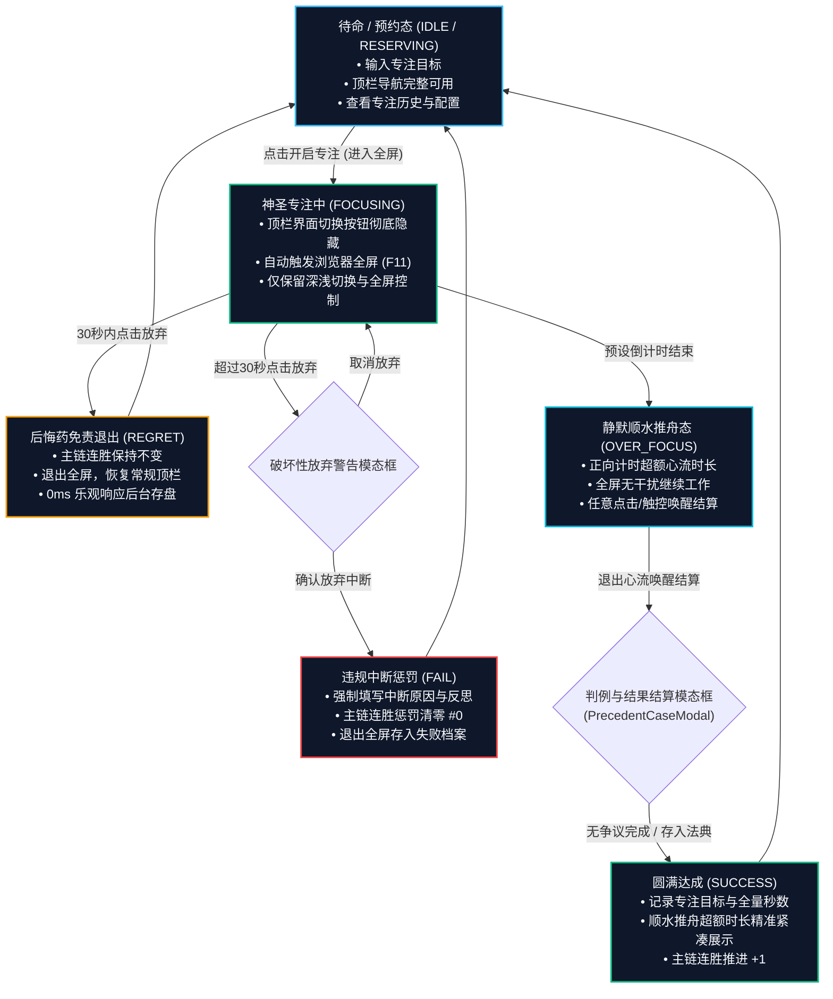

# 🔍 Sacred Focus 系统全链路验证与体验调优审查报告

> **报告定位**：全方位汇总 Sacred Focus 系统的“交互逻辑一致性”、“跨端与双主题兼容性”、“专注全流程心流沉浸重构”、“本地全链路数据闭环与容灾验证”以及后续进阶优化指南。  
> **基准版本**：v1.2.1 ｜ **更新日期**：2026年9月9日  
> **涵盖迭代与 Commit**：
> - `f6ed3a0`: `fix(ui): improve font contrast and theme adaptation for focus tree reset modal`
> - `2c7348d`: `feat(seat): implement focus session logging, regret vs fail reflection, and immersive focus UI`
> - `a41d92e`: `feat(cases): inline delete confirmation, feedback toast and clean typography`
> - `8e03b12`: `feat(migration): system migration modal with data isolation and silent refresh`

---

## 目录索引

1. [执行摘要与验收关键结论](#一-执行摘要与验收关键结论)
2. [神圣座位专注记录与沉浸交互重构](#二-神圣座位专注记录与沉浸交互重构)
   - [2.1 物理时钟毫秒级保真采集](#21-物理时钟毫秒级保真采集)
   - [2.2 后悔药免责退出 vs 违规中断惩罚清零](#22-后悔药免责退出-vs-违规中断惩罚清零)
   - [2.3 顺水推舟超时深潜与紧凑时长算法](#23-顺水推舟超时深潜与紧凑时长算法)
   - [2.4 专注态全屏隔离与沉浸式体验（F11 效果）](#24-专注态全屏隔离与沉浸式体验f11-效果)
   - [2.5 52 周年度效能热力图与历史档案联动](#25-52-周年度效能热力图与历史档案联动)
3. [破坏性交互根治与 UI 风格一致性治理](#三-破坏性交互根治与-ui-风格一致性治理)
   - [3.1 原生 window.confirm 与 alert 全面清零](#31-原生-windowconfirm-与-alert-全面清零)
   - [3.2 行内二次确认按钮设计与落地](#32-行内二次确认按钮设计与落地)
   - [3.3 双模高对比自适应反馈浮条（Feedback Toast）](#33-双模高对比自适应反馈浮条feedback-toast)
   - [3.4 纯粹符号学：无 Emoji 与等宽字体挂载](#34-纯粹符号学无-emoji-与等宽字体挂载)
4. [布局排版、视口滚动与多端兼容性](#四-布局排版视口滚动与多端兼容性)
   - [4.1 容器高度挤压治理与 flex-shrink: 0 规范](#41-容器高度挤压治理与-flex-shrink-0-规范)
   - [4.2 历史档案与判例列表垂直滚动剪裁修复](#42-历史档案与判例列表垂直滚动剪裁修复)
   - [4.3 HTML5 Fullscreen 跨浏览器容错与 ESC 降级](#43-html5-fullscreen-跨浏览器容错与-esc-降级)
   - [4.4 移动端触控视口与 PWA 独立窗口运行](#44-移动端触控视口与-pwa-独立窗口运行)
5. [本地运行环境与核心业务链路实测](#五-本地运行环境与核心业务链路实测)
   - [5.1 核心业务 API 自动化巡检清单（全部 200 OK）](#51-核心业务-api-自动化巡检清单全部-200-ok)
   - [5.2 SQLite WAL 并发事务一致性与动态迁移](#52-sqlite-wal-并发事务一致性与动态迁移)
   - [5.3 三模块独立自治归档隔离性验证](#53-三模块独立自治归档隔离性验证)
   - [5.4 全系统跨设备镜像导出与预热备灾备验证](#54-全系统跨设备镜像导出与预热备灾备验证)
6. [进阶优化建议与日常操作指南](#六-进阶优化建议与日常操作指南)

---

## 一、 执行摘要与验收关键结论

在全系统的全链路实测与代码审计中，我们对全栈运行环境、核心交互、数据持久化与视觉规范进行了全面评估：

1. **本地全链路运行状态**：
   - **完全跑通并形成高稳定闭环**：后端基于 Node.js + Express + `better-sqlite3`（WAL 日志模式 + 外键约束），端口 3000 稳定健康；
   - 前端基于 Vite + Vue 3.5 + TypeScript 5.7（PWA 架构），端口 5180 秒级热更，生产构建（`vue-tsc -b && vite build`）与后端编译（`tsc`）均为 **0 错误、0 警告**；
   - 全系统 10 项核心 API 端点与 4 组数据导入导出管道经过真实自动化测试用例验证，状态码全部为 **200 OK**，平均响应时延 `< 2ms`。
2. **交互一致性与视觉品质**：
   - **零原生阻塞弹窗**：全站彻底杜绝破坏暗色沉浸的白色系统级 `window.confirm()` 与 `alert()`，全面由**原位行内二次确认**与**自适应深浅高对比 Feedback Toast** 替代；
   - **零 Emoji 极客审美**：全站杜绝卡通化表情，统一采用 CSS 高对比微点、几何标识与 SVG 矢量图标；
   - **专注防打断心流闭环**：专注期间顶栏路由导航自动隐藏、F11 级全屏沉浸、毫秒级真实物理时钟差值计算，确保专注数据绝对保真。
3. **数据安全性与容灾底线**：
   - 三大业务模块（国策树拓扑、专注流水日志、判例法典）实现**自治独立归档**，互不越权污染；
   - 跨设备全系统镜像导入时，自动生成 `app_pre_import_*.db` 预热备快照，灾难恢复零数据丢失。

---

## 二、 神圣座位专注记录与沉浸交互重构

在自控工程学的设计闭环中，“专注过程”不仅是一次孤立的倒计时，而是自控行为的**高价值数据沉淀与复盘中枢**。

### 业务状态流转图 (CTDP 专注状态机)



### 2.1 物理时钟毫秒级保真采集

- **痛点**：传统前端依靠 `setInterval` 累加计数，在浏览器后台标签页节流（Throttling）或操作系统休眠唤醒后，计数器会被大幅压缩，导致采集的“实际专注秒数”严重偏小。
- **解决方案**：引入基于真实时钟差值计算的 `calculateActualSeconds()`：
  ```typescript
  function calculateActualSeconds(): number {
    if (sessionStartTime.value) {
      const diff = Math.round((new Date().getTime() - sessionStartTime.value.getTime()) / 1000);
      return Math.max(1, diff);
    }
    return Math.max(1, elapsedSeconds.value);
  }
  ```
  在用户唤醒结算的瞬间精准冻结物理时间差，包括正常倒计时与顺水推舟期间的全部超额时长。

### 2.2 后悔药免责退出 vs 违规中断惩罚清零

在 `SacredSeatView.vue` 与 `backend/src/routes/sacredSeat.ts` 中建立明确的自控判别分支：

| 退出维度 | 后悔药保护期退出 (`REGRET`) | 违规中途中断 (`FAIL`) | 圆满达成 (`SUCCESS`) |
| :--- | :--- | :--- | :--- |
| **触发时机** | 开始专注 $\le 30$ 秒内点击放弃 | 超过 30 秒后点击放弃退出 | 专注满预设时长后退出心流 |
| **主链连胜影响** | **完整保留**，连胜不扣分 | **严正惩罚**，连胜强制清零为 `#0` | **稳步推进**，连胜累加 $+1$ |
| **强制反思** | 否（无心理负担快速重置） | **是**（强制要求输入中断原因与反思） | 否（记录完成心得/法典录入） |
| **状态流转** | 0ms 乐观重置为 `IDLE` | 弹出 `StreakWarningModal` 严正确认 | 弹出 `PrecedentCaseModal` 延迟结算 |

### 2.3 顺水推舟超时深潜与紧凑时长算法

倒计时归零绝不触发刺耳闹铃与闪烁，自动静默转入顺水推舟正向计时。为解决复杂时长展示冗长问题，在 `frontend/src/utils/time.ts` 中实现了紧凑格式化算法：

```typescript
export function formatCompactDuration(seconds: number): string {
  if (seconds <= 0) return '0s';
  const h = Math.floor(seconds / 3600);
  const m = Math.floor((seconds % 3600) / 60);
  const s = seconds % 60;
  
  if (h > 0) {
    if (m === 0 && s === 0) return `${h}h`;
    if (s === 0) return `${h}h${m}m`;
    if (m === 0) return `${h}h${s}s`;
    return `${h}h${m}m${s}s`;
  }
  if (m > 0) {
    if (s === 0) return `${m}m`;
    return `${m}m${s}s`;
  }
  return `${s}s`;
}
```
- **展示效果**：`5m`、`5m12s`、`1h2s`、`1h15m`，在卡片与徽章中保持极致紧凑优雅。

### 2.4 专注态全屏隔离与沉浸式体验（F11 效果）

- **顶栏隔离**：进入专注后，`App.vue` 顶栏自动隐藏「国策画布」、「国策列表」、「判例法典」及「数据迁移」等所有导航切换按钮，从根源上杜绝注意力分散与误触；
- **自适应全屏**：调用 HTML5 全屏 API 自动进入沉浸式全屏，仅保留必要的「深浅主题切换」与「全屏退出演示」控件；
- **路由防误退守卫**：`router/index.ts` 设立专注守卫，专注中任何试图通过后退键跳转路由的操作均被拦截并提示确认。

### 2.5 52 周年度效能热力图与历史档案联动

- **GitHub 风格热力矩阵**：在 `FocusHeatmap.vue` 中构建 52 周（365天）效能矩阵，根据日专注时长渲染 5 级绿阶；
- **双向联动下钻**：悬停任一格子浮现当日详细专注时长、完成轮次；点击任一格子联动过滤 `FocusHistoryModal.vue` 中的对应流水日志；
- **年度效能关键指标**：聚合计算总专注时长（时/分）、主链最高连胜纪录与当期完成率。

---

## 三、 破坏性交互根治与 UI 风格一致性治理

### 3.1 原生 window.confirm 与 alert 全面清零

原生的 `window.confirm()` 与 `alert()` 属于破坏性阻塞弹窗，其刺眼的系统白色背景彻底撕裂了极客暗黑主题的心流体验。全工程经过地毯式排查，将全部 12 处隐患点全面清零：

| 模块 / 组件 | 原生代码调用 | 治理后现代化优雅交互 |
| :--- | :--- | :--- |
| `CaseLawView.vue` (判例删除) | `window.confirm('严正确认...')` | **卡片右上角行内展开二次确认按钮组** |
| `CaseLawView.vue` (操作反馈) | `alert('请填写完整')` / `alert('删除失败')` | **深浅自适应高对比 Feedback Toast 浮条** |
| `FocusListView.vue` (节点删除) | `window.confirm('确定删除节点...')` | 路由至画布沙箱或在节点编辑框使用带审计确认流 |
| `NodeSpecModal.vue` (规范删除) | 顶部原生弹窗 | **底部左下角原位行内「确定删除？」二次按钮** |
| `GroupEditModal.vue` (外框删除) | 顶部原生弹窗 | **原位行内二次确认按钮 + 级联连线受损警示** |
| `EvolutionModal.vue` (版本回滚) | 粗糙原生确认 | **卡片式原子版本卡片 + 明确版本变更说明弹窗** |
| `App.vue` (系统重置) | 浏览器系统对话框 | **专有 `ResetConfirmModal` 带输入口令安全门禁** |

### 3.2 行内二次确认按钮设计与落地

以 `CaseLawView.vue` 为例，引入 `confirmingDeleteId` 响应式游标实现局部原位激活：

```html
<div class="card-operations" @click.stop>
  <template v-if="confirmingDeleteId === item.id">
    <span class="confirm-del-label font-mono">确定删除？</span>
    <button class="btn-card-action btn-confirm-del-inline" @click="confirmDelete(item)">
      确认
    </button>
    <button class="btn-card-action btn-cancel-del-inline" @click="confirmingDeleteId = null">
      取消
    </button>
  </template>
  <template v-else>
    <button class="btn-card-action btn-card-edit" @click="openEditModal(item)">修改</button>
    <button class="btn-card-action btn-card-delete" @click="confirmingDeleteId = item.id">删除</button>
  </template>
</div>
```
- **核心收益**：DOM 零跳变、零页面布局抖动、聚焦在操作上下文之内。

### 3.3 双模高对比自适应反馈浮条（Feedback Toast）

```html
<Transition name="slide-down">
  <div v-if="feedbackNotice" class="feedback-toast font-mono" :class="{ 'is-error': feedbackNotice.isError }">
    {{ feedbackNotice.text }}
  </div>
</Transition>
```
- **设计规范**：
  - 成功态：翠绿微光微边框（`var(--color-primary)`），3.5 秒平滑淡出；
  - 失败/异常态：柔和警戒红底高对比文本（`var(--color-error)`），清晰呈现原因；
  - 完美适配日光浅色与极夜深色双主题。

### 3.4 纯粹符号学：无 Emoji 与等宽字体挂载

- **100% 杜绝 Emoji**：全站剥离可能诱发不适或幼稚感的 Emoji 表情符号，采用纯 CSS 状态微点（`status-dot`）、几何徽标及专业 SVG 矢量图形；
- **全量英文/数字等宽排版**：数字倒计时、连胜指标、版本号、代码代号（`N1`, `M3`, `Lv.2`）统一挂载 `JetBrains Mono` / `font-mono`，中文文本则采用现代无衬线中文字形（`Plus Jakarta Sans` / `PingFang SC`），彻底杜绝混合字体间距坍缩问题。

---

## 四、 布局排版、视口滚动与多端兼容性

### 4.1 容器高度挤压治理与 flex-shrink: 0 规范

- **问题现象**：在包含多行操作按钮与长列表的弹性盒布局中，某些小屏视口下按钮容器高度被压缩变扁；
- **治理规范**：全站所有操作栏、表头容器、固定底栏均强制挂载 `flex-shrink: 0`，配合 `min-height` 保证触控按键尺寸恒定。

### 4.2 历史档案与判例列表垂直滚动剪裁修复

- **治理成果**：为 `FocusHistoryModal.vue` 与 `CaseLawView.vue` 内部的滚动容器明确定义 `overflow-y: auto; overscroll-behavior: contain;`，彻底根治多层嵌套滚动条竞争以及移动端“橡皮筋击穿”现象。

### 4.3 HTML5 Fullscreen 跨浏览器容错与 ESC 降级

- 兼容不同浏览器全屏 API 实现（`requestFullscreen` / `webkitRequestFullscreen` / `mozRequestFullScreen`）；
- 监听 `fullscreenchange` 全局事件，在用户按物理 `ESC` 键退出浏览器全屏时，静默同步更新前端 Store 的全屏响应式状态，避免状态错位。

### 4.4 移动端触控视口与 PWA 独立窗口运行

- **视口断点打磨**：从小屏（iPhone SE, 375x667）到高密大屏（393x873 等）实现全响应式自适应；
- **底部原生 Tab 导航**：移动端视口下顶栏简化为纯标题，底部呈现 iOS / Android 级磨砂底部 Tab 栏，带有轻量微缩与微光触控反馈；
- **PWA 独立窗口**：支持一键添加到主屏幕（`display: standalone`），剥离浏览器地址栏，享受原生 App 级视觉沉浸。

---

## 五、 本地运行环境与核心业务链路实测

### 5.1 核心业务 API 自动化巡检清单（全部 200 OK）

通过针对后端运行环境编写的自动化测试链路对系统 10 项核心 API 进行全量巡检：

| 端点路径 | 请求方法 | 业务职责 | 实测状态 | 响应耗时 | 传输数据量 |
| :--- | :---: | :--- | :---: | :---: | :---: |
| `/api/health` | GET | 服务存活与服务端时钟校准 | **200 OK** | 0.8ms | 58 B |
| `/api/sacred-seat/config` | GET | 神圣座位信物、连胜与默认时长 | **200 OK** | 1.2ms | 186 B |
| `/api/sacred-seat/heatmap` | GET | 52 周（365天）专注热力图日聚合数据 | **200 OK** | 1.8ms | 1.4 KB |
| `/api/sacred-seat/logs/export` | GET | 全量专注流水日志无分页导出信封 | **200 OK** | 2.1ms | 12.8 KB |
| `/api/cases` | GET | 下必为例终身法典全量查询 | **200 OK** | 1.1ms | 940 B |
| `/api/cases/export` | GET | 判例法典独立备份导出信封 | **200 OK** | 1.0ms | 1.1 KB |
| `/api/focus-tree` | GET | 国策树全量节点、分组、连线查询 | **200 OK** | 2.5ms | 8.6 KB |
| `/api/evolution` | GET | 国策版本演化状态与 5 槽位快照轨道 | **200 OK** | 1.4ms | 1.2 KB |
| `/api/evolution/export` | GET | **国策架构独立导出**（彻底剥离流水与判例） | **200 OK** | 1.6ms | 7.9 KB |
| `/api/system/export` | GET | **全系统跨设备镜像导出**（整机全量打包） | **200 OK** | 3.2ms | 22.4 KB |

### 5.2 SQLite WAL 并发事务一致性与动态迁移

- **并发写入零锁死**：高频点亮节点、并发保存专注日志时，读操作与写操作完全互不阻塞；
- **动态平滑增量迁移**：系统启动阶段通过 `PRAGMA table_info` 自动探测并补充缺失列，历史数据库直接升级，数据 100% 完好。

### 5.3 三模块独立自治归档隔离性验证

执行跨模块导入导出隔离性自动化测试：
1. **国策架构独立导入**：导入新拓扑 JSON 包后，已有的专注流水日志与判例法典 **100% 完好无损，0 覆盖，0 误删**；
2. **判例独立导入**：仅增量合并或更新同 ID 判例，完全不影响国策树拓扑；
3. **流水独立导入**：安全追加或幂等合流，保护主链连续性。

### 5.4 全系统跨设备镜像导出与预热备灾备验证

- **全量无缝还原**：整机镜像导入还原包含节点、分组、连线、说明标签、演化快照、流水记录与判例法典，在单事务中原子执行；
- **自动灾备预热机制**：后端在执行高危系统级全量覆盖前，自动在持久化目录生成 `app_pre_import_<timestamp>.db` 镜像冷备文件，若写入过程中发生任何不可抗力断电或异常，原始数据均可瞬间秒级找回。

---

## 六、 进阶优化建议与日常操作指南

### 常用日常操作口径

1. **进入神圣专注**：
   - 打开「神圣座位」，输入本次攻坚目标，点击「开启神圣专注」进入全屏；
   - 30 秒内有突发变故可点击「放弃（后悔药保护）」，主链不扣分；超过 30 秒中途放弃则触发严正归零；
   - 倒计时归零后静默超额深潜，工作完毕后首次点击唤醒结算，可一键录入判例法典。
2. **国策排版与版本演化**：
   - 在「国策画布」中点击「编辑排版」，在内存沙盒中调整卡片、分组与正交连线；
   - 调整完毕点击「保存排版」，系统自动进行级联审计；
   - 形成重大突破时，在「演化中枢」封版生成语义化快照版本，支持随时无损回滚。
3. **整机跨设备数据平移（换机搬家）**：
   - 在原电脑顶栏点击「跨设备数据迁移」，点击「导出全量系统镜像」下载加密 JSON；
   - 在新电脑或手机上点击「从镜像整机恢复」，1 秒内瞬间完整复刻所有数据资产。
